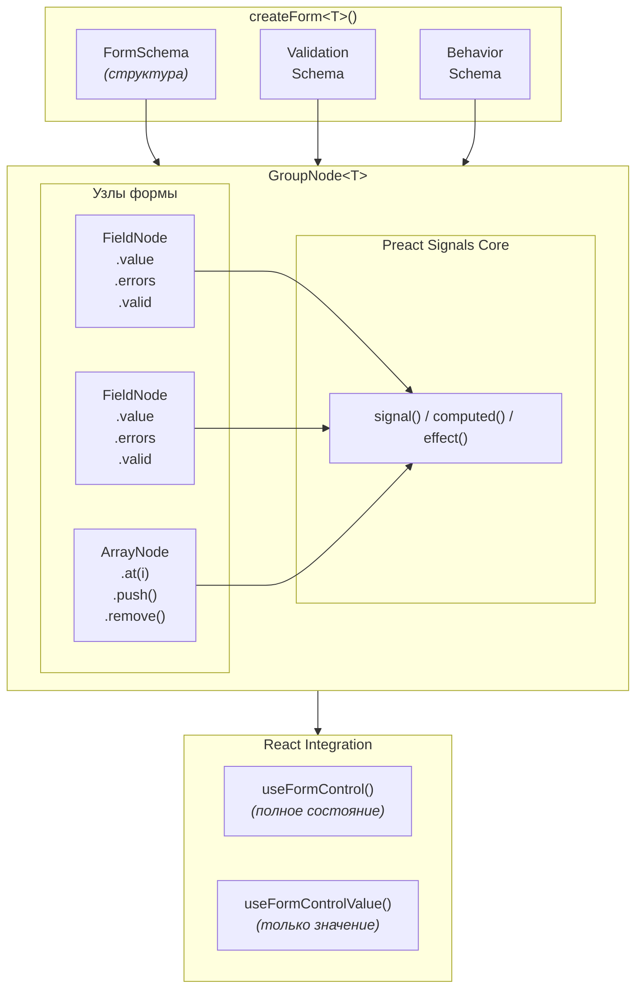
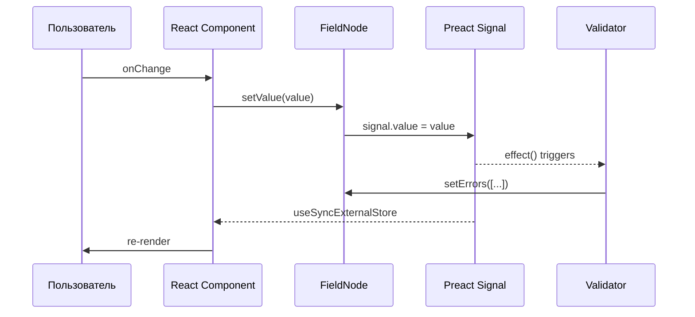

# ReFormer: Почему стоит использовать?

> Реактивная библиотека для форм на Preact Signals с декларативными behaviors и типобезопасностью

---

## TL;DR

| Что | Описание |
|-----|----------|
| **Технология** | Реактивные формы на [Preact Signals](https://preactjs.com/guide/v10/signals/) |
| **Главное отличие** | Декларативные behaviors + типобезопасный доступ к полям |
| **Для кого** | Сложные формы с зависимыми полями, wizard-формы, async валидация |
| **Bundle size** | ~15kb (gzipped) |

---

## Почему ReFormer? 5 ключевых преимуществ

### 1. Signals-based реактивность

Ре-рендерится только изменённое поле, а не вся форма:

```tsx
// React Hook Form: при изменении ЛЮБОГО поля вызывается watch callback
const values = watch(); // ре-рендер всей формы

// ReFormer: подписка на конкретное поле
const email = useFormControlValue(form.email); // ре-рендер только этого компонента
```

### 2. Типобезопасный доступ к полям

TypeScript знает о структуре формы:

```tsx
// React Hook Form: строки, нет автокомплита
setValue('address.city', 'Moscow');
watch('adress.city'); // опечатка — узнаём только в runtime

// ReFormer: типизированный Proxy
form.address.city.setValue('Moscow'); // автокомплит + проверка типов
form.adress.city.setValue('Moscow'); // ❌ ошибка TypeScript!
```

### 3. Декларативные behaviors

Связь между полями описывается декларативно:

```tsx
behavior: (path) => {
  // Автоматический расчёт
  computeFrom([path.price, path.quantity], path.total,
    (v) => v.price * v.quantity);

  // Условное включение поля
  enableWhen(path.city, (form) => Boolean(form.country));

  // Копирование значений
  copyFrom(path.shippingAddress, path.billingAddress, {
    when: (form) => form.sameAddress
  });
}
```

### 4. Единая система валидации

Sync, async и cross-field валидация в одном месте:

```tsx
validation: (path) => {
  // Синхронная
  validate(path.email, required());
  validate(path.email, email());

  // Асинхронная с debounce
  validateAsync(path.email, async (value) => {
    const exists = await checkEmailExists(value);
    return exists ? { code: 'taken', message: 'Email занят' } : null;
  }, { debounce: 500 });

  // Cross-field
  validate(path.confirmPassword, (value, ctx) => {
    return value !== root.password.value.value
      ? { code: 'mismatch', message: 'Пароли не совпадают' }
      : null;
  });
}
```

### 5. Framework-agnostic ядро

Core-библиотека не зависит от React:

```tsx
// Работает без React (Node.js, CLI, тесты)
const form = new GroupNode({ ... });
form.email.setValue('test@mail.com');
await form.validate();
console.log(form.valid.value); // true/false
```

---

## Сравнение с конкурентами

| Критерий | ReFormer | React Hook Form | Formik |
|----------|:--------:|:---------------:|:------:|
| **Реактивность** | Signals | Proxy + subscribe | Context |
| **Типобезопасность путей** | `path.email` | строки `"email"` | строки |
| **Computed fields** | `computeFrom` | ручной useEffect | ручной |
| **Условное включение** | `enableWhen` | ручной | ручной |
| **Копирование полей** | `copyFrom` | ручной | ручной |
| **Async валидация** | debounce | есть | есть |
| **Cross-field валидация** | `validateGroup` | resolver | yup/zod |
| **Вложенные формы** | GroupNode | FieldArray | FieldArray |
| **Массивы** | ArrayNode | useFieldArray | FieldArray |
| **Bundle size** | ~15kb | ~9kb | ~13kb |
| **Зависимость от React** | только хуки | полная | полная |

---

## Примеры кода: ReFormer vs React Hook Form

### Задача 1: Вычисляемое поле

**Total = Price × Quantity**

```tsx
// ❌ React Hook Form — императивный useEffect
function OrderForm() {
  const { watch, setValue, register } = useForm();
  const [price, quantity] = watch(['price', 'quantity']);

  useEffect(() => {
    setValue('total', (price || 0) * (quantity || 0));
  }, [price, quantity, setValue]);

  return (
    <form>
      <input {...register('price')} type="number" />
      <input {...register('quantity')} type="number" />
      <input {...register('total')} disabled />
    </form>
  );
}
```

```tsx
// ✅ ReFormer — декларативный behavior + чистая вёрстка
const createOrderForm = () => createForm<OrderForm>({
  form: {
    price: { value: 0, component: Input, componentProps: { label: 'Цена', type: 'number' } },
    quantity: { value: 1, component: Input, componentProps: { label: 'Количество', type: 'number' } },
    total: { value: 0, component: Input, componentProps: { label: 'Итого', disabled: true } },
  },
  behavior: (path) => {
    computeFrom([path.price, path.quantity], path.total, (v) => v.price * v.quantity);
  },
});

function OrderForm() {
  const form = useMemo(() => createOrderForm(), []);

  return (
    <form>
      <FormField control={form.price} />
      <FormField control={form.quantity} />
      <FormField control={form.total} />
    </form>
  );
}
```

### Задача 2: Условное включение поля

**Показать поле города только если выбрана страна**

```tsx
// ❌ React Hook Form — ручная логика
function AddressForm() {
  const { watch, register, resetField } = useForm();
  const country = watch('country');

  useEffect(() => {
    if (!country) {
      resetField('city');
    }
  }, [country, resetField]);

  return (
    <form>
      <select {...register('country')}>...</select>
      <input {...register('city')} disabled={!country} />
    </form>
  );
}
```

```tsx
// ✅ ReFormer — декларативный enableWhen + чистая вёрстка
const createAddressForm = () => createForm<AddressForm>({
  form: {
    country: {
      value: '',
      component: Select,
      componentProps: {
        label: 'Страна',
        options: [{ value: 'ru', label: 'Россия' }, { value: 'us', label: 'США' }]
      }
    },
    city: { value: '', component: Input, componentProps: { label: 'Город' } },
  },
  behavior: (path) => {
    enableWhen(path.city, (form) => Boolean(form.country), { resetOnDisable: true });
  },
});

function AddressForm() {
  const form = useMemo(() => createAddressForm(), []);

  return (
    <form>
      <FormField control={form.country} />
      <FormField control={form.city} />
    </form>
  );
}
```

### Задача 3: Копирование адреса доставки

**Использовать адрес доставки как адрес оплаты**

```tsx
// ❌ React Hook Form — ручное копирование
function CheckoutForm() {
  const { watch, setValue, register } = useForm();
  const [sameAddress, shipping] = watch(['sameAddress', 'shippingAddress']);

  useEffect(() => {
    if (sameAddress) {
      setValue('billingAddress', shipping);
    }
  }, [sameAddress, shipping, setValue]);

  return (
    <form>
      <input {...register('shippingAddress')} />
      <input type="checkbox" {...register('sameAddress')} />
      <input {...register('billingAddress')} disabled={sameAddress} />
    </form>
  );
}
```

```tsx
// ✅ ReFormer — декларативный copyFrom + чистая вёрстка
const createCheckoutForm = () => createForm<CheckoutForm>({
  form: {
    shippingAddress: { value: '', component: Input, componentProps: { label: 'Адрес доставки' } },
    sameAddress: { value: false, component: Checkbox, componentProps: { label: 'Использовать для оплаты' } },
    billingAddress: { value: '', component: Input, componentProps: { label: 'Адрес оплаты' } },
  },
  behavior: (path) => {
    copyFrom(path.shippingAddress, path.billingAddress, {
      when: (form) => form.sameAddress,
    });
  },
});

function CheckoutForm() {
  const form = useMemo(() => createCheckoutForm(), []);

  return (
    <form>
      <FormField control={form.shippingAddress} />
      <FormField control={form.sameAddress} />
      <FormField control={form.billingAddress} />
    </form>
  );
}
```

### Задача 4: Многошаговая форма (Wizard)

**Форма из 3 шагов с валидацией каждого шага**

```tsx
// ❌ React Hook Form — много boilerplate
function WizardForm() {
  const [step, setStep] = useState(0);
  const { trigger, getValues, register, formState } = useForm();

  const stepFields = {
    0: ['name', 'email'],
    1: ['address', 'city'],
    2: ['cardNumber', 'cvv'],
  };

  const nextStep = async () => {
    const isValid = await trigger(stepFields[step]); // валидация текущего шага
    if (isValid) setStep(step + 1);
  };

  const prevStep = () => setStep(step - 1);

  const onSubmit = async () => {
    const isValid = await trigger(); // полная валидация
    if (isValid) {
      await api.submit(getValues());
    }
  };

  return (
    <form>
      {step === 0 && (
        <>
          <input {...register('name', { required: true })} />
          <input {...register('email', { required: true })} />
        </>
      )}
      {step === 1 && (
        <>
          <input {...register('address', { required: true })} />
          <input {...register('city', { required: true })} />
        </>
      )}
      {step === 2 && (
        <>
          <input {...register('cardNumber', { required: true })} />
          <input {...register('cvv', { required: true })} />
        </>
      )}

      <button type="button" onClick={prevStep} disabled={step === 0}>Назад</button>
      {step < 2 ? (
        <button type="button" onClick={nextStep}>Далее</button>
      ) : (
        <button type="button" onClick={onSubmit}>Отправить</button>
      )}
    </form>
  );
}
```

```tsx
// ✅ ReFormer — встроенный FormNavigation
import { FormNavigation } from '@reformer/ui/form-navigation';

// Валидация по шагам
const STEP_VALIDATIONS = {
  0: (path) => { validate(path.name, required()); validate(path.email, required()); validate(path.email, email()); },
  1: (path) => { validate(path.address, required()); validate(path.city, required()); },
  2: (path) => { validate(path.cardNumber, required()); validate(path.cvv, required()); },
};

function WizardForm() {
  const form = useMemo(() => createForm({ ... }), []);
  const navRef = useRef<FormNavigationHandle>(null);

  const handleSubmit = async () => {
    const result = await navRef.current?.submit(async (values) => {
      return await api.submit(values);
    });
  };

  return (
    <FormNavigation ref={navRef} form={form} config={{ stepValidations: STEP_VALIDATIONS }}>
      {/* Шаг 1 */}
      <FormNavigation.Step component={PersonalInfoStep} control={form} />
      {/* Шаг 2 */}
      <FormNavigation.Step component={AddressStep} control={form} />
      {/* Шаг 3 */}
      <FormNavigation.Step component={PaymentStep} control={form} />

      {/* Кнопки — автоматически скрываются/показываются */}
      <FormNavigation.Actions onSubmit={handleSubmit}>
        <FormNavigation.Prev>Назад</FormNavigation.Prev>
        <FormNavigation.Next>Далее</FormNavigation.Next>
        <FormNavigation.Submit>Отправить</FormNavigation.Submit>
      </FormNavigation.Actions>

      {/* Прогресс */}
      <FormNavigation.Progress>
        {({ current, total, percent }) => (
          <div>Шаг {current} из {total} ({percent}%)</div>
        )}
      </FormNavigation.Progress>
    </FormNavigation>
  );
}
```

### Задача 5: Валидация — sync, async, cross-field

**Комплексная валидация формы регистрации**

```tsx
// ❌ React Hook Form — разрозненные подходы
import { useForm } from 'react-hook-form';
import { zodResolver } from '@hookform/resolvers/zod';
import * as z from 'zod';

// Zod схема — но async валидация отдельно!
const schema = z.object({
  username: z.string().min(3).regex(/^[a-zA-Z0-9_]+$/),
  email: z.string().email(),
  password: z.string().min(8),
  confirmPassword: z.string(),
}).refine(data => data.password === data.confirmPassword, {
  message: 'Пароли не совпадают',
  path: ['confirmPassword'],
});

function RegistrationForm() {
  const { register, handleSubmit, setError, formState } = useForm({
    resolver: zodResolver(schema),
  });

  // Async валидация — отдельный useEffect!
  const [checkingUsername, setCheckingUsername] = useState(false);
  const username = watch('username');

  useEffect(() => {
    const checkUsername = async () => {
      if (username?.length >= 3) {
        setCheckingUsername(true);
        const exists = await api.checkUsername(username);
        if (exists) {
          setError('username', { message: 'Логин занят' });
        }
        setCheckingUsername(false);
      }
    };
    const timer = setTimeout(checkUsername, 500); // ручной debounce
    return () => clearTimeout(timer);
  }, [username]);

  return <form>...</form>;
}
```

```tsx
// ✅ ReFormer — всё в одном месте + чистая вёрстка
const createRegistrationForm = () => createForm<RegistrationForm>({
  form: {
    username: { value: '', component: Input, componentProps: { label: 'Логин' } },
    email: { value: '', component: Input, componentProps: { label: 'Email', type: 'email' } },
    password: { value: '', component: InputPassword, componentProps: { label: 'Пароль' } },
    confirmPassword: { value: '', component: InputPassword, componentProps: { label: 'Подтвердите пароль' } },
  },
  validation: (path) => {
    // Синхронная
    validate(path.username, required({ message: 'Обязательное поле' }));
    validate(path.username, minLength(3, { message: 'Минимум 3 символа' }));
    validate(path.username, pattern(/^[a-zA-Z0-9_]+$/, { message: 'Только латиница' }));

    validate(path.email, required());
    validate(path.email, email());
    validate(path.password, required());
    validate(path.password, minLength(8));

    // Кастомная
    validate(path.password, (value) => {
      if (!/[A-Z]/.test(value) || !/[a-z]/.test(value) || !/\d/.test(value)) {
        return { code: 'weak', message: 'Нужны заглавные, строчные и цифры' };
      }
      return null;
    });

    // Cross-field
    validate(path.confirmPassword, (value, ctx) => {
      if (value !== root.password.value.value) {
        return { code: 'mismatch', message: 'Пароли не совпадают' };
      }
      return null;
    });

    // Async с debounce
    validateAsync(path.username, async (value) => {
      if (value.length < 3) return null;
      const exists = await api.checkUsername(value);
      return exists ? { code: 'taken', message: 'Логин занят' } : null;
    }, { debounce: 500 });
  },
});

function RegistrationForm() {
  const form = useMemo(() => createRegistrationForm(), []);

  const handleSubmit = async (e: React.FormEvent) => {
    e.preventDefault();
    form.markAsTouched();
    await form.validate();
    if (form.valid.value) {
      await api.register(form.getValue());
    }
  };

  return (
    <form onSubmit={handleSubmit}>
      <FormField control={form.username} />
      <FormField control={form.email} />
      <FormField control={form.password} />
      <FormField control={form.confirmPassword} />
      <button disabled={form.invalid.value || form.pending.value}>
        {form.pending.value ? 'Проверка...' : 'Зарегистрироваться'}
      </button>
    </form>
  );
}
```

### Задача 6: Behaviors — загрузка данных при изменении поля

**При выборе страны — загрузить список городов**

```tsx
// ❌ React Hook Form — ручной useEffect
function AddressForm() {
  const { watch, setValue, register } = useForm();
  const [cities, setCities] = useState([]);
  const [loading, setLoading] = useState(false);
  const country = watch('country');

  useEffect(() => {
    if (country) {
      setLoading(true);
      api.getCities(country)
        .then(setCities)
        .finally(() => setLoading(false));
      setValue('city', ''); // сброс города
    } else {
      setCities([]);
    }
  }, [country, setValue]);

  return (
    <form>
      <select {...register('country')}>
        <option value="">Выберите страну</option>
        <option value="ru">Россия</option>
        <option value="us">США</option>
      </select>

      <select {...register('city')} disabled={!country || loading}>
        <option value="">{loading ? 'Загрузка...' : 'Выберите город'}</option>
        {cities.map(city => <option key={city} value={city}>{city}</option>)}
      </select>
    </form>
  );
}
```

```tsx
// ✅ ReFormer — декларативный watchField + чистая вёрстка
const createAddressForm = () => createForm<AddressForm>({
  form: {
    country: {
      value: '',
      component: Select,
      componentProps: {
        label: 'Страна',
        options: [{ value: 'ru', label: 'Россия' }, { value: 'us', label: 'США' }]
      }
    },
    city: {
      value: '',
      component: Select,
      componentProps: { label: 'Город', options: [] }
    },
  },
  behavior: (path) => {
    watchField(path.country, async (country, _control, root) => {
      if (country) {
        const cities = await api.getCities(country);
        root.city.setComponentProps({
          options: cities.map(c => ({ value: c, label: c })),
        });
        ctx.setFieldValue('city', '');
      }
    }, { debounce: 300 });

    enableWhen(path.city, (form) => Boolean(form.country));
  },
});

function AddressForm() {
  const form = useMemo(() => createAddressForm(), []);

  return (
    <form>
      <FormField control={form.country} />
      <FormField control={form.city} />
    </form>
  );
}
```

### Задача 7: Программное управление формой

**Установка значений, сброс, валидация из кода**

```tsx
// ❌ React Hook Form — разные методы
function MyForm() {
  const { setValue, reset, trigger, getValues, setError, clearErrors } = useForm();

  const loadData = async () => {
    const data = await api.getData();
    // Установка каждого поля отдельно или reset всей формы
    reset(data); // сбрасывает dirty/touched статус
    // или
    Object.entries(data).forEach(([key, value]) => {
      setValue(key, value, { shouldDirty: true });
    });
  };

  const validateField = async (name) => {
    await trigger(name);
  };

  const setFieldError = (name, message) => {
    setError(name, { message });
  };

  return <form>...</form>;
}
```

```tsx
// ✅ ReFormer — единый API через узлы формы
function MyForm() {
  const form = useMemo(() => createForm({ ... }), []);

  // Загрузка данных
  const loadData = async () => {
    const data = await api.getData();

    // Установка всех значений одним вызовом
    form.patchValue(data);

    // Или отдельных полей
    form.email.setValue('new@email.com');
    form.address.city.setValue('Moscow'); // вложенные поля

    // Без триггера валидации
    form.email.setValue('test', { emitEvent: false });
  };

  // Сброс формы
  const resetForm = () => {
    form.reset(); // к начальным значениям
    // или с новыми значениями
    form.reset({ email: '', name: '' });
  };

  // Валидация
  const validateAll = async () => {
    await form.validate();
    console.log(form.valid.value); // true/false
  };

  const validateField = async () => {
    await form.email.validate();
    console.log(form.email.valid.value);
  };

  // Ошибки
  const setCustomError = () => {
    form.email.setErrors([{ code: 'custom', message: 'Кастомная ошибка' }]);
  };

  const clearFieldErrors = () => {
    form.email.clearErrors();
    // или очистить конкретную ошибку
    form.email.clearErrors({ code: 'custom' });
  };

  // Состояния
  const markTouched = () => {
    form.markAsTouched(); // вся форма
    form.email.markAsTouched(); // одно поле
  };

  const disableField = () => {
    form.email.disable();
    form.email.enable();
  };

  // Чтение состояния (реактивно!)
  console.log(form.valid.value);      // boolean
  console.log(form.dirty.value);      // boolean
  console.log(form.touched.value);    // boolean
  console.log(form.pending.value);    // async валидация
  console.log(form.errors.value);     // ValidationError[]
  console.log(form.getValue());       // полный объект формы

  return <form>...</form>;
}
```

### Задача 8: Массивы — динамический список элементов

**Список товаров с возможностью добавления/удаления**

```tsx
// ❌ React Hook Form — useFieldArray
function OrderForm() {
  const { control, register, watch } = useForm({
    defaultValues: { items: [{ title: '', price: 0 }] }
  });

  const { fields, append, remove } = useFieldArray({ control, name: 'items' });

  // Расчёт суммы — ручной useEffect
  const items = watch('items');
  const total = items?.reduce((sum, item) => sum + (item.price || 0), 0) || 0;

  return (
    <form>
      {fields.map((field, index) => (
        <div key={field.id}>
          <input {...register(`items.${index}.title`)} />
          <input {...register(`items.${index}.price`)} type="number" />
          <button type="button" onClick={() => remove(index)}>Удалить</button>
        </div>
      ))}
      <button type="button" onClick={() => append({ title: '', price: 0 })}>
        Добавить
      </button>
      <div>Итого: {total}</div>
    </form>
  );
}
```

```tsx
// ✅ ReFormer — ArrayNode с computeFrom
interface OrderForm {
  items: Array<{ title: string; price: number }>;
  total: number;
}

const form = createForm<OrderForm>({
  form: {
    items: [{ // ArrayNode
      title: { value: '', component: Input },
      price: { value: 0, component: Input },
    }],
    total: { value: 0, component: Input, componentProps: { disabled: true } },
  },
  behavior: (path) => {
    // Автоматический расчёт суммы
    computeFrom([path.items], path.total, (values) => {
      return values.items.reduce((sum, item) => sum + (item.price || 0), 0);
    });
  },
});

function OrderFormComponent() {
  const form = useMemo(() => createForm(...), []);
  const itemsLength = useFormControlValue(form.items.length); // реактивная длина

  return (
    <form>
      {Array.from({ length: itemsLength }).map((_, index) => (
        <div key={index}>
          <FormField control={form.items.at(index).title} />
          <FormField control={form.items.at(index).price} />
          <button type="button" onClick={() => form.items.remove(index)}>
            Удалить
          </button>
        </div>
      ))}

      <button type="button" onClick={() => form.items.push({ title: '', price: 0 })}>
        Добавить
      </button>

      <FormField control={form.total} />
    </form>
  );
}
```

---

## Архитектура



### Поток данных



### Иерархия узлов

| Узел | Описание | Пример |
|------|----------|--------|
| `FieldNode<T>` | Одиночное поле | `form.email`, `form.age` |
| `GroupNode<T>` | Группа полей (объект) | `form.address` → `{ city, street }` |
| `ArrayNode<T>` | Массив элементов | `form.items` → `[{ title, price }]` |

---

## Доступные Behaviors

| Behavior | Описание | Пример |
|----------|----------|--------|
| `computeFrom` | Вычисляемое поле | `total = price × quantity` |
| `enableWhen` | Условное включение | Город активен если выбрана страна |
| `disableWhen` | Условное отключение | Поле readonly при подтверждении |
| `copyFrom` | Копирование значений | Адрес доставки → адрес оплаты |
| `watchField` | Отслеживание изменений | Загрузка городов при смене страны |
| `transformValue` | Трансформация значения | Автоматический uppercase |
| `resetWhen` | Сброс при условии | Очистить карту если оплата наличными |
| `syncFields` | Синхронизация полей | Двусторонняя связь |
| `revalidateWhen` | Перевалидация | Проверить сумму при изменении лимита |

---

## Встроенные валидаторы

| Валидатор | Описание |
|-----------|----------|
| `required` | Обязательное поле |
| `email` | Формат email |
| `minLength` / `maxLength` | Длина строки |
| `min` / `max` | Числовой диапазон |
| `pattern` | Регулярное выражение |
| `url` | Формат URL |
| `phone` | Формат телефона |
| `date` | Валидация даты |
| `number` | Числовая валидация |
| `validate` | Кастомная синхронная |
| `validateAsync` | Кастомная асинхронная |
| `validateGroup` | Cross-field валидация |

---

## Практический пример: Форма регистрации

```tsx
// 1. Определяем тип формы
interface RegistrationForm {
  username: string;
  email: string;
  password: string;
  confirmPassword: string;
  acceptTerms: boolean;
}

// 2. Создаём форму
const form = createForm<RegistrationForm>({
  form: {
    username: { value: '', component: Input, componentProps: { label: 'Логин' } },
    email: { value: '', component: Input, componentProps: { label: 'Email' } },
    password: { value: '', component: InputPassword, componentProps: { label: 'Пароль' } },
    confirmPassword: { value: '', component: InputPassword, componentProps: { label: 'Подтвердите' } },
    acceptTerms: { value: false, component: Checkbox, componentProps: { label: 'Принимаю условия' } },
  },

  validation: (path) => {
    // Синхронная валидация
    validate(path.username, required());
    validate(path.username, minLength(3));
    validate(path.username, pattern(/^[a-zA-Z0-9_]+$/));

    validate(path.email, required());
    validate(path.email, email());

    validate(path.password, required());
    validate(path.password, minLength(8));

    // Cross-field: проверка совпадения паролей
    validate(path.confirmPassword, (value, ctx) => {
      if (value !== root.password.value.value) {
        return { code: 'mismatch', message: 'Пароли не совпадают' };
      }
      return null;
    });

    // Async: проверка уникальности username
    validateAsync(path.username, async (value) => {
      const exists = await checkUsernameExists(value);
      return exists ? { code: 'taken', message: 'Логин занят' } : null;
    }, { debounce: 500 });
  },

  behavior: (path) => {
    // Перевалидировать confirmPassword при изменении password
    revalidateWhen(path.confirmPassword, [path.password]);
  },
});

// 3. Используем в компоненте
function RegistrationPage() {
  const form = useMemo(() => createForm(...), []);

  const handleSubmit = async (e: React.FormEvent) => {
    e.preventDefault();
    form.markAsTouched();
    await form.validate();

    if (form.valid.value) {
      await api.register(form.getValue());
    }
  };

  return (
    <form onSubmit={handleSubmit}>
      <FormField control={form.username} />
      <FormField control={form.email} />
      <FormField control={form.password} />
      <FormField control={form.confirmPassword} />
      <FormField control={form.acceptTerms} />

      <button disabled={form.invalid.value || form.pending.value}>
        {form.pending.value ? 'Проверка...' : 'Зарегистрироваться'}
      </button>
    </form>
  );
}
```

---

## Когда использовать ReFormer?

### Подходит

- Формы с **зависимыми полями** (расчёты, условия, копирование)
- **Wizard-формы** с валидацией по шагам
- Формы с **async валидацией** (проверка уникальности)
- Проекты с **TypeScript** (типобезопасность)
- **Сложные формы** (кредитные заявки, анкеты, опросы)

### Overkill для

- Простые формы на 2-3 поля без зависимостей
- Формы без межполевых связей
- Проекты без TypeScript

---

## Быстрый старт

```bash
npm install @reformer/core
```

```tsx
import { createForm, required, email } from '@reformer/core';
import { FormField } from './FormField';

const form = createForm({
  form: {
    email: { value: '', component: Input },
  },
  validation: (path) => {
    validate(path.email, required());
    validate(path.email, email());
  },
});

function MyForm() {
  return <FormField control={form.email} />;
}
```

---

## Ссылки

- [Документация](./projects/reformer-doc/)
- [Примеры (React Playground)](./projects/react-playground/)
- [API Reference](./packages/core/)
