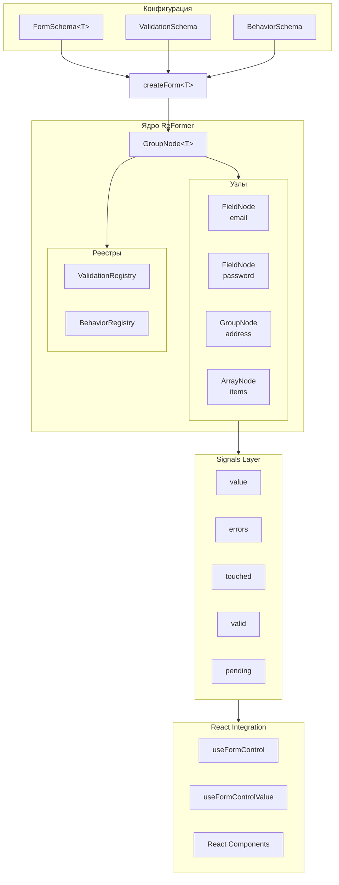
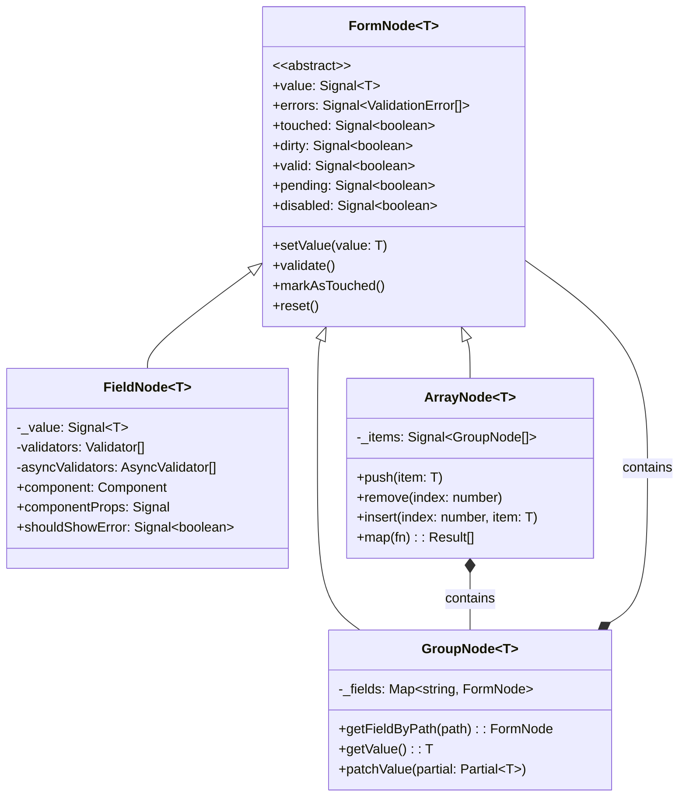

# Архитектура ReFormer

ReFormer — это современная библиотека для работы с формами, построенная на сигналах (Preact Signals) с фокусом на типобезопасность, реактивность и декларативность.

## Общая структура



## Ключевые компоненты

### 1. createForm&lt;T&gt;

Точка входа для создания формы. Принимает конфигурацию и возвращает типизированный Proxy.

```typescript
const form = createForm<MyForm>({
  form: { /* FormSchema */ },
  validation: (path) => { /* validators */ },
  behavior: (path) => { /* behaviors */ },
});
```

### 2. FormNode (базовый класс)

Абстрактный класс, от которого наследуются все типы узлов.

### 3. FieldNode&lt;T&gt;

Узел для примитивных значений (строки, числа, булевы).

### 4. GroupNode&lt;T&gt;

Узел для вложенных объектов. Содержит Map дочерних узлов.

### 5. ArrayNode&lt;T&gt;

Узел для массивов. Поддерживает операции push, remove, insert.

---

## Иерархия узлов



---

## Структура пакетов

```
packages/
├── reformer/              # Ядро библиотеки (~15kb gzipped)
│   ├── core/
│   │   ├── nodes/         # FormNode, FieldNode, GroupNode, ArrayNode
│   │   ├── types/         # Типы и интерфейсы
│   │   ├── behavior/      # Система behaviors
│   │   ├── validation/    # Система валидации
│   │   ├── factories/     # NodeFactory
│   │   └── utils/         # Утилиты (signals, registry)
│   ├── hooks/             # React-интеграция
│   └── index.ts           # Public API
├── reformer-zod/          # Адаптер для Zod
├── reformer-yup/          # Адаптер для Yup
└── reformer-valibot/      # Адаптер для Valibot
```

---

## Связанные документы

- [Signals и реактивность](signals.md)
- [Система Behaviors](behaviors.md)
- [Валидация](validation.md)
- [Типобезопасность](type-safety.md)
- [Примеры](examples.md)
