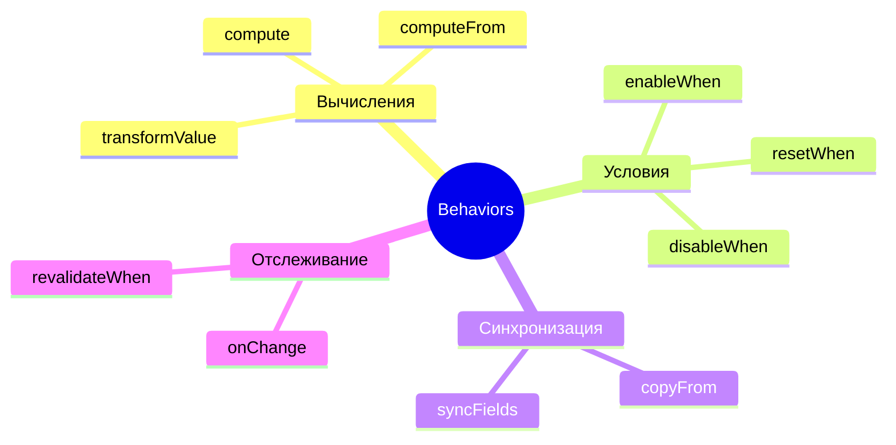
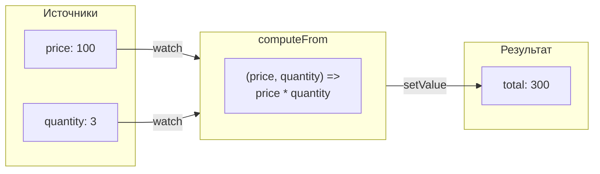
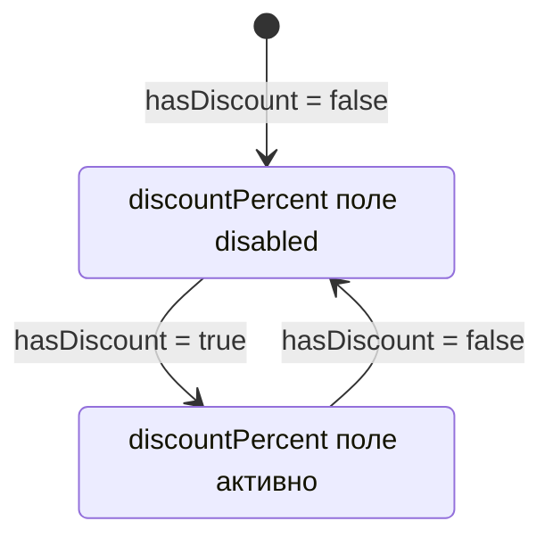
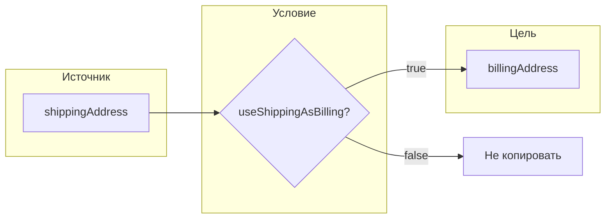
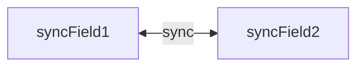
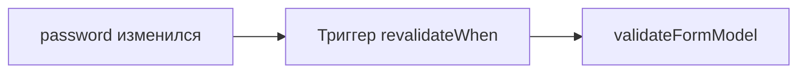

# Система Behaviors

Behaviors — это декларативный способ описания зависимостей и автоматизации логики между полями формы.

Под архитектурой M1 операторы объявляются внутри `defineFormBehavior(({ model, form }) => { … })` из `@reformer/core/behaviors` и привязываются к форме через `createForm({ model, schema, behavior })`. Операторы работают с сигналами модели (`model.$.<field>`); условия — это замыкания без аргументов, читающие модель.

## Обзор всех behaviors



---

## computeFrom

Автоматически вычисляет значение поля на основе других полей. Источники приходят в функцию **позиционно**.



### Использование

```typescript
const behavior = defineFormBehavior<OrderForm>(({ model }) => {
  computeFrom(
    [model.$.price, model.$.quantity],
    model.$.total,
    (price, quantity) => price * quantity
  );
});
```

### Опции

| Опция  | Тип                      | Описание                                |
| ------ | ------------------------ | --------------------------------------- |
| `when` | `(...values) => boolean` | Пропустить пересчёт, если условие ложно |

> Есть также `compute(target, () => …)` с авто-трекингом зависимостей — без явного списка источников.

---

## enableWhen / disableWhen

Условное включение/отключение полей. Условие — замыкание без аргументов, читающее модель.



### Использование

```typescript
const behavior = defineFormBehavior<OrderForm>(({ model }) => {
  // Поле активно только если hasDiscount = true
  enableWhen(model.$.discountPercent, () => model.hasDiscount, { resetOnDisable: true });

  // Или наоборот — отключить при условии
  disableWhen(model.$.manualTotal, () => model.autoCalculate);
});
```

### Опции

| Опция            | Тип       | Описание                         |
| ---------------- | --------- | -------------------------------- |
| `resetOnDisable` | `boolean` | Сбросить значение при отключении |

> `enableWhen` — state-операция: поле должно быть материализовано в форме (`createForm`), чтобы нода нашлась в реестре.

---

## onChange

Реагирует на изменение поля и выполняет callback. Колбэк выполняется ВНЕ effect-контекста — можно безопасно писать сигналы и ноды. Для async-колбэков 2-м аргументом приходит `{ signal }` (AbortSignal): при следующей смене значения предыдущий `signal` аннулируется.


### Использование

```typescript
const behavior = defineFormBehavior<AddressForm>(({ model, form }) => {
  onChange(
    model.$.country,
    async (country, { signal }) => {
      if (!country) return;
      const cities = await fetchCities(country, { signal });
      form.city.updateComponentProps({ options: cities });
      model.city = null;
    },
    { debounce: 300 }
  );
});
```

### Опции

| Опция       | Тип       | Описание                        |
| ----------- | --------- | ------------------------------- |
| `debounce`  | `number`  | Задержка перед вызовом (мс)     |
| `immediate` | `boolean` | Вызвать сразу при инициализации |

> Низкоуровневый примитив `watchField(source, cb, opts)` (из `@reformer/core`) — без `debounce`/AbortSignal; в схемах поведения используйте `onChange`.

---

## copyFrom

Копирует значение из одного поля в другое (скаляр или группа-объект целиком).



### Использование

```typescript
const behavior = defineFormBehavior<CheckoutForm>(({ model }) => {
  copyFrom(model.$.shippingAddress, model.$.billingAddress, {
    when: () => model.useShippingAsBilling,
  });
});
```

---

## syncFields

Двусторонняя синхронизация двух полей.



### Использование

```typescript
const behavior = defineFormBehavior<MyForm>(({ model }) => {
  syncFields(model.$.field1, model.$.field2);
});
```

---

## resetWhen

Сбрасывает поле при выполнении условия.

### Использование

```typescript
const behavior = defineFormBehavior<MyForm>(({ model }) => {
  resetWhen(model.$.selectedCity, () => model.country !== previousCountry, { resetValue: '' });
});
```

---

## revalidateWhen

Перезапускает валидацию при изменении зависимостей. Первый аргумент — массив сигналов-зависимостей, второй — колбэк ревалидации.



### Использование

```typescript
const behavior = defineFormBehavior<RegistrationForm>(({ model }) => {
  // Перевалидировать при изменении password
  revalidateWhen([model.$.password], () => validateFormModel(model, schema));
});
```

---

## transformValue

Трансформирует значение поля при изменении (идемпотентно).

### Использование

```typescript
const behavior = defineFormBehavior<MyForm>(({ model }) => {
  transformValue(
    model.$.phone,
    (value) => value.replace(/\D/g, '') // Только цифры
  );
});
```

---

## Комбинирование behaviors

```typescript
const behavior = defineFormBehavior<OrderForm>(({ model, form }) => {
  // 1. Вычисление итога
  compute(model.$.subtotal, () =>
    model.items.reduce((sum, item) => sum + item.price * item.qty, 0)
  );

  // 2. Скидка активна только при subtotal > 100
  enableWhen(model.$.discountCode, () => model.subtotal > 100);

  // 3. При изменении страны — загрузить города
  onChange(model.$.country, async (country) => {
    const cities = await api.getCities(country);
    form.city.updateComponentProps({ options: cities });
  });

  // 4. Перевалидация при изменении зависимостей
  revalidateWhen([model.$.email], () => validateFormModel(model, schema));
});
```

---

## Best practices: типизация и структура callback'ов

Эти правила относятся ко всей схеме поведения (`defineFormBehavior<T>`).

### 1. Используй типизированный generic формы — НЕ `any`

`defineFormBehavior<T>` параметризован form-interface'ом. Передай его явно — тогда `model`/`form` и значения в callback'ах инферятся правильно:

```typescript
import { defineFormBehavior, computeFrom } from '@reformer/core/behaviors';
import type { OrderForm } from './types';

// ✅ generic зафиксирован — TS инферит source-values, model, value
const behavior = defineFormBehavior<OrderForm>(({ model }) => {
  computeFrom([model.$.price, model.$.quantity], model.$.total, (price, quantity) => price * quantity);
});

// ❌ generic пропущен — silent fail на опечатках в имени поля
const behavior = defineFormBehavior(({ model }: any) => { ... });
```

### 2. Inline callback OK для коротких, extract module-level для содержательных

**Inline-callback** (короткие predicates, один вызов):

```typescript
enableWhen(model.$.discountCode, () => model.subtotal > 100);
copyFrom(model.$.shippingAddress, model.$.billingAddress, {
  when: () => model.sameAsShipping === true,
});
```

**Extracted module-level function** (предпочтительно для computeFrom, async onChange, любой логики >5 строк):

```typescript
// ✅ предпочтительно — extracted типизированный helper
function computeMonthlyPayment(loanAmount: number, loanTerm: number, annual: number): number {
  if (!loanAmount || !loanTerm || !annual || loanAmount <= 0 || loanTerm <= 0) return 0;
  const i = annual / 100 / 12;
  if (i <= 0) return Math.round(loanAmount / loanTerm);
  const factor = Math.pow(1 + i, loanTerm);
  return Math.round((loanAmount * (i * factor)) / (factor - 1));
}

const behavior = defineFormBehavior<LoanForm>(({ model }) => {
  computeFrom(
    [model.$.loanAmount, model.$.loanTerm, model.$.interestRate],
    model.$.monthlyPayment,
    computeMonthlyPayment // референс — TS инферит сигнатуру
  );
});
```

**Когда extract обязателен:**

- callback >5 строк или содержит несколько return-веток / try/catch;
- callback переиспользуется в нескольких behavior-вызовах (DRY);
- async onChange с try/catch на 10+ строк — extracted async-функция читаемее.

**Inline OK когда:**

- predicate в `enableWhen`/`disableWhen`/`copyFrom.when`;
- onChange с 2-3 строками простой логики;
- single computeFn на 1 line (`(price, qty) => price * qty`).

См. примеры: [`projects/react-playground/src/pages/examples/complex-multy-step-form/schemas/behavior.ts`](../projects/react-playground/src/pages/examples/complex-multy-step-form/schemas/behavior.ts).

---

## Связанные документы

- [Архитектура](architecture.md)
- [Signals и реактивность](signals.md)
- [Валидация](validation.md)
