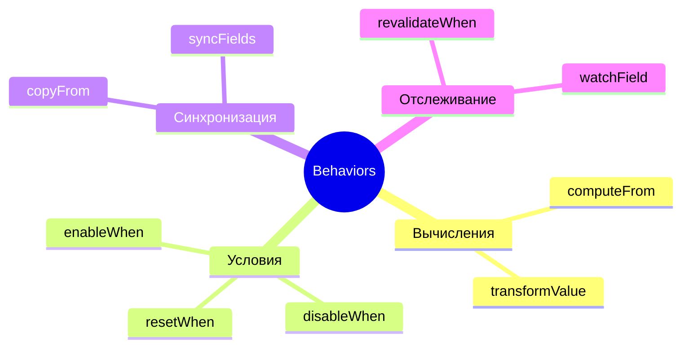
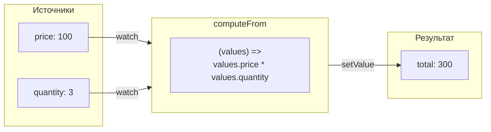
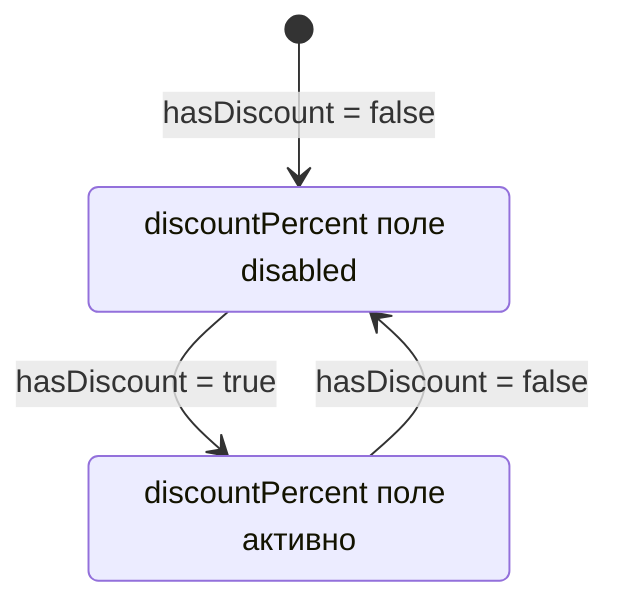
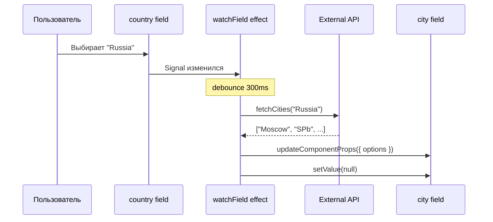
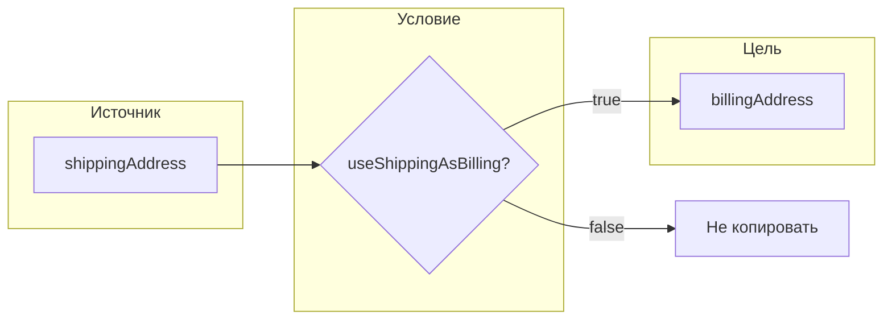
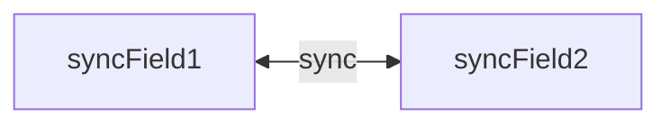
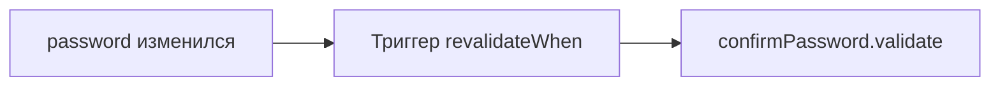

# Система Behaviors

Behaviors — это декларативный способ описания зависимостей и автоматизации логики между полями формы.

## Обзор всех behaviors



---

## computeFrom

Автоматически вычисляет значение поля на основе других полей.



### Использование

```typescript
const behavior: BehaviorSchemaFn<OrderForm> = (path) => {
  computeFrom(
    [path.price, path.quantity],
    path.total,
    (values) => values.price * values.quantity,
    { debounce: 100 }
  );
};
```

### Опции

| Опция | Тип | Описание |
|-------|-----|----------|
| `debounce` | `number` | Задержка перед вычислением (мс) |

---

## enableWhen / disableWhen

Условное включение/отключение полей.



### Использование

```typescript
const behavior: BehaviorSchemaFn<OrderForm> = (path) => {
  // Поле активно только если hasDiscount = true
  enableWhen(
    path.discountPercent,
    (form) => form.hasDiscount,
    { resetOnDisable: true }
  );

  // Или наоборот — отключить при условии
  disableWhen(
    path.manualTotal,
    (form) => form.autoCalculate
  );
};
```

### Опции

| Опция | Тип | Описание |
|-------|-----|----------|
| `resetOnDisable` | `boolean` | Сбросить значение при отключении |

---

## watchField

Отслеживает изменения поля и выполняет callback.



### Использование

```typescript
const behavior: BehaviorSchemaFn<AddressForm> = (path) => {
  watchField(path.country, async (country, ctx) => {
    if (country) {
      const cities = await fetchCities(country);
      ctx.updateComponentProps(path.city, { options: cities });
      ctx.form.city.setValue(null);
    }
  }, { debounce: 300, immediate: false });
};
```

### Опции

| Опция | Тип | Описание |
|-------|-----|----------|
| `debounce` | `number` | Задержка перед вызовом (мс) |
| `immediate` | `boolean` | Вызвать сразу при инициализации |

### Контекст (ctx)

```typescript
interface WatchFieldContext<T> {
  form: FormProxy<T>;                    // Доступ к форме
  updateComponentProps(path, props);     // Обновить props компонента
}
```

---

## copyFrom

Копирует значение из одного поля в другое.



### Использование

```typescript
const behavior: BehaviorSchemaFn<CheckoutForm> = (path) => {
  copyFrom(
    path.shippingAddress,
    path.billingAddress,
    { when: (form) => form.useShippingAsBilling }
  );
};
```

---

## syncFields

Двусторонняя синхронизация двух полей.



### Использование

```typescript
const behavior: BehaviorSchemaFn<MyForm> = (path) => {
  syncFields(path.field1, path.field2);
};
```

---

## resetWhen

Сбрасывает поле при выполнении условия.

### Использование

```typescript
const behavior: BehaviorSchemaFn<MyForm> = (path) => {
  resetWhen(
    path.selectedCity,
    (form) => form.country !== previousCountry
  );
};
```

---

## revalidateWhen

Перезапускает валидацию поля при изменении зависимостей.



### Использование

```typescript
const behavior: BehaviorSchemaFn<RegistrationForm> = (path) => {
  // Перевалидировать confirmPassword при изменении password
  revalidateWhen(path.confirmPassword, [path.password]);
};
```

---

## transformValue

Трансформирует значение поля при изменении.

### Использование

```typescript
const behavior: BehaviorSchemaFn<MyForm> = (path) => {
  transformValue(
    path.phone,
    (value) => value.replace(/\D/g, '') // Только цифры
  );
};
```

---

## Комбинирование behaviors

```typescript
const behavior: BehaviorSchemaFn<OrderForm> = (path) => {
  // 1. Вычисление итога
  computeFrom(
    [path.items, path.taxRate],
    path.subtotal,
    (v) => v.items.reduce((sum, item) => sum + item.price * item.qty, 0)
  );

  // 2. Скидка активна только при subtotal > 100
  enableWhen(
    path.discountCode,
    (form) => form.subtotal > 100
  );

  // 3. При изменении страны — загрузить города
  watchField(path.country, async (country, ctx) => {
    const cities = await api.getCities(country);
    ctx.updateComponentProps(path.city, { options: cities });
  });

  // 4. Перевалидация при изменении зависимостей
  revalidateWhen(path.confirmEmail, [path.email]);
};
```

---

## Best practices: типизация и структура callback'ов

Эти два правила относятся **ко всей behavior-схеме** (`BehaviorSchemaFn<T>`).

### 1. Используй типизированный generic формы — НЕ `any`

`BehaviorSchemaFn<T>` параметризован form-interface'ом. Передай его явно:

```typescript
import type { OrderForm } from './types';

// ✅ generic зафиксирован — TS инферит values, ctx, value во всех callback'ах
const behavior: BehaviorSchemaFn<OrderForm> = (path) => {
  computeFrom([path.price, path.quantity], path.total, (values) => {
    // values: OrderForm — IDE автодополняет
    return values.price * values.quantity;
  });
};

// ❌ generic пропущен или path: any — silent fail на опечатках в имени поля
const behavior: BehaviorSchemaFn<any> = (path: any) => { ... };
```

`as any` иногда нужен в отдельных call-site (например, computeFrom-source для очень глубокого пути). Тогда **сужай cast до конкретного выражения**, а не на весь callback.

### 2. Inline callback OK для коротких, extract module-level для содержательных

**Inline-callback** (короткие predicates, один вызов):

```typescript
// ✅ нормально для 1-2 строк
enableWhen(path.discountCode, (form) => form.subtotal > 100);
copyFrom(path.shippingAddress, path.billingAddress, {
  when: (form) => form.sameAsShipping === true,
  fields: 'all',
});
```

**Extracted module-level function** (предпочтительно для computeFrom, async watchField, любой логики >5 строк):

```typescript
// ✅ предпочтительно — extracted типизированный helper
function computeMonthlyPayment(form: LoanForm): number {
  const P = form.loanAmount;
  const n = form.loanTerm;
  const annual = form.interestRate;
  if (!P || !n || !annual || P <= 0 || n <= 0) return 0;
  const i = annual / 100 / 12;
  if (i <= 0) return Math.round(P / n);
  const factor = Math.pow(1 + i, n);
  return Math.round((P * (i * factor)) / (factor - 1));
}

const behavior: BehaviorSchemaFn<LoanForm> = (path) => {
  computeFrom(
    [path.loanAmount, path.loanTerm, path.interestRate],
    path.monthlyPayment,
    computeMonthlyPayment,  // референс — TS инферит signature
  );
};
```

**Когда extract обязателен:**
- callback >5 строк или содержит несколько return-веток / try/catch;
- callback переиспользуется в нескольких behavior-вызовах (DRY);
- **inline-arrow в `computeFrom([...], target, callback)`** — TS не всегда инферит `values: TForm`, может потребоваться `(values: any)`. Module-level функция с сигнатурой `(form: T) => Result` инферится без cast.
- async watchField с try/catch на 10+ строк — extracted async-функция читаемее.

**Inline OK когда:**
- predicate в `enableWhen`/`disableWhen`/`copyFrom.when` на 1 значение;
- watchField с 2-3 строками простой логики;
- single computeFn на 1 line (`(v) => v.price * v.quantity`).

См. примеры: [`projects/react-playground/src/pages/examples/complex-multy-step-form/schemas/credit-application-behavior.ts`](../projects/react-playground/src/pages/examples/complex-multy-step-form/schemas/credit-application-behavior.ts) и [`mcp-credit-application-v10/schema.ts`](../projects/react-playground/src/pages/examples/mcp-credit-application-v10/schema.ts) (секция «Compute helpers»).

---

## Связанные документы

- [Архитектура](architecture.md)
- [Signals и реактивность](signals.md)
- [Валидация](validation.md)
