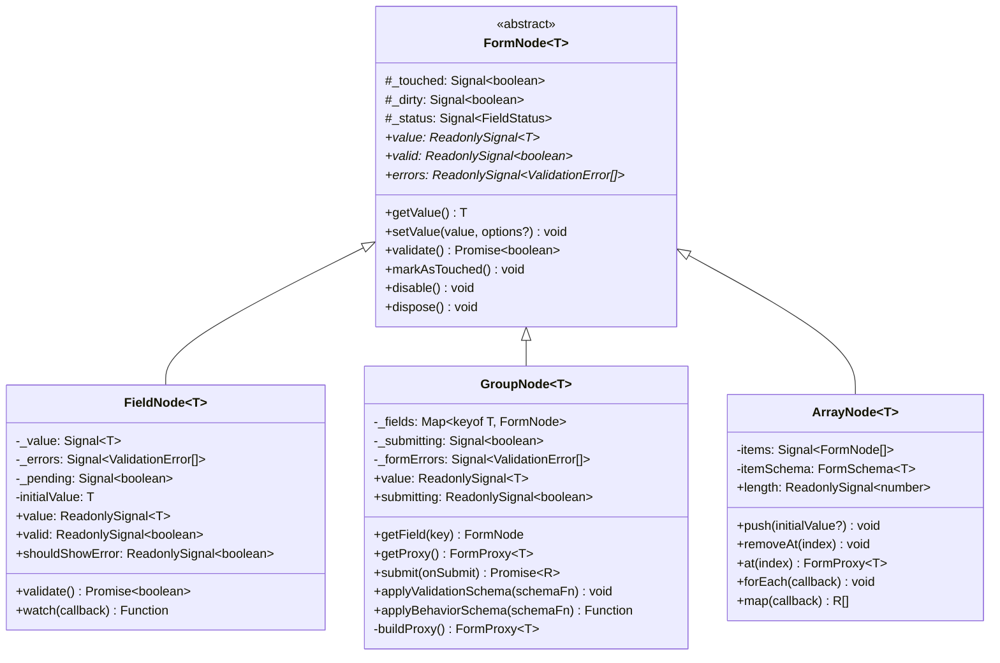
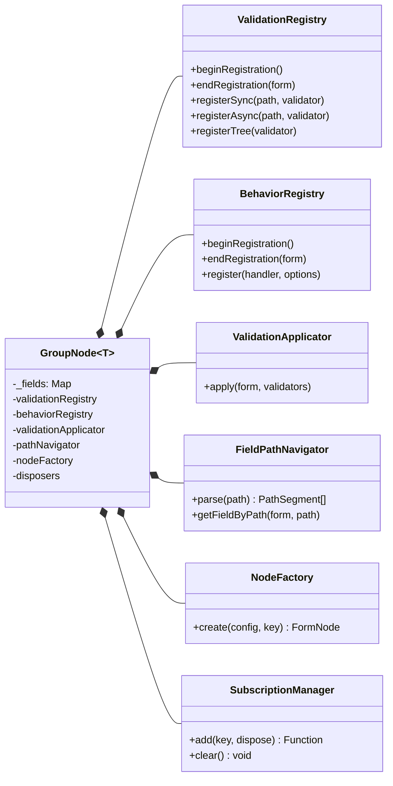
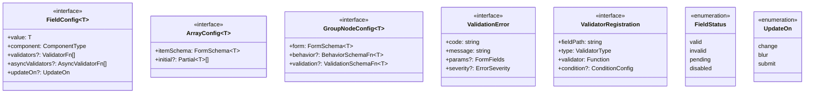
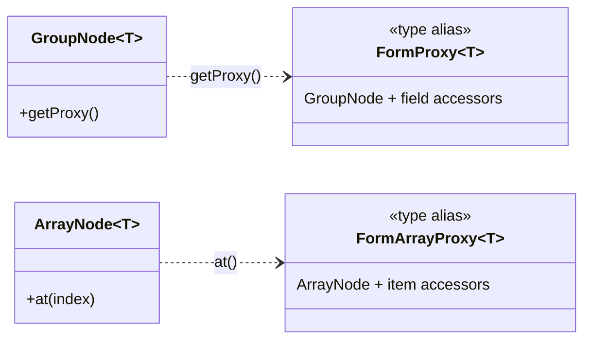
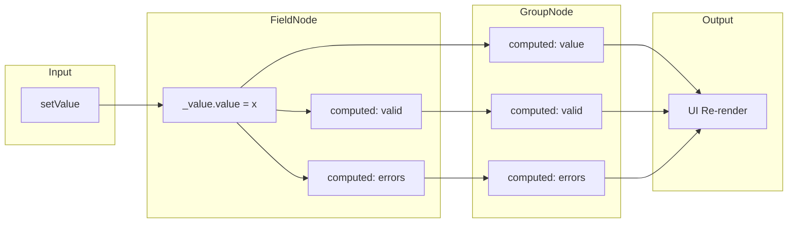
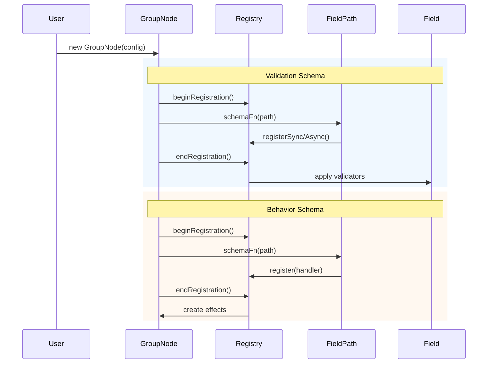
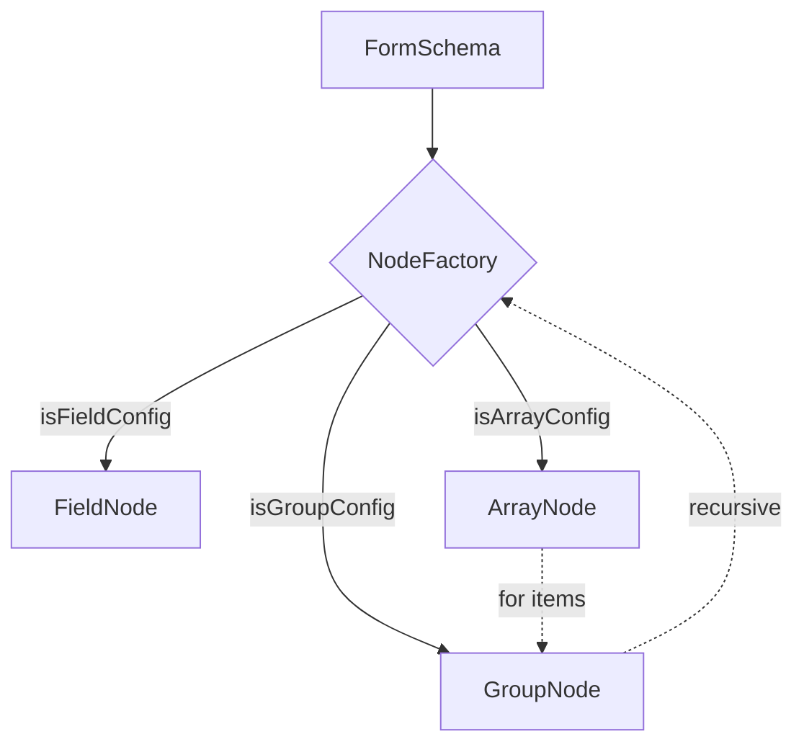

# ReFormer Core - Class Diagram

## 1. Node Hierarchy (Core)

## 2. GroupNode Composition

## 3. Type System

## 4. Proxy Types

> **Proxy:** позволяет писать `form.email.setValue()` вместо `form.getField('email').setValue()`

## 5. Signal Flow

## 6. Schema Application Flow

## 7. Node Creation Flow

## Design Patterns

| Pattern | Implementation | Purpose |
|---------|---------------|---------|
| **Template Method** | FormNode with hooks | Subclasses override behavior |
| **Composition** | GroupNode → Registries | Single Responsibility |
| **Factory** | NodeFactory | Centralized node creation |
| **Proxy** | GroupNode.buildProxy() | Type-safe `form.email` access |
| **Registry** | Validation/BehaviorRegistry | Stack-based context isolation |
| **Observer** | Preact Signals | Reactive state management |
