# План: Наглядная демонстрация принципов работы ReFormer

## Цель

Создать документацию в формате Markdown + Mermaid для наглядной демонстрации всех ключевых концепций ReFormer.

---

## 1. Структура документации

```
docs/
├── architecture.md      # Общая архитектура
├── signals.md           # Signals и реактивность
├── behaviors.md         # Система behaviors
├── validation.md        # Валидация
├── type-safety.md       # Типобезопасность
└── examples.md          # Полные примеры
```

---

## 2. Архитектура (architecture.md)

### 2.1 Общая структура

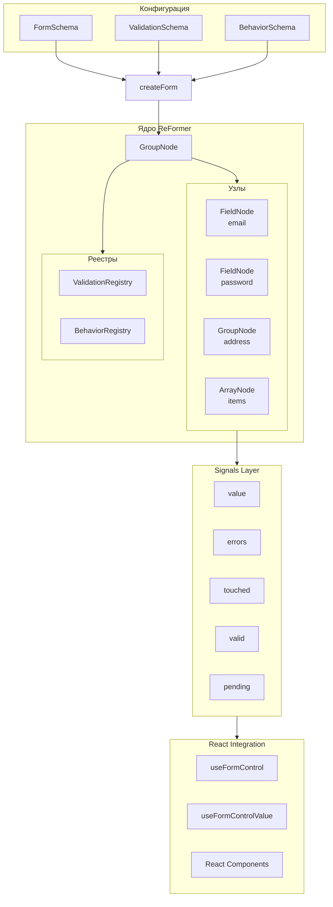

### 2.2 Иерархия узлов

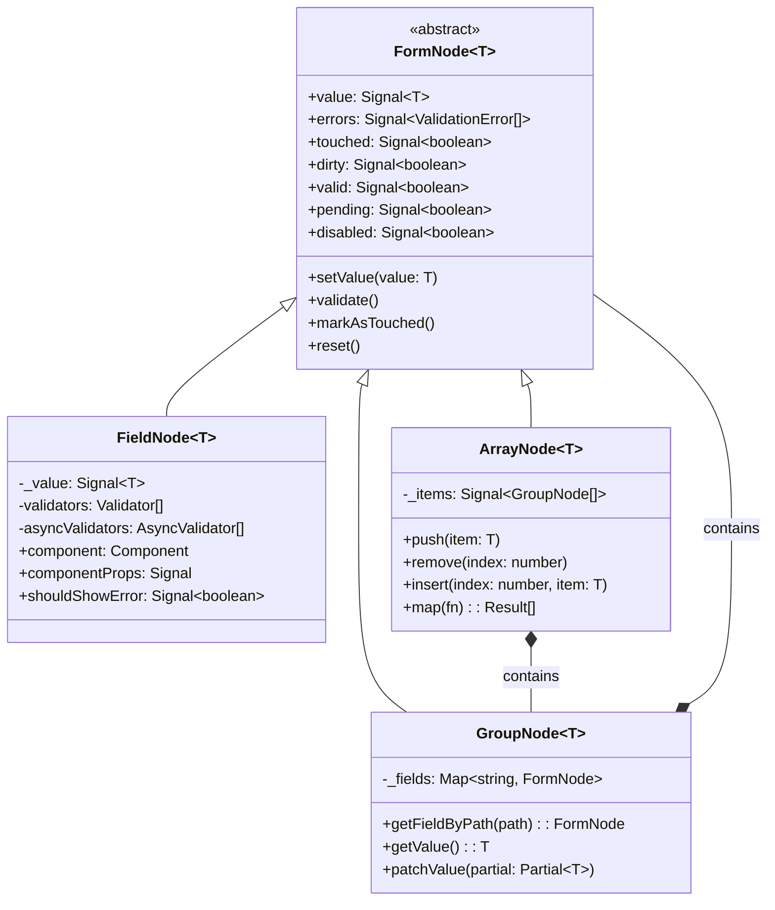

---

## 3. Signals и реактивность (signals.md)

### 3.1 Как работают Signals

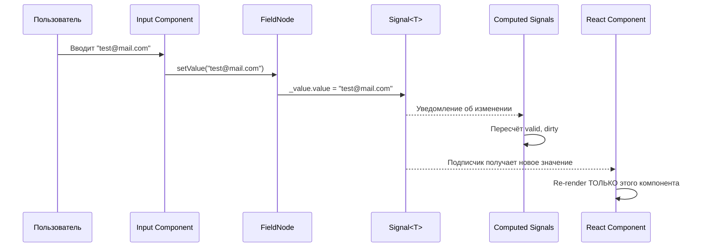

### 3.2 Сравнение подходов

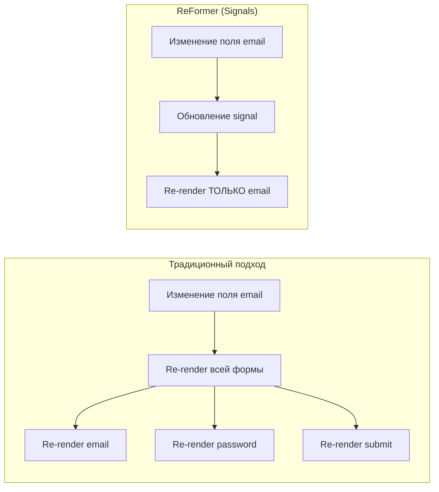

### 3.3 Агрегация состояния

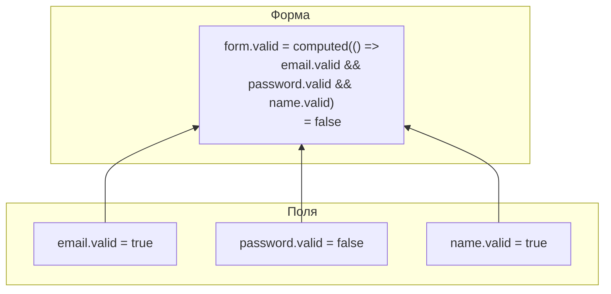

---

## 4. Система Behaviors (behaviors.md)

### 4.1 computeFrom

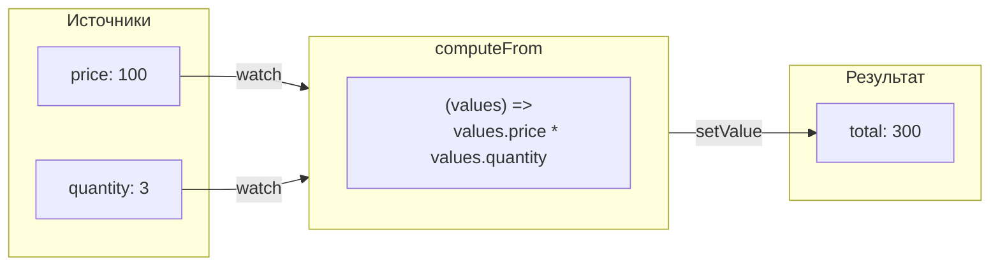

**Код:**

```typescript
computeFrom([path.price, path.quantity], path.total, (values) => values.price * values.quantity, {
  debounce: 100,
});
```

### 4.2 enableWhen

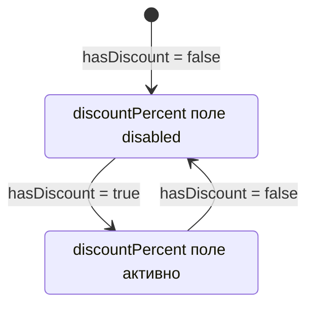

**Код:**

```typescript
enableWhen(path.discountPercent, (form) => form.hasDiscount, { resetOnDisable: true });
```

### 4.3 watchField

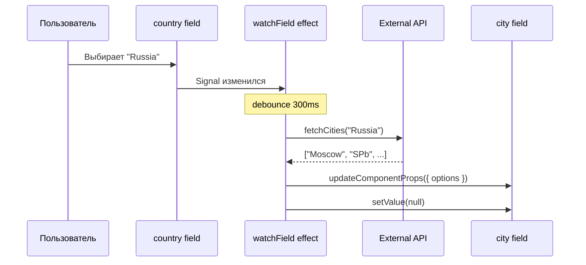

**Код:**

```typescript
watchField(
  path.country,
  async (country, ctx) => {
    const cities = await fetchCities(country);
    ctx.updateComponentProps(path.city, { options: cities });
    ctx.form.city.setValue(null);
  },
  { debounce: 300 }
);
```

### 4.4 Все behaviors

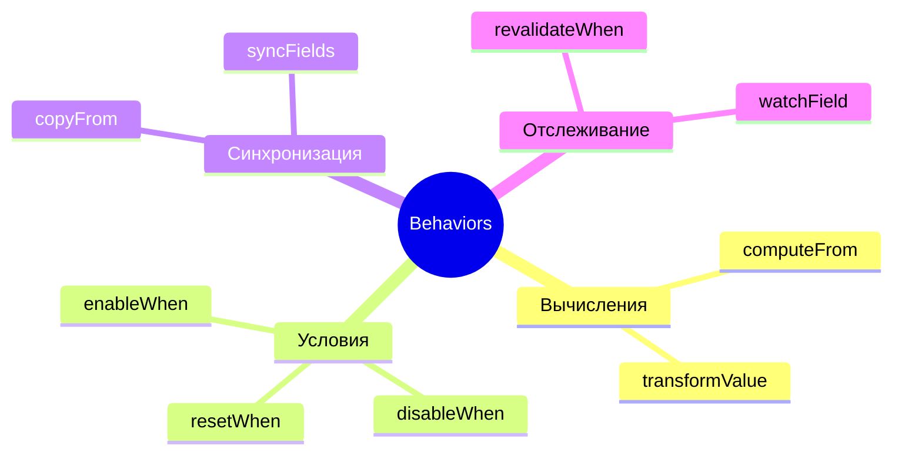

---

## 5. Валидация (validation.md)

### 5.1 Pipeline валидации

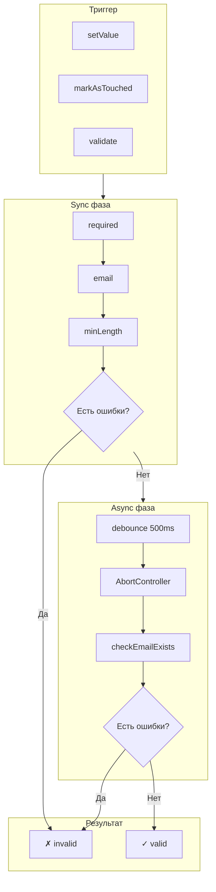

### 5.2 Async валидация с отменой

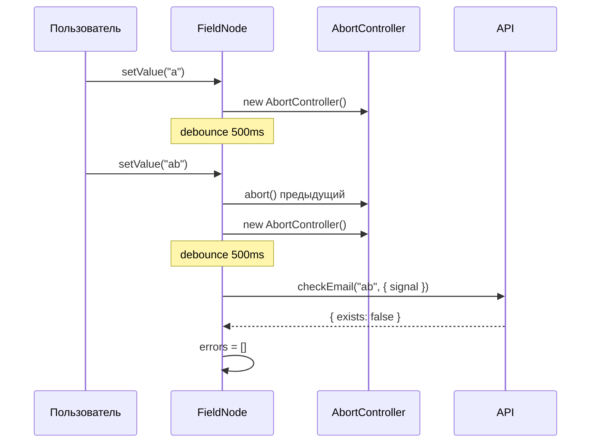

### 5.3 Условная валидация

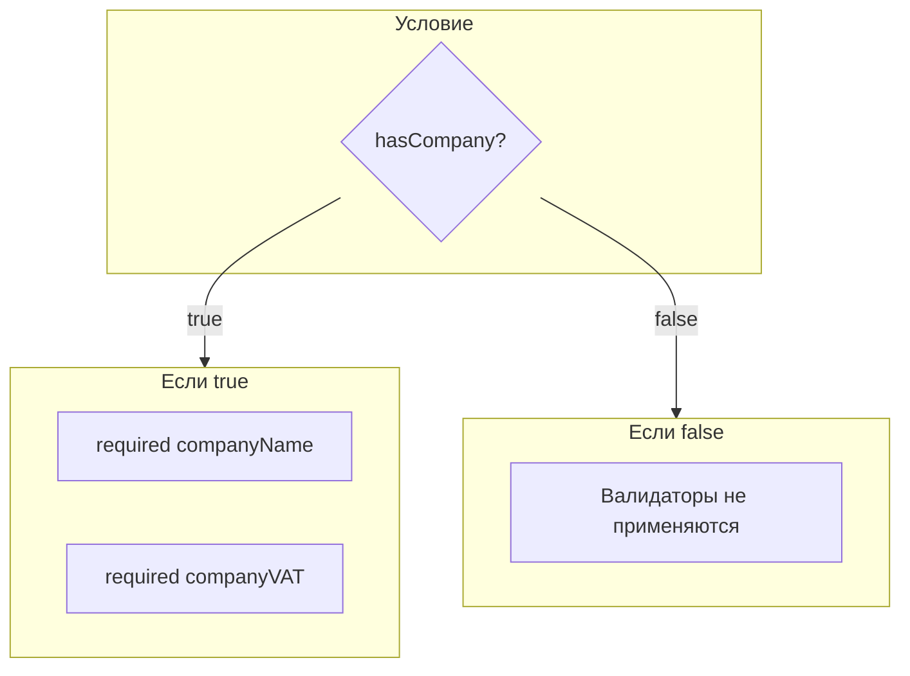

**Код:**

```typescript
validators.applyWhen(
  (form) => form.hasCompany,
  (path) => {
    required(path.companyName);
    required(path.companyVAT);
  }
);
```

---

## 6. Типобезопасность (type-safety.md)

### 6.1 FieldPath Proxy

```mermaid
flowchart LR
    subgraph TypeScript["TypeScript"]
        I["interface Form {
          email: string
          address: {
            city: string
          }
        }"]
    end

    subgraph FieldPath["FieldPath<Form>"]
        P1["path.email → 'email'"]
        P2["path.address.city → 'address.city'"]
        P3["path.invalid ❌ TS Error"]
    end

    TypeScript --> FieldPath
```

### 6.2 FormProxy

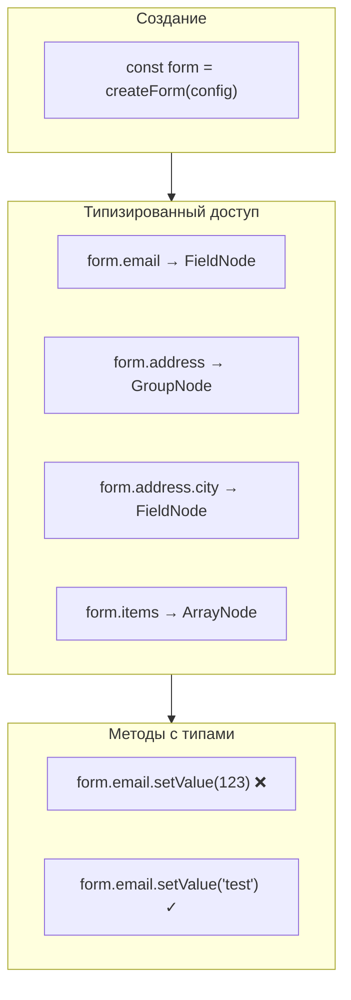

---

## 7. Полный пример (examples.md)

### 7.1 Жизненный цикл формы

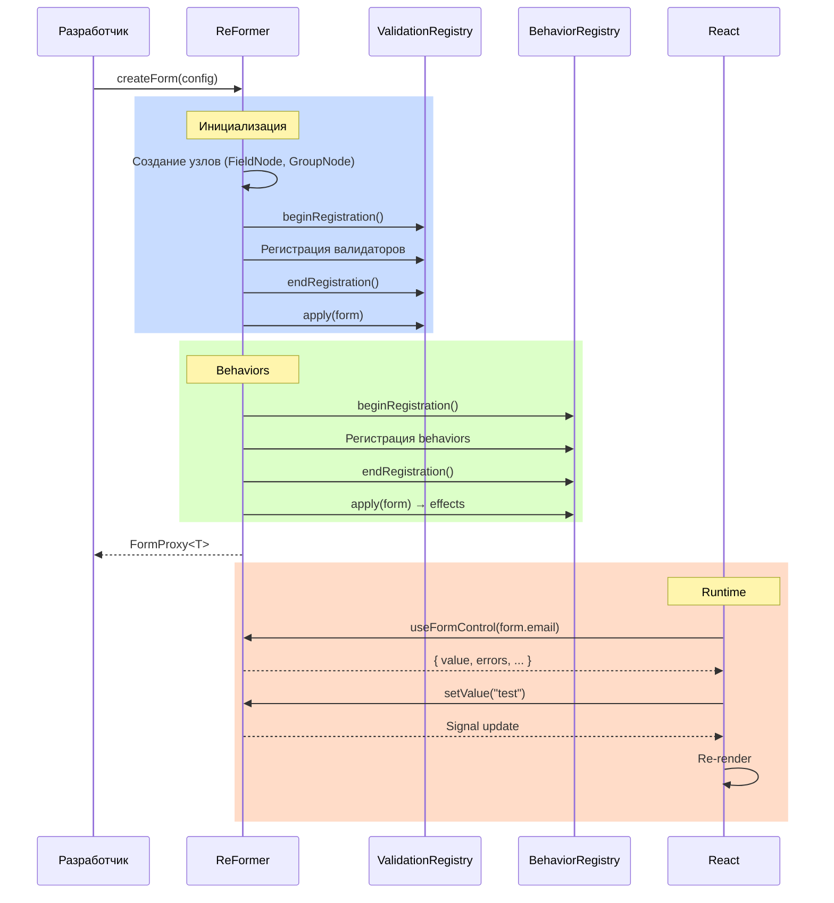

### 7.2 Пример: Форма регистрации

```typescript
interface RegistrationForm {
  email: string;
  password: string;
  confirmPassword: string;
  profile: {
    firstName: string;
    lastName: string;
  };
}

const form = createForm<RegistrationForm>({
  form: {
    email: { value: '', component: Input },
    password: { value: '', component: PasswordInput },
    confirmPassword: { value: '', component: PasswordInput },
    profile: {
      firstName: { value: '', component: Input },
      lastName: { value: '', component: Input },
    },
  },

  validation: (path) => {
    required(path.email);
    email(path.email);

    required(path.password);
    minLength(path.password, 8);

    required(path.confirmPassword);
    validators.validate(path.confirmPassword, (value, ctx) =>
      value !== ctx.form.password.value.value
        ? { code: 'mismatch', message: 'Пароли не совпадают' }
        : null
    );
  },

  behavior: (path) => {
    // Перевалидировать confirmPassword при изменении password
    revalidateWhen(path.confirmPassword, [path.password]);
  },
});
```

---

## 8. План реализации

### Файлы для создания

| Файл                                         | Описание                        |
| -------------------------------------------- | ------------------------------- |
| [docs/architecture.md](docs/architecture.md) | Общая архитектура с диаграммами |
| [docs/signals.md](docs/signals.md)           | Signals и реактивность          |
| [docs/behaviors.md](docs/behaviors.md)       | Система behaviors               |
| [docs/validation.md](docs/validation.md)     | Валидация                       |
| [docs/type-safety.md](docs/type-safety.md)   | Типобезопасность                |
| [docs/examples.md](docs/examples.md)         | Полные примеры                  |

### Порядок работы

1. Создать базовую структуру документации
2. Написать architecture.md с общими диаграммами
3. Детализировать каждую концепцию в отдельных файлах
4. Добавить примеры кода с комментариями
5. Проверить рендеринг Mermaid диаграмм

---

## Верификация

- Проверить рендеринг Mermaid в GitHub/GitLab
- Убедиться что все ссылки между документами работают
- Проверить примеры кода на актуальность с текущим API
