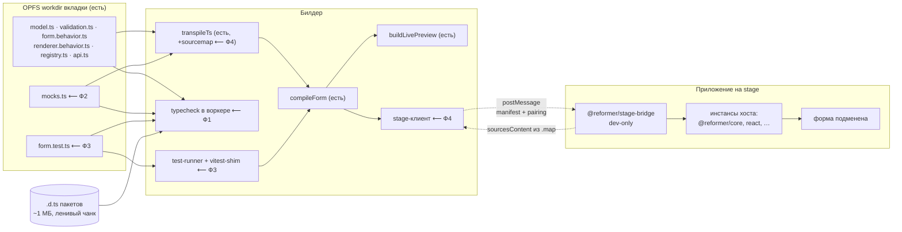

# Билдер как среда разработки формы: типы, моки, тесты, stage

## Context

Пять идей из брейншторма. Две из них уже реализованы, и это меняет постановку остальных трёх.

**Уже работает:**

- **Рабочая копия на вкладку в OPFS** — [io/opfs.ts](../../projects/reformer-builder/src/io/opfs.ts) (`workdirs/<encodeURIComponent(tabId)>`, манифест в `localStorage`, подметание брошенных каталогов на старте) + [app/workdir-actions.ts](../../projects/reformer-builder/src/app/workdir-actions.ts) (co-ownership по маркеру и хэшу: сгенерированное догоняет схему, рукописное не затирается). Идея 1 закрыта; в скоуп этого плана не входит.
- **Компиляция каталога формы из рабочей копии** — [live/compile-form.ts](../../projects/reformer-builder/src/preview-runtime/live/compile-form.ts) → [live/link.ts](../../projects/reformer-builder/src/preview-runtime/live/link.ts) (CJS через `new Function`, чтобы не поднять второй инстанс `@reformer/core`) → [live/build-live-preview.ts](../../projects/reformer-builder/src/preview-runtime/live/build-live-preview.ts). Валидация и поведение уже исполняются по-настоящему. Идея 2 закрыта в ядре; здесь достраиваются недостающие слои.

**Три дыры, ради которых пишется план:**

1. **Проверки типов нет вообще.** [monaco-setup.ts](../../projects/reformer-builder/src/canvas/monaco-setup.ts) настраивает только `jsonDefaults`, [monaco-languages.ts](../../projects/reformer-builder/src/canvas/monaco-languages.ts) регистрирует «только грамматики, без языковых сервисов». Комментарий [transpile.ts:10](../../projects/reformer-builder/src/preview-runtime/live/transpile.ts#L10) («типы в билдере проверяет Monaco») не соответствует коду. `ts.transpileModule` ловит только синтаксис — форма может ожить в превью и не собраться у пользователя. Ровно этот класс дефектов ловит [example-compiles.test.ts](../../projects/reformer-builder/src/codegen/example-compiles.test.ts), но только для кодогена и только в CI.
2. **Моки не являются артефактом формы.** Они живут JSON-текстом в сторе вкладки ([canvas/mock-data.ts](../../projects/reformer-builder/src/canvas/mock-data.ts) → `TabState.mock`). В проект уезжает только `data-sources.ts`. Импортировать их из теста нечем.
3. **Прогонять форму негде, кроме глаз.** Тест-раннера нет; [live/sibling-sources.ts:34](../../projects/reformer-builder/src/preview-runtime/live/sibling-sources.ts#L34) сейчас отбрасывает `.test.ts` из исполнения — место под них зарезервировано, но пусто. Канала до stage-сервера нет.

**Результат:** каталог формы в билдере проверяется тем же способом, что и в проекте (типы, тесты, моки — одни и те же файлы), а готовая форма уезжает на живой стенд целиком, включая код, и возвращается оттуда на редактирование.

---

## Решения по развилкам (согласовано)

| Развилка              | Выбор                                                                                                                                                                                                                                                                                                                                          |
| --------------------- | ---------------------------------------------------------------------------------------------------------------------------------------------------------------------------------------------------------------------------------------------------------------------------------------------------------------------------------------------- |
| Что уезжает на stage  | **Форма целиком, включая код** (не только схема)                                                                                                                                                                                                                                                                                              |
| Конверт доставки      | **Не native ESM, а манифест транспилированных модулей + линкер на стороне stage.** Уточнение к выбранной опции: цель («вся форма») сохраняется, механика другая — см. [обоснование](#почему-не-native-esm-бандл)                                                                                                                              |
| Sourcemap             | **Оба направления** — со stage вытащить исходники в билдер, из билдера отдать map для DevTools                                                                                                                                                                                                                                                 |
| Где гоняются тесты    | **Оба уровня**: браузерный раннер сейчас, Node-раннер после появления `@reformer/devhost` ([RFC-0001](../../projects/reformer-builder/docs/rfcs/0001-local-development-runtime.md)). В этот план входит только браузерный — по принципу runtime-optional (P1 того же RFC)                                                                       |
| Очередь               | Все четыре потока, в порядке Ф1 → Ф2 → Ф3 → Ф4 (каждый следующий опирается на предыдущий)                                                                                                                                                                                                                                                     |

---

## Целевая картина



---

## Ф1 — Проверка типов каталога формы

**Что:** полная проверка типов всего каталога (не файла по отдельности), с реальными `.d.ts` пакетов `@reformer/*`, в web-worker'е, с маркерами в Monaco и списком в панели «Сборка».

Проверять надо каталогом целиком: дефект из шапки `example-compiles.test.ts` жил **между** файлами (`validation.ts` экспортирует `formValidation`, а `renderer.behavior.ts` импортирует `makeValidationConfig` — по отдельности оба валидны).

**Почему не Monaco TS-worker:** он тянет вторую копию `typescript` (~5 МБ) и проверяет по одной модели за раз. `typescript` уже в зависимостях билдера и уже грузится лениво в [transpile.ts](../../projects/reformer-builder/src/preview-runtime/live/transpile.ts). Один `ts.createProgram` поверх виртуального `CompilerHost` даёт и межфайловые ошибки, и squiggles — маркеры рисуются вручную через `monaco.editor.setModelMarkers`.

**Файлы:**

| Файл                              | Что                                                                                                                                                    |
| --------------------------------- | -------------------------------------------------------------------------------------------------------------------------------------------------------- |
| `scripts/build-types-bundle.mjs`  | новый. Собирает `packages/*/dist/**/*.d.ts` + нужные `lib.*.d.ts` + `@types/react` в один JSON-артефакт. Замер: core 290 КБ, ui-kit 412 КБ, cdk 196 КБ, renderer-json 84 КБ, renderer-react 53 КБ — ~1 МБ несжатых, ленивым чанком приемлемо |
| `src/workers/pool.ts`             | новый. Пул с **типизированными дорожками и affinity**, а не безликий: воркер держит резидентный `ts.Program`/кэш `ajv`, и миграция задачи на «свободный» воркер этот кэш обнуляет (обоснование — [RFC-0003](../../projects/reformer-builder/docs/rfcs/0003-schema-validation-and-worker-pool.md) §6.7). Обязателен inline-фолбэк: нет воркеров — считаем в главном потоке |
| `src/typecheck/host.ts`           | новый. Виртуальный `CompilerHost` поверх `FormSources` + артефакта типов; `compilerOptions` — те же, что в `example-compiles.test.ts`, чтобы билдер и CI судили одинаково                                                                       |
| `src/typecheck/index.ts`          | новый. `checkFormTypes(sources) → Diagnostic[]` с `{file, line, col, code, severity, message}`. Формат — тот же `Diagnostic`, что вводит RFC-0003 Ф1: две диагностики в UI не заводим                                                        |
| `canvas/BottomPanel.tsx`          | правка. Ошибки типов в панель «Сборка» рядом с `LiveError`                                                                                              |
| `canvas/FormSourceEditor.tsx`     | правка. `setModelMarkers` по диагностикам                                                                                                                |
| `live/transpile.ts`               | правка. Убрать неверное утверждение про Monaco в шапке модуля                                                                                            |

**Тонкость:** `@reformer/ui-kit` — самый крупный `.d.ts` (412 КБ), но выкинуть его нельзя: `registry.ts` формы импортирует компоненты кита. Артефакт типов должен собираться **под активный кит** — при переключении кита ([эпик ReFormer-s0j](#)) подгружается свой набор.

---

## Ф2 — `mocks.ts` как единый файл фикстур

**Что:** моки переезжают из стора вкладки в файл каталога формы. Один и тот же файл кормит превью в билдере, уезжает в проект и импортируется тестами — и в билдере (Ф3), и в vitest проекта.

**Контракт файла** (user-owned, пишется один раз, не затирается регенерацией):

```ts
// mocks.ts
export const modelMock: LoanFormShape = {...};              // фикстура модели
export const dataSourcesMock: Record<string, unknown> = {...}; // значения $dataSource
export const apiMock = { submitForm: async () => ({...}) };  // заглушки api.ts
```

**Файлы:**

| Файл                             | Что                                                                                                                                                                                                      |
| -------------------------------- | ---------------------------------------------------------------------------------------------------------------------------------------------------------------------------------------------------------- |
| `src/codegen/emit-mocks.ts`      | новый. Печатает `mocks.ts` из `synthMock(schema)` — тот же синтез, что сейчас питает панель                                                                                                                |
| `src/codegen/index.ts`           | правка. Добавить в `buildExampleFiles` с `cls: 'user'`                                                                                                                                                    |
| `live/extract-exports.ts`        | правка. `modelMock`/`dataSourcesMock`/`apiMock` в `FormContract` + `AppliedArtifact`                                                                                                                       |
| `live/build-live-preview.ts`     | правка. `dataSources` берутся из `mocks.ts`, если он есть; иначе прежний путь                                                                                                                              |
| `canvas/mock-data.ts`            | правка. Источник истины — `mocks.ts` из workdir. `effectiveMock` остаётся фолбэком для формы без файла                                                                                                     |
| `canvas/MockDataEditor.tsx`      | правка. Редактирует `mocks.ts` (Monaco/TS), как остальные файлы каталога. JSON-вид секций «Модель»/«Registry» остаётся только на чтение — как быстрый просмотр                                             |
| `src/codegen/emit-data-sources.ts` | правка. `data-sources.ts` — прод-значения; в шапке ссылка на `mocks.ts` как источник тестовых                                                                                                            |

**Миграция:** у формы без `mocks.ts` файл создаётся при первой синхронизации workdir из `synthMock` — тем же путём, что уже работает для остальных сгенерированных файлов в [workdir-actions.ts](../../projects/reformer-builder/src/app/workdir-actions.ts). Правки, лежащие сейчас в `TabState.mock`, при открытии вкладки переносятся в файл один раз.

---

## Ф3 — Тест-раннер в билдере

**Ключевое решение: `module-registry` резолвит спецификатор `'vitest'` на собственный shim.** Тогда `form.test.ts` — один и тот же файл и в билдере, и в `npm test` проекта. Никакого «билдерского диалекта тестов» не появляется, а переносимость проверяется самим фактом, что файл уезжает в репозиторий без правок.

**Файлы:**

| Файл                            | Что                                                                                                                                                                                                                                     |
| ------------------------------- | ------------------------------------------------------------------------------------------------------------------------------------------------------------------------------------------------------------------------------------------- |
| `live/vitest-shim.ts`           | новый. `describe`/`it`/`test`/`expect`/`beforeEach`/`afterEach`/`vi.fn`. Матчеры — по факту нужды тестов формы (`toBe`, `toEqual`, `toBeTruthy`, `toContain`, `toHaveLength`, `rejects/resolves`). Неподдержанный матчер обязан падать явным сообщением, а не молча проходить |
| `live/module-registry.ts`       | правка. `'vitest'` → shim. Ровно одна строка в `STATIC_MODULES`-ветке, но с комментарием: shim активен только внутри прогона, вне его импорт `vitest` — ошибка                                                                            |
| `live/test-runner.ts`           | новый. Сбор `*.test.ts` из workdir → `transpileTs` → `evalCjsModule` → сбор результатов. **Главный поток** (в воркере нет инстанса `@reformer/core`, а он обязан быть общим — см. шапку [module-registry.ts](../../projects/reformer-builder/src/preview-runtime/live/module-registry.ts)), с `await yieldToBrowser()` между тестами, чтобы не морозить UI |
| `live/sibling-sources.ts`       | правка. `.test.ts` не отбрасываются, а уезжают отдельным полем `tests` — исполняемый набор превью остаётся прежним                                                                                                                        |
| `src/codegen/emit-tests.ts`     | новый. Стартовый `form.test.ts` (cls `user`) из схемы и правил: `required`-поля дают «пусто → невалидно», правила `enableWhen`/`computeFrom` — по тесту на правило. Импортирует `mocks.ts` из Ф2                                          |
| `canvas/BottomPanel.tsx`        | правка. Вкладка «Тесты»: список, статус, сообщение падения с файлом и строкой                                                                                                                                                             |

**Граница:** раннер не эмулирует DOM. Тесты формы — это тесты модели, валидации и поведения (создать модель → применить → проверить сигналы). Рендер-тесты остаются за e2e и за vitest проекта.

---

## Ф4 — Мост до stage-сервера (в обе стороны)

### Почему не native ESM-бандл

Выбранная цель — «форма целиком, включая код» — сохраняется. Меняется конверт, по трём причинам:

1. **Единственный инстанс `@reformer/core`.** Native ESM с голыми спецификаторами резолвит браузер, то есть тянет второй бандл core — и форма теряет связь сигналов с form-node'ами. Это уже разобрано и решено в билдере ([link.ts](../../projects/reformer-builder/src/preview-runtime/live/link.ts), [module-registry.ts](../../projects/reformer-builder/src/preview-runtime/live/module-registry.ts)); повторять решение вторым способом незачем.
2. **Sourcemap без склейки.** Помодульный конверт позволяет каждому модулю нести собственный inline map — не нужно сливать mappings нескольких файлов (нетривиально: индекс `source` в VLQ относительный).
3. **Ноль новых зависимостей.** Native ESM потребовал бы `esbuild-wasm` (~10 МБ) либо import-map-шимов, генерируемых на лету. Каталог формы плоский по контракту `compile-form`, импорты — либо относительные внутри каталога, либо из белого списка. Бандлер здесь не нужен.

**Конверт:** `FormBundle = { schema, files: Record<name, jsWithInlineMap>, meta }`. Линкер на стороне stage — тот же, что в билдере.

### Общее ядро выносится в пакет

`evalCjsModule` + резолвер + `compileForm` дублировать в bridge нельзя — это ядро корректности. Новый пакет **`@reformer/form-linker`** (без React и без зависимостей билдера): билдер и bridge становятся его потребителями. Билдерские [link.ts](../../projects/reformer-builder/src/preview-runtime/live/link.ts) / [compile-form.ts](../../projects/reformer-builder/src/preview-runtime/live/compile-form.ts) переезжают туда; [module-registry.ts](../../projects/reformer-builder/src/preview-runtime/live/module-registry.ts) остаётся в билдере — карта модулей у билдера и у приложения разная, и это и есть точка расширения.

### Транспорт

`window.open(stageUrl)` + `MessageChannel`, `postMessage` со строгим `targetOrigin`, одноразовый pairing-код. Без сервера, без WebSocket, без зависимости от `@reformer/devhost` — работает с любым стендом, где подключён bridge.

**Безопасность** (исполнение чужого кода в чужом приложении — самая рискованная часть плана):

- bridge — **dev-зависимость**, монтируется только под `import.meta.env.DEV` либо явным флагом; в прод-сборке его нет физически;
- pairing-код показывается на стенде, вводится в билдере — вкладка не может подменить форму молча;
- `targetOrigin` фиксируется на handshake и проверяется на каждом сообщении;
- на странице stage — видимый индикатор «форма подменена билдером» с кнопкой возврата.

### Файлы

| Файл                                   | Что                                                                                                                        |
| -------------------------------------- | -------------------------------------------------------------------------------------------------------------------------- |
| `packages/reformer-form-linker/`        | новый пакет. Переезд `link.ts` + `compile-form.ts`, резолвер как инъекция                                                  |
| `packages/reformer-stage-bridge/`       | новый пакет, dev-only. Хост-модули, приём манифеста, монтирование формы, отдача исходников назад                            |
| `src/stage/client.ts`                   | новый. Handshake, pairing, отправка манифеста, статус                                                                       |
| `src/stage/import-sources.ts`           | новый. Обратное направление (ниже)                                                                                          |
| `canvas/FloatingActions.tsx`            | правка. Кнопка «Отправить на stage» + индикатор соединения                                                                  |
| `live/transpile.ts`                     | правка. `sourceMap: true` + `inlineSourceMap` + `inlineSources` — сейчас их нет, поэтому DevTools показывает только `sourceURL` |

### Обратное направление: stage → билдер

Два пути, оба через тот же канал:

- **dev-стенд:** bridge отдаёт исходники каталога формы напрямую (`import.meta.glob`);
- **собранный стенд:** bridge фетчит собственные чанки и их `.js.map`, вынимает `sourcesContent`, фильтрует по каталогу формы, отдаёт билдеру.

Билдер материализует полученное в OPFS-workdir новой вкладки — дальше это обычная форма. Практический смысл: открыть на редактирование форму с любого стенда, не имея доступа к репозиторию.

Cross-origin фетч чанков делает **bridge**, а не билдер: он на той же странице, ему не нужен CORS.

---

## Порядок и зависимости

```
Ф1 типы ──┐
          ├─→ Ф3 тесты ──→ Ф4 stage
Ф2 моки ──┘
```

- **Ф1** самостоятелен, но даёт пул воркеров, которым потом пользуется валидация схемы (RFC-0003 Ф4) — поэтому первым.
- **Ф2** разблокирует Ф3: тесту нечего импортировать без `mocks.ts`.
- **Ф3** до Ф4 намеренно: отправлять на живой стенд форму, которая не прошла собственные тесты, — ровно тот сценарий, ради которого мост и строится.
- **Ф4** последний и самый рискованный; при остановке после Ф3 первые три потока остаются самостоятельной ценностью.

---

## Что в скоуп не входит

- Node-раннер тестов и `tsc` через `@reformer/devhost` — после реализации RFC-0001, отдельно.
- Снапшоты и восстановление workdir после падения браузера — идея 1 работает, доработка отдельной задачей.
- Единая модель диагностик и подсветка на canvas — это RFC-0003 Ф1/Ф3; здесь только **потребляется** её формат `Diagnostic`, чтобы не заводить второй.
- Изменение контракта `CodeSource` в [form-registry](../../packages/reformer-form-registry/src/types.ts) — запрет на код по сети остаётся; мост живёт рядом и только в dev.

---

## Верификация

**Ф1.**

- Юнит: каталог с межфайловым конфликтом (`validation.ts` отдаёт `formValidation`, `renderer.behavior.ts` ждёт `makeValidationConfig`) даёт диагностику — тот самый случай из `example-compiles.test.ts`.
- Совпадение вердиктов: прогнать `checkFormTypes` на фикстурах `codegen/__fixtures__` и сверить с `example-compiles.test.ts`. Расхождение = разные `compilerOptions`.
- Ручное: открыть форму, сломать тип в `validation.ts` → squiggle в редакторе + строка в панели «Сборка».
- Осторожно с [ReFormer-3ee](#) — тесты билдера с настоящим `tsc` уже флакают при полном прогоне.

**Ф2.**

- Юнит: `emit-mocks` детерминирован при фиксированной дате (как `synthMock` в `example-compiles.test.ts`).
- Ручное: правка `mocks.ts` меняет превью; сохранение уносит файл в проект; форма без `mocks.ts` открывается по-прежнему.

**Ф3.**

- Юнит: `test-runner` на каталоге с падающим и проходящим тестом — оба статуса, сообщение с файлом и строкой.
- **Переносимость (главная проверка):** сгенерированный `form.test.ts` кладётся в `projects/react-playground/src/pages/examples/…` и запускается настоящим `vitest` без единой правки. Расхождение здесь означает, что shim разошёлся с `vitest` — это дефект shim'а, не теста.
- Ручное: вкладка «Тесты», зелёный и красный прогон.

**Ф4.**

- Юнит: линкер из `@reformer/form-linker` собирает тот же контракт, что билдерский путь (общий набор фикстур для обоих потребителей).
- Интеграция: `react-playground` под dev поднимается с bridge, билдер отправляет форму, стенд её показывает; e2e в `projects/react-playground-e2e/tests/` со скриншотом в `screenshots/stage-bridge/`.
- Round-trip: отправить форму на стенд → вытащить обратно через `import-sources` → сравнить с исходным содержимым workdir.
- Безопасность: без pairing-кода подмена отклоняется; сообщение с чужого origin игнорируется; в прод-сборке `react-playground` bridge отсутствует в бандле (проверяется grep'ом по `dist/`).
