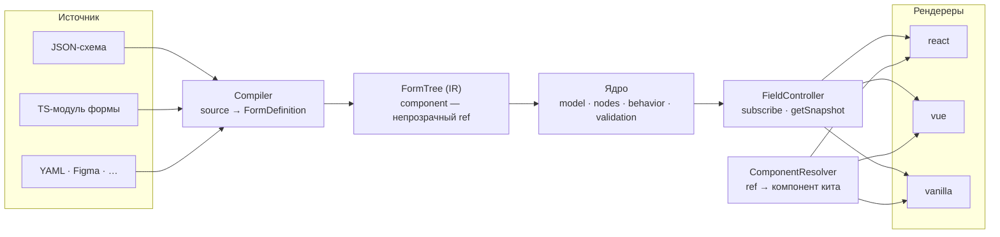

# Пересборка ядра: конвейер вместо трёх связанных пакетов

> Прошлый план из этого файла (билдер: типы, моки, тесты, stage) закоммичен в `eefb4429` и
> доступен в истории. Файл переиспользован под новую задачу.

## Context

Цель — ядро, пригодное для **разных UI-китов, разных компиляторов и разных рендереров**.
Сегодня ни одно из трёх не выполняется до конца, и мешает этому не объём кода, а расположение
границ: они проведены по технологиям (`core` / `renderer-react` / `renderer-json`), а не по ролям
в конвейере.

**Четыре факта, установленные по коду:**

| Факт | Где | Следствие |
| --- | --- | --- |
| `@reformer/core` объявляет `react`/`react-dom` в **обязательных** peerDependencies, а корневой barrel реэкспортирует `platforms/react` | [package.json](../../packages/reformer/package.json), [src/index.ts:20](../../packages/reformer/src/index.ts#L20) | любой `import from '@reformer/core'` тянет React; ядро нельзя поставить в Vue-проект |
| `@reformer/renderer-json` держит peer на `@reformer/renderer-react` и импортирует его типы | [create-json-form.ts:24](../../packages/reformer-renderer-json/src/create-json-form.ts#L24), [converter](../../packages/reformer-renderer-json/src/converter/json-to-render-schema.ts#L14) | второй рендерер потребует второй копии JSON-слоя |
| Дерево формы описано **дважды**: открытый `FormSchemaNode` в ядре и строгий union `RenderNode` в рендерере | [schema-node.ts](../../packages/reformer/src/form/types/schema-node.ts), [core/types.ts](../../packages/reformer-renderer-react/src/core/types.ts) | поля расходятся — `testId` в ядре объявлен, но рантаймом не читается |
| Компоненты подключаются **двумя контрактами**: прямая ссылка `component: ElementType` и имя через `ComponentRegistry` | [registry/types.ts](../../packages/reformer-renderer-json/src/registry/types.ts) | «сменный кит» работает только в JSON-ветке |

**Хорошая новость, на которой стоит план:** ядро уже почти разрезано. `model/`, `form/` и
`validators/` от React свободны (остались только type-only `ComponentType`/`ElementType`), сабпаты
`./model`, `./signals`, `./validation`, `./validators` уже опубликованы, а React собран в одном
каталоге `platforms/react` (1344 строки из 11 893). В шапке [platforms/react/index.ts](../../packages/reformer/src/platforms/react/index.ts)
это прямо названо «точкой для будущего сабпата». То есть работа — доведение уже начатого
разделения, а не переписывание.

**Согласованные рамки:** обратная совместимость не нужна (пользователей нет); «компилятор»
понимается как **одна ось** — и «формат → дерево», и «TS → исполняемый модуль»; целевые рендереры —
**другие фреймворки** (Vue, Svelte, vanilla); «проще» = **меньше способов собрать форму** (сейчас
их четыре: `createForm`, `createCoreForm`, `createReactForm`, `createJsonForm`).

---

## Целевая архитектура

Одна цепочка с четырьмя сменными звеньями и явными контрактами между ними:



Четыре контракта, которые и есть вся суть переделки:

```ts
// 1. Компилятор — единственная ось «откуда взялась форма».
type Compiler<S> = (source: S) => FormDefinition | Promise<FormDefinition>;
interface FormDefinition<T = unknown> {
  tree: FormNode;                    // IR
  model?: FormModel<T>;              // если источник сам создаёт модель
  behavior?: FormBehavior<T>;
  validation?: FormValidation<T>;
}

// 2. IR — одно описание дерева на всех. Компонент здесь НЕ тип фреймворка.
type ComponentRef = string | symbol;  // имя в ките либо токен
interface FormNode { value?: Signal<unknown>; component?: ComponentRef; /* … */ }

// 3. Резолвер компонентов — единственный способ подключить кит.
type ComponentResolver = (ref: ComponentRef) => unknown;

// 4. Контроллер поля — то, что рендереру нужно от ядра. Без React.
interface FieldController<V> {
  subscribe(cb: () => void): () => void;
  getSnapshot(): FieldSnapshot<V>;   // value · errors · disabled · touched · status
  setValue(v: V): void;
  blur(): void;
}
```

Прямая ссылка на компонент (нынешний `component: InputField`) становится частным случаем:
`resolve = (ref) => ref`. Это убирает второй контракт, не отнимая удобства code-first.

---

## Фазы

Порядок выбран так, чтобы каждая фаза давала проверяемый результат, а не только приближала финал.

### Ф0 — Разрезать поверхность ядра

Самая дешёвая фаза с самым большим эффектом: снимает блокирующий факт №1.

- `packages/reformer/package.json`: добавить сабпат `./react`; `react`/`react-dom` перевести в
  `peerDependenciesMeta: { optional: true }`.
- [src/index.ts](../../packages/reformer/src/index.ts): убрать `export * from './platforms/react'`.
  Корневой barrel остаётся зонтиком над `model` + `form` и становится React-free.
- Потребители React-хуков (`useFormControl`, `useFormBundle`, …) переходят на
  `@reformer/core/react` — это `renderer-react`, `cdk`, `ui-kit`, playground, билдер.
- Тест: собрать пакет и проверить, что в графе `@reformer/core` (корень) нет `react`.

### Ф1 — Одно дерево вместо двух

- Новый пакет **`@reformer/tree`**: `FormNode`, обход, `harvest` (переезд `harvestFieldConfig` из
  [create-form.ts:68](../../packages/reformer/src/form/create-form.ts#L68) — там же живут защиты от
  спуска в `Signal` и `FormProxy`, их терять нельзя).
- `component` становится `ComponentRef`; `ElementType`/`ComponentType` из IR уходят.
- `RenderNode` в [renderer-react/core/types.ts](../../packages/reformer-renderer-react/src/core/types.ts)
  перестаёт быть отдельным описанием и становится **сужением** `FormNode` для React-рендера.
- Мёртвое поле `testId` из IR удаляется — рантайм читает `componentProps.testId`.

### Ф2 — Единый резолвер компонентов

- `ComponentResolver` переезжает в `@reformer/tree`; `ComponentRegistry` из
  [renderer-json](../../packages/reformer-renderer-json/src/registry/types.ts) становится его
  реализацией (плюс `dataSource`/`fn`/`locale`, которые к компонентам отношения не имеют — они
  выделяются в отдельный `ValueResolver`).
- Прямые ссылки поддерживаются тождественным резолвером.

### Ф3 — Компилятор как контракт

- `@reformer/renderer-json` распадается: **`@reformer/compiler-json`** (JSON → `FormNode`,
  операторы, ajv-валидация схемы — без React) и React-часть (`JsonFormRenderer`, контекст,
  локаль-провайдер) уезжает в `render-react`.
- **`@reformer/compiler-module`** — вторая ось компиляции: каталог TS-файлов → транспиляция →
  линковка → `FormDefinition`. Это ядро из [live/compile-form.ts](../../projects/reformer-builder/src/preview-runtime/live/compile-form.ts)
  и [live/link.ts](../../projects/reformer-builder/src/preview-runtime/live/link.ts), вынесенное из
  билдера. Резолвер импортов — параметр, а не константа: билдер подставит свои инстансы, стенд —
  свои. Это же закрывает `@reformer/form-linker` из прошлого плана.

### Ф4 — `FieldController`: то, что рендерер берёт у ядра

- Агностичный контроллер в `@reformer/core` (не в `platforms/`): `subscribe`/`getSnapshot`/
  `setValue`/`blur`. Заготовка уже есть — [field-adapter.ts](../../packages/reformer-renderer-react/src/core/field-adapter.ts) (47 строк)
  и `hooks/types.ts` (`FieldControlState`).
- `platforms/react/hooks/*` худеют до обёрток `useSyncExternalStore(ctrl.subscribe, ctrl.getSnapshot)`.
- `render-behavior` и `render-schema-proxy` ([294](../../packages/reformer-renderer-react/src/core/render-behavior.ts) и
  [290](../../packages/reformer-renderer-react/src/core/render-schema-proxy.ts) строк) — сегодня они
  на React-хуках, хотя выражают агностичные правила (`hideWhen`, `onEvent`, патч пропсов). Логика
  переезжает на сигналы, React остаётся только в точке подписки.

### Ф5 — Одна фабрика

```ts
const form = createForm({
  source, compile,            // откуда форма
  resolve,                    // каким китом рисуется
  initial | model, behavior, validation,
});
```

`createCoreForm`, `createReactForm`, `createJsonForm` удаляются (совместимость не требуется).
Общий конфиг уже выделен — [`CreateFormConfigBase`](../../packages/reformer/src/form/create-core-form.ts);
он и становится единственным.

### Ф6 — Доказательство агностичности

**`@reformer/render-vanilla`** — минимальный рендерер на DOM, без фреймворка. Не продукт, а тест
архитектуры: пока второго рендерера нет, «агностичное ядро» — утверждение, а не факт. Ориентир —
300–400 строк; если получается заметно больше, значит контракт `FieldController` неполон.

---

## Что остаётся React-специфичным — и это нормально

`@reformer/cdk` (55 файлов из 76 зависят от React) и `@reformer/ui-kit` — по природе React-пакеты.
Их аналоги для других фреймворков пишутся отдельно и общаются с ядром через те же четыре контракта.
Попытка сделать агностичным ещё и CDK утроит объём работы без выигрыша.

---

## Порядок и риски

```
Ф0 ─→ Ф1 ─→ Ф2 ─→ Ф3
      └────→ Ф4 ─→ Ф5 ─→ Ф6
```

Ф0 самостоятельна и делается первой. Ф1 — фундамент для Ф2/Ф3/Ф4. Ф6 проверяет всё сразу.

**Главный риск — связывание по идентичности сигнала.** `harvest` находит поле сравнением
`node.value === model.$.path`, то есть по ссылке на объект. Отсюда запрет на два инстанса ядра
(`CORE_RUNTIME_TOKEN`, guard в `form-registry`, `module-registry` в билдере). При выносе IR в
отдельный пакет число мест, где инстанс может задвоиться, растёт. Ты не отметил это как боль,
поэтому механизм сохраняется как есть — но `@reformer/tree` обязан быть **типами и функциями без
собственного состояния**, иначе появится второй кандидат на задвоение.

**Второй риск — объём Ф3.** `renderer-json` — 3182 строки, и разрез проходит через
`json-form-renderer.tsx` и локаль-контекст. Здесь стоит остановиться и проверить границу до того,
как начнётся перенос файлов.

---

## Верификация

**Ф0.** `npm run build` во всех пакетах; проверка графа зависимостей: `@reformer/core` (корневой
вход) не тянет `react`. Playground и билдер собираются после перевода импортов на `/react`.

**Ф1–Ф2.** Существующие тесты ядра и рендерера — зелёные без правок логики (правки импортов
допустимы). Отдельный тест: один и тот же `FormNode` проходит `harvest` и рендер, поля совпадают.

**Ф3.** `compiler-json` собирается и тестируется **без установленного react** — это и есть проверка
разреза. Для `compiler-module` — перенос тестов из
[live-form.test.ts](../../projects/reformer-builder/src/preview-runtime/live/live-form.test.ts) и
[live-plumbing.test.ts](../../projects/reformer-builder/src/preview-runtime/live/live-plumbing.test.ts).

**Ф4–Ф5.** E2E `projects/react-playground-e2e` целиком зелёный — он покрывает реальные формы и
поймает регрессии связывания и валидации, которых юнит-тесты не видят.

**Ф6.** Одна и та же JSON-схема кредитной заявки рендерится React-рендерером и vanilla-рендерером;
ввод, валидация и условная видимость работают в обоих. Это финальный критерий: если vanilla
потребовал правок в ядре — разделение не завершено.
