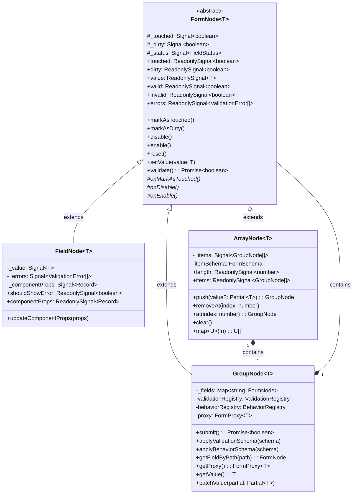
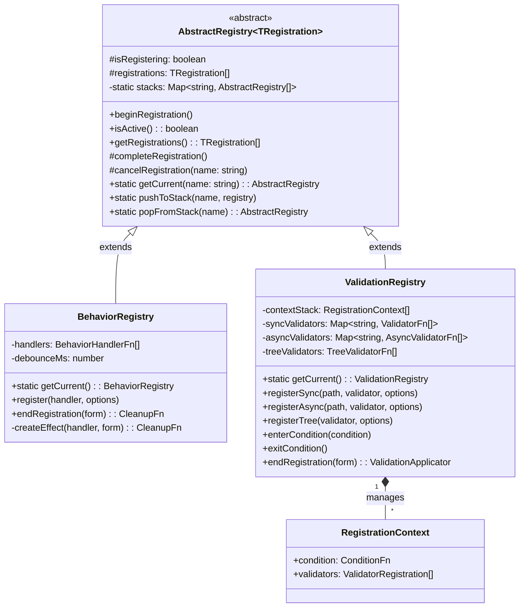
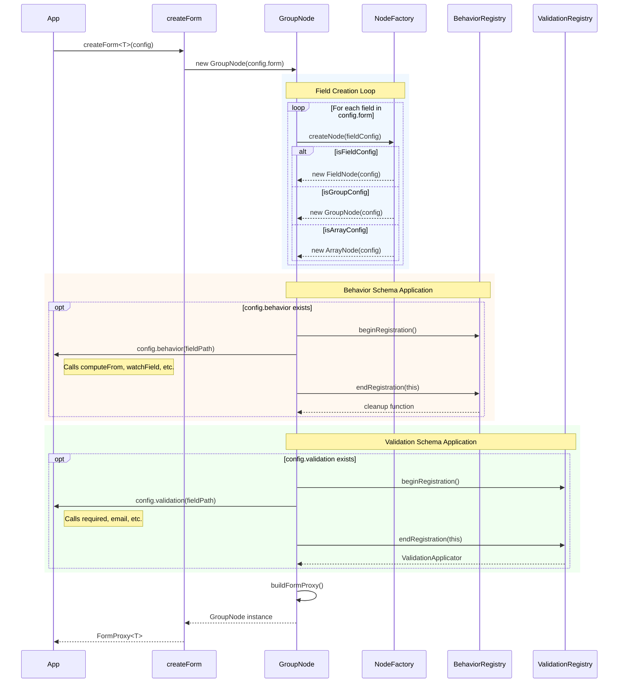
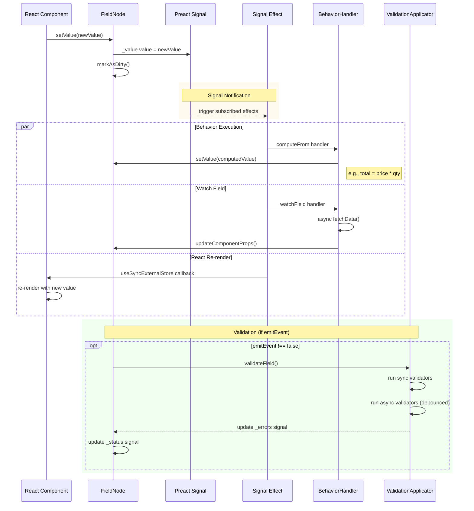
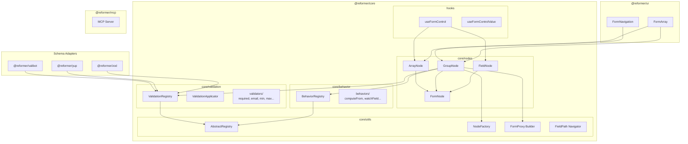
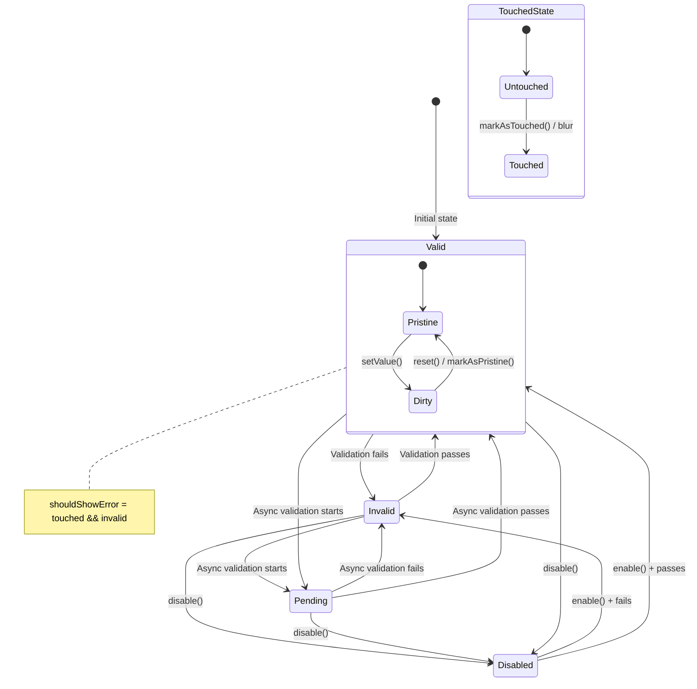
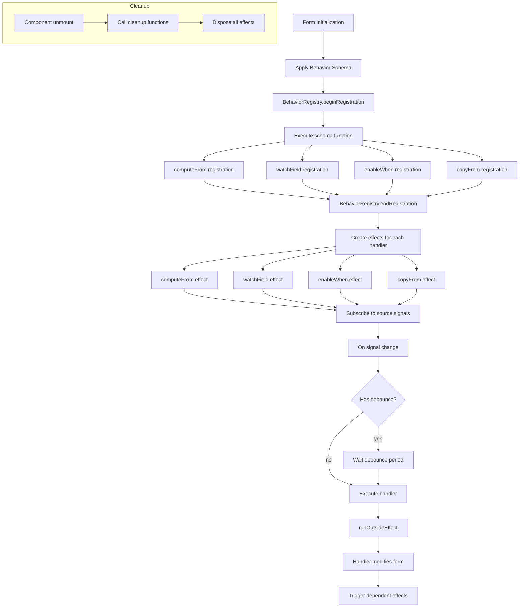

# ReFormer Architecture Diagrams

Visual representation of ReFormer's architecture and data flows.

---

## 1. Node Hierarchy (Class Diagram)



---

## 2. Registry Pattern (Class Diagram)



---

## 3. Form Initialization (Sequence Diagram)



---

## 4. setValue Flow (Sequence Diagram)



---

## 5. Package Structure (Component Diagram)



---

## 6. Field Status State Machine



---

## 7. Validation Flow

```mermaid
flowchart TD
    A[setValue called] --> B{emitEvent?}
    B -->|false| Z[Skip validation]
    B -->|true| C[Sync Validators]

    C --> D{All passed?}
    D -->|no| E[Set errors, status = invalid]
    D -->|yes| F[Async Validators]

    F --> G[status = pending]
    G --> H{Debounce active?}
    H -->|yes| I[Wait for debounce]
    H -->|no| J[Run async validators]
    I --> J

    J --> K{All passed?}
    K -->|no| L[Set errors, status = invalid]
    K -->|yes| M[Tree Validators]

    M --> N{All passed?}
    N -->|no| O[Set errors on target field]
    N -->|yes| P[status = valid, errors = []]

    E --> Q[Notify subscribers]
    L --> Q
    O --> Q
    P --> Q

    Q --> R[React re-render]
```

---

## 8. Behavior Execution Flow



---

## Usage

These diagrams can be rendered using:

1. **Mermaid Live Editor**: https://mermaid.live
2. **GitHub/GitLab**: Native Mermaid support in markdown
3. **VS Code**: Mermaid Preview extension
4. **Documentation tools**: Docusaurus, VitePress, etc.

For presentations, export as SVG or PNG from Mermaid Live Editor.
