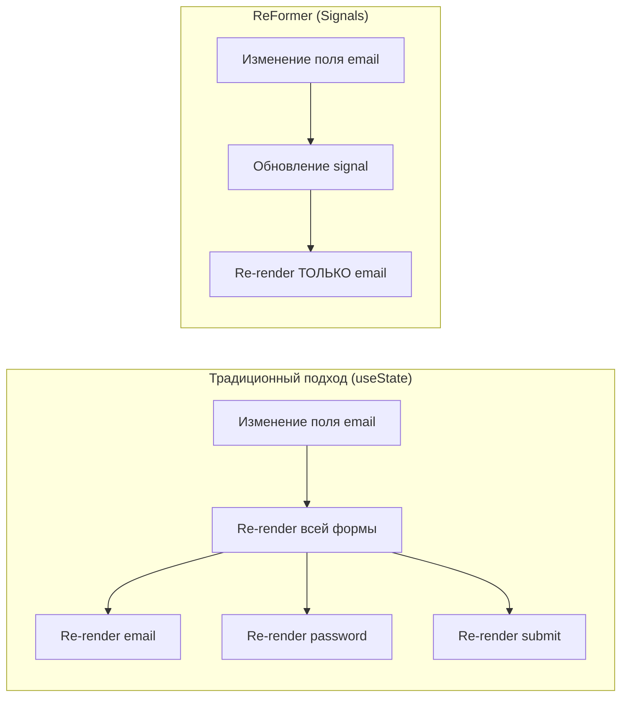
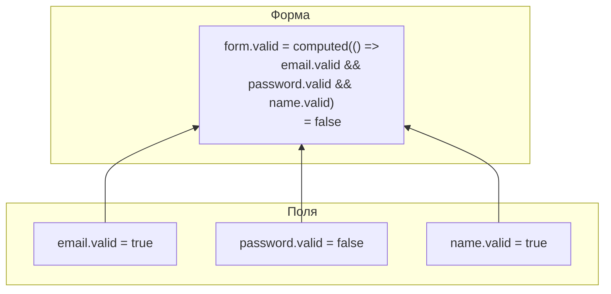

# Signals и реактивность

ReFormer использует **@preact/signals-core** для fine-grained реактивности. Это позволяет обновлять только те компоненты, которые зависят от изменённых данных.

## Как работают Signals

```mermaid
sequenceDiagram
    participant User as Пользователь
    participant Input as Input Component
    participant FN as FieldNode
    participant Signal as Signal&lt;T&gt;
    participant Computed as Computed Signals
    participant React as React Component

    User->>Input: Вводит "test@mail.com"
    Input->>FN: setValue("test@mail.com")
    FN->>Signal: _value.value = "test@mail.com"
    Signal-->>Computed: Уведомление об изменении
    Computed->>Computed: Пересчёт valid, dirty
    Signal-->>React: Подписчик получает новое значение
    React->>React: Re-render ТОЛЬКО этого компонента
```

## Основные сигналы FieldNode

```typescript
// Внутренние (private) сигналы
private _value: Signal<T> = signal(initialValue);
private _errors: Signal<ValidationError[]> = signal([]);
private _touched: Signal<boolean> = signal(false);
private _dirty: Signal<boolean> = signal(false);

// Публичные (readonly) сигналы
public readonly value: ReadonlySignal<T>;
public readonly errors: ReadonlySignal<ValidationError[]>;
public readonly touched: ReadonlySignal<boolean>;
public readonly dirty: ReadonlySignal<boolean>;

// Computed сигналы (автоматически пересчитываются)
public readonly valid: ReadonlySignal<boolean> =
  computed(() => this._errors.value.length === 0);

public readonly shouldShowError: ReadonlySignal<boolean> =
  computed(() => this.invalid.value && (this.touched.value || this.dirty.value));
```

---

## Сравнение с традиционным подходом



### Почему это важно?

| Подход   | Изменение 1 поля  | Форма с 20 полями |
| -------- | ----------------- | ----------------- |
| useState | Re-render всех 20 | 20 re-renders     |
| ReFormer | Re-render 1 поля  | 1 re-render       |

---

## Агрегация состояния

GroupNode и ArrayNode агрегируют состояние дочерних узлов через computed сигналы:



### Пример агрегации

```typescript
// В GroupNode
const aggregateSignals = createAggregateSignals({
  getChildren: () => Array.from(this._fields.values()),
  ownErrors: this._formErrors,
  disabled: this._disabled,
});

// valid = нет собственных ошибок И все дочерние валидны
this.valid = computed(() => {
  if (this._formErrors.value.length > 0) return false;
  return this.getChildren().every((child) => child.valid.value);
});

// pending = хотя бы один дочерний в состоянии pending
this.pending = computed(() => this.getChildren().some((child) => child.pending.value));

// errors = собственные + все дочерние
this.errors = computed(() => {
  const allErrors = [...this._formErrors.value];
  for (const child of this.getChildren()) {
    allErrors.push(...child.errors.value);
  }
  return allErrors;
});
```

---

## React интеграция

### useFormControl

Подписывается на все сигналы поля:

```typescript
function EmailField({ control }: { control: FieldNode<string> }) {
  const { value, errors, touched, pending, disabled } = useFormControl(control);

  return (
    <div>
      <input
        value={value}
        disabled={disabled}
        onChange={(e) => control.setValue(e.target.value)}
        onBlur={() => control.markAsTouched()}
      />
      {touched && errors[0] && (
        <span className="error">{errors[0].message}</span>
      )}
      {pending && <span className="spinner" />}
    </div>
  );
}
```

### useFormControlValue

Подписывается только на значение (оптимизация):

```typescript
function DisplayEmail({ control }: { control: FieldNode<string> }) {
  const value = useFormControlValue(control);
  return <span>Email: {value}</span>;
}
```

---

## Effect и Behaviors

Behaviors используют `effect()` для создания реактивных подписок:

```typescript
effect(() => {
  // Читаем значения (создаём подписку)
  const price = priceNode.value.value;
  const quantity = quantityNode.value.value;

  // При изменении любого из них — effect перезапускается
  totalNode.setValue(price * quantity);
});
```

---

## Связанные документы

- [Архитектура](architecture.md)
- [Система Behaviors](behaviors.md)
- [Валидация](validation.md)
