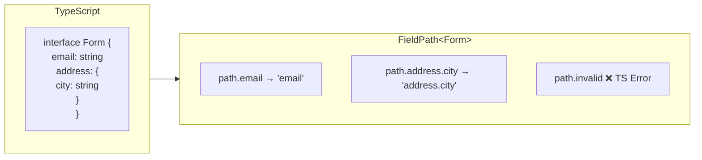
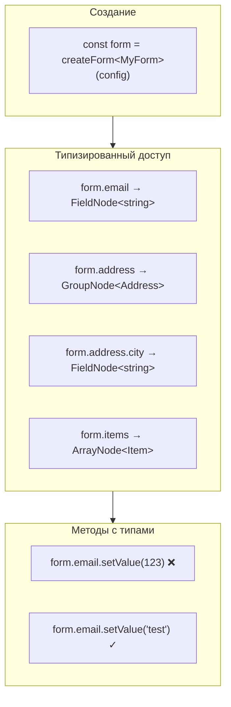

# Типобезопасность

ReFormer построен с фокусом на типобезопасность. TypeScript знает структуру вашей формы и предоставляет автокомплит на каждом шаге.

## FieldPath Proxy

FieldPath — это типизированный способ ссылаться на поля формы в validation и behavior схемах.



### Как это работает

```typescript
interface MyForm {
  email: string;
  address: {
    city: string;
    zip: string;
  };
  items: Array<{ title: string; price: number }>;
}

const validation: ValidationSchemaFn<MyForm> = (path) => {
  // ✅ TypeScript знает все поля
  required(path.email);
  required(path.address.city);
  required(path.address.zip);

  // ✅ Работает с массивами
  required(path.items);

  // ❌ Ошибка компиляции — поля не существует
  required(path.invalid);
  required(path.address.invalid);
};
```

### Внутренняя реализация

```typescript
// FieldPath — это Proxy, который строит путь при обращении к свойствам
type FieldPath<T> = {
  [K in keyof T]: T[K] extends object
    ? FieldPath<T[K]> & { __path: string; __key: K }
    : { __path: string; __key: K };
};

// В runtime path.address.city возвращает:
// { __path: 'address.city', __key: 'city' }
```

---

## FormProxy

FormProxy — это типизированный доступ к узлам формы после создания.



### Использование

```typescript
interface MyForm {
  email: string;
  age: number;
  address: {
    city: string;
  };
  tags: string[];
}

const form = createForm<MyForm>({
  form: {
    email: { value: '', component: Input },
    age: { value: 0, component: NumberInput },
    address: {
      city: { value: '', component: Input },
    },
    tags: { value: [], component: TagsInput },
  },
});

// ✅ TypeScript знает типы
form.email.setValue('test@mail.com'); // OK
form.email.setValue(123); // ❌ Ошибка: number не string

form.age.setValue(25); // OK
form.age.setValue('25'); // ❌ Ошибка: string не number

form.address.city.setValue('Moscow'); // OK (вложенные поля)

// ✅ Автокомплит работает
form.email.value.value; // string
form.email.valid.value; // boolean
form.email.errors.value; // ValidationError[]
```

### Типы узлов

```typescript
type FormProxy<T> = {
  [K in keyof T]: T[K] extends Array<infer U>
    ? U extends object
      ? ArrayNode<U> // Массив объектов
      : FieldNode<T[K]> // Массив примитивов
    : T[K] extends object
      ? GroupNode<T[K]> // Вложенный объект
      : FieldNode<T[K]>; // Примитив
};
```

---

## Типизация валидаторов

```typescript
// Валидатор получает правильный тип значения
validators.validate(path.email, (value) => {
  // value: string (TypeScript знает!)
  return value.includes('@') ? null : { code: 'invalid' };
});

validators.validate(path.age, (value) => {
  // value: number
  return value >= 18 ? null : { code: 'underage' };
});
```

---

## Типизация behaviors

```typescript
const behavior: BehaviorSchemaFn<OrderForm> = (path) => {
  // computeFrom знает типы источников и результата
  computeFrom(
    [path.price, path.quantity], // number, number
    path.total, // number
    (values) => {
      // values.price: number
      // values.quantity: number
      return values.price * values.quantity; // должен вернуть number
    }
  );

  // watchField знает тип значения
  watchField(path.country, (country, ctx) => {
    // country: string
    // ctx.form типизирован
  });
};
```

---

## Типизация компонентов

```typescript
interface InputProps {
  label: string;
  placeholder?: string;
}

const schema: FormSchema<MyForm> = {
  email: {
    value: '',
    component: Input,
    componentProps: {
      label: 'Email', // ✅ TypeScript проверяет props
      placeholder: 'Enter', // ✅ OK
      invalid: true, // ❌ Ошибка если не в InputProps
    },
  },
};
```

---

## Полный пример с типами

```typescript
// 1. Определяем интерфейс формы
interface RegistrationForm {
  email: string;
  password: string;
  confirmPassword: string;
  profile: {
    firstName: string;
    lastName: string;
    age: number;
  };
  interests: string[];
}

// 2. Создаём форму — все типы выводятся автоматически
const form = createForm<RegistrationForm>({
  form: {
    email: { value: '', component: Input },
    password: { value: '', component: PasswordInput },
    confirmPassword: { value: '', component: PasswordInput },
    profile: {
      firstName: { value: '', component: Input },
      lastName: { value: '', component: Input },
      age: { value: 0, component: NumberInput },
    },
    interests: { value: [], component: MultiSelect },
  },

  validation: (path) => {
    // path полностью типизирован
    required(path.email);
    email(path.email);
    minLength(path.password, 8);
    min(path.profile.age, 18);
  },

  behavior: (path) => {
    // path полностью типизирован
    revalidateWhen(path.confirmPassword, [path.password]);
  },
});

// 3. Используем — автокомплит везде
form.email.setValue('test@mail.com');
form.profile.firstName.setValue('John');
form.profile.age.setValue(25);

const data = form.getValue();
// data: RegistrationForm — полностью типизирован
```

---

## Связанные документы

- [Архитектура](architecture.md)
- [Signals и реактивность](signals.md)
- [Примеры](examples.md)
