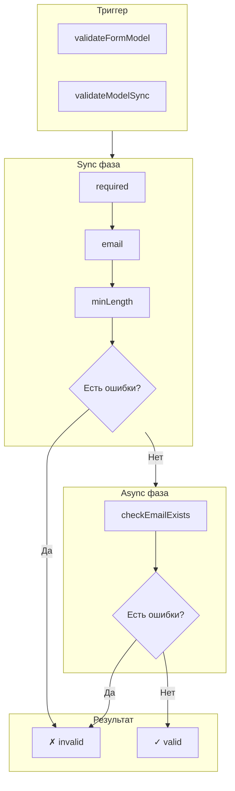
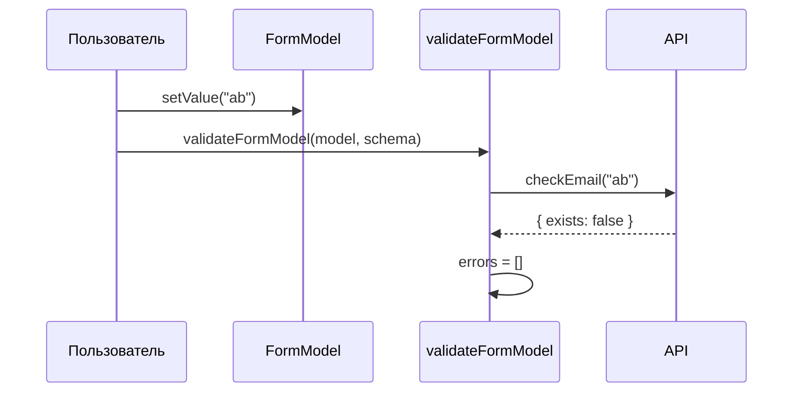
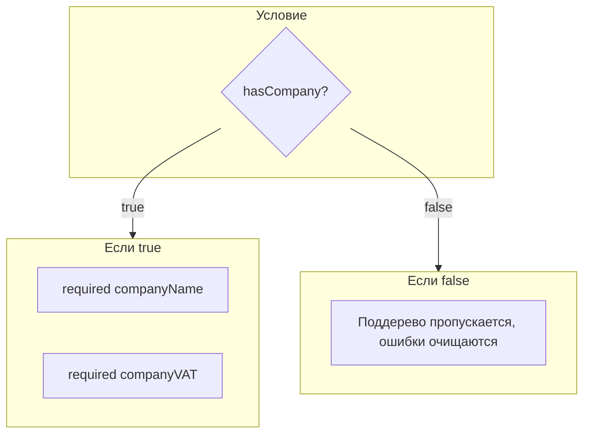

# Валидация

ReFormer предоставляет мощную систему валидации с поддержкой синхронных и асинхронных валидаторов и условной валидации.

Под архитектурой M1 валидация — это **чистая функция данных**: валидаторы объявляются в единой схеме формы (поле `validators` на узле), а вся модель проверяется вызовом `validateFormModel(model, schema)` (async) или `validateModelSync(model, schema)` (sync-only).

## Pipeline валидации



`validateModelSync` прогоняет только синхронные валидаторы (async пропускаются) — удобно для быстрого gate «можно ли перейти на следующий шаг». `validateFormModel` прогоняет sync + async и разводит ошибки по нодам формы.

---

## Встроенные валидаторы

Валидаторы — чистые фабрики из `@reformer/core/validators`. Каждая возвращает функцию `(value) => error | null` и кладётся в массив `validators` узла схемы.

### Базовые

```typescript
import { createModel } from '@reformer/core';
import {
  required,
  email,
  minLength,
  maxLength,
  min,
  max,
  pattern,
} from '@reformer/core/validators';

const model = createModel<MyForm>({
  /* ... */
});

const schema = {
  children: [
    // Обязательное поле
    { value: model.$.email, validators: [required()] },
    { value: model.$.name, validators: [required({ message: 'Имя обязательно' })] },

    // Email формат
    { value: model.$.email, validators: [email()] },

    // Длина строки
    { value: model.$.password, validators: [minLength(8)] },
    { value: model.$.name, validators: [maxLength(100)] },

    // Числовые диапазоны
    { value: model.$.age, validators: [min(18), max(120)] },

    // Регулярное выражение
    { value: model.$.phone, validators: [pattern(/^\+?[0-9]{10,14}$/)] },
  ],
};
```

### Специализированные

```typescript
import { phone, url, isDate, minDate, maxDate } from '@reformer/core/validators';

const schema = {
  children: [
    // Телефон
    { value: model.$.phone, validators: [phone()] },

    // URL
    { value: model.$.website, validators: [url()] },

    // Даты
    {
      value: model.$.birthDate,
      validators: [isDate(), minDate(new Date('1900-01-01')), maxDate(new Date())],
    },
  ],
};
```

---

## Кастомная валидация

Кастомный валидатор — это **model-валидатор** `(value, model, root) => ValidationError | null`. Кладётся в тот же массив `validators`. `model` — ближайший scope, `root` — корневая модель.

### Синхронная

```typescript
const schema = {
  children: [
    {
      value: model.$.confirmPassword,
      validators: [
        required(),
        (value, m) =>
          value !== m.password ? { code: 'mismatch', message: 'Пароли не совпадают' } : null,
      ],
    },
  ],
};
```

### Асинхронная



Асинхронный валидатор — это функция в `validators`, возвращающая `Promise`. Она прогоняется под `validateFormModel` (в `validateModelSync` пропускается):

```typescript
const schema = {
  children: [
    {
      value: model.$.email,
      validators: [
        required(),
        async (value) => {
          const response = await fetch(`/api/check-email?email=${value}`);
          const { exists } = await response.json();
          return exists ? { code: 'taken', message: 'Email уже занят' } : null;
        },
      ],
    },
  ],
};
```

> Дебаунс сетевых проверок — это забота слоя взаимодействия (`onChange(..., { debounce })` из `@reformer/core/behaviors`), а не опция валидатора.

---

## Условная валидация

Оберни поля в **branch-узел** `{ when, children }`. Когда `when(model, root)` возвращает `false`, всё поддерево пропускается (а ошибки этих полей очищаются).



### Использование

```typescript
const schema = {
  children: [
    // Валидируется только если hasCompany = true
    {
      when: (m) => m.hasCompany === true,
      children: [
        { value: model.$.companyName, validators: [required()] },
        { value: model.$.companyVAT, validators: [required(), minLength(10)] },
      ],
    },
  ],
};
```

---

## Cross-field валидация

Cross-field проверка — тот же model-валидатор, повешенный на поле-носитель ошибки; соседние поля читаются через `model`/`root`:

```typescript
const schema = {
  children: [
    // Пароли должны совпадать
    {
      value: model.$.confirmPassword,
      validators: [
        (value, m) =>
          value !== m.password ? { code: 'mismatch', message: 'Пароли не совпадают' } : null,
      ],
    },

    // Дата окончания > дата начала
    {
      value: model.$.endDate,
      validators: [
        (value, m) =>
          value <= m.startDate
            ? { code: 'invalid_range', message: 'Дата окончания должна быть позже даты начала' }
            : null,
      ],
    },
  ],
};
```

---

## Состояния валидации

```typescript
// Доступные сигналы ноды поля
field.valid.value; // true если нет ошибок
field.invalid.value; // true если есть ошибки
field.pending.value; // true если идёт async валидация
field.errors.value; // ValidationError[]
field.status.value; // 'valid' | 'invalid' | 'pending' | 'disabled'

// Показывать ли ошибку пользователю
field.shouldShowError.value; // invalid && (touched || dirty)
```

---

## Структура ошибки

```typescript
interface ValidationError {
  code: string; // Уникальный код ошибки
  message: string; // Сообщение для пользователя
  path?: string; // Путь к полю (для вложенных)
}
```

---

## Best practices: типизация и структура валидаторов

### 1. Типизируй модель — не `any`

Типобезопасность приходит из типа модели: `createModel<T>(...)` даёт `model.$.<field>` с точными типами, а cross-field валидатор типизируется через `ModelValidator<TValue, TForm, TForm>`.

```typescript
import type { ModelValidator } from '@reformer/core';
import type { CreditApplicationForm } from './types';

// ✅ типизированный extracted-валидатор — value/form инферятся правильно
const validateLoanCap: ModelValidator<number, CreditApplicationForm, CreditApplicationForm> = (
  loanAmount,
  form
) => {
  if (!loanAmount || !form.totalIncome) return null;
  const cap = form.totalIncome * 12 * 10;
  return loanAmount > cap
    ? { code: 'loanAmountExceedsCap', message: `Превышен лимит ${cap}` }
    : null;
};

const schema = {
  children: [{ value: model.$.loanAmount, validators: [validateLoanCap] }],
};
```

### 2. Inline OK для простых, extract для сложных

**Inline-валидатор** (короткие одиночные проверки) — нормально:

```typescript
{ value: model.$.age, validators: [required(), min(18)] }
```

**Extracted module-level функция** предпочтительна для cross-field и многострочной логики:

- валидатор >5 строк или содержит несколько return-веток;
- валидатор переиспользуется на нескольких полях (DRY);
- cross-field проверка, читающая несколько полей формы, — extracted функция читается легче и типизируется без cast.

См. примеры: [`projects/react-playground/src/pages/examples/complex-multy-step-form/schemas/validation.ts`](../projects/react-playground/src/pages/examples/complex-multy-step-form/schemas/validation.ts).

---

## Связанные документы

- [Архитектура](architecture.md)
- [Signals и реактивность](signals.md)
- [Система Behaviors](behaviors.md)
