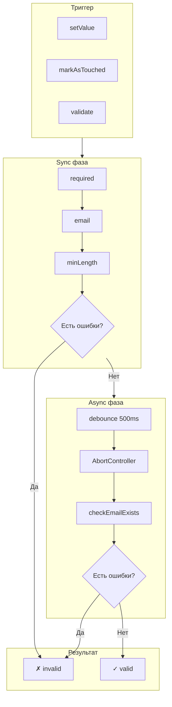
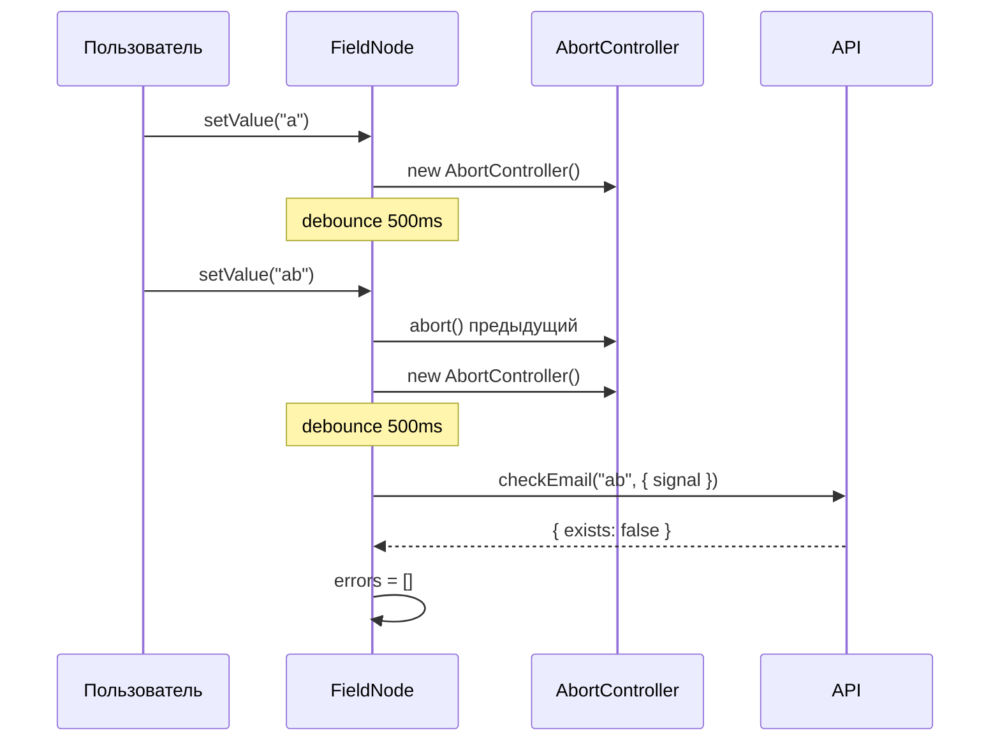
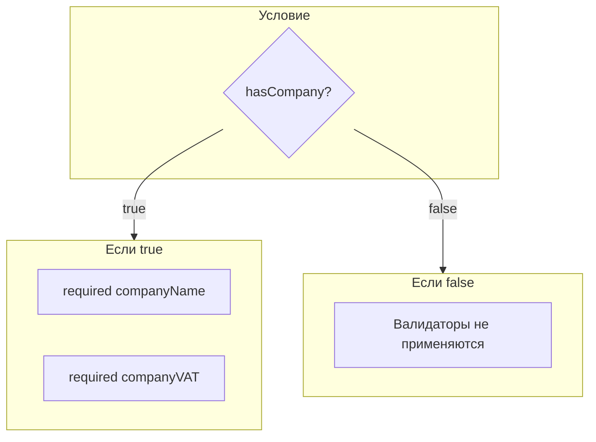

# Валидация

ReFormer предоставляет мощную систему валидации с поддержкой синхронных и асинхронных валидаторов, debounce и условной валидации.

## Pipeline валидации



---

## Встроенные валидаторы

### Базовые

```typescript
const validation: ValidationSchemaFn<MyForm> = (path) => {
  // Обязательное поле
  required(path.email);
  required(path.name, { message: 'Имя обязательно' });

  // Email формат
  email(path.email);

  // Длина строки
  minLength(path.password, 8);
  maxLength(path.name, 100);

  // Числовые диапазоны
  min(path.age, 18);
  max(path.age, 120);

  // Регулярное выражение
  pattern(path.phone, /^\+?[0-9]{10,14}$/);
};
```

### Специализированные

```typescript
const validation: ValidationSchemaFn<MyForm> = (path) => {
  // Телефон
  phone(path.phone);

  // URL
  url(path.website);

  // Даты
  isDate(path.birthDate);
  minDate(path.birthDate, new Date('1900-01-01'));
  maxDate(path.birthDate, new Date());
};
```

---

## Кастомная валидация

### Синхронная

```typescript
const validation: ValidationSchemaFn<MyForm> = (path) => {
  validators.validate(path.confirmPassword, (value, ctx) => {
    if (value !== ctx.form.password.value.value) {
      return {
        code: 'mismatch',
        message: 'Пароли не совпадают'
      };
    }
    return null;
  });
};
```

### Асинхронная



```typescript
const validation: ValidationSchemaFn<MyForm> = (path) => {
  validators.validateAsync(
    path.email,
    async (value, options) => {
      const response = await fetch(`/api/check-email?email=${value}`, {
        signal: options?.signal // Поддержка отмены
      });
      const { exists } = await response.json();

      return exists
        ? { code: 'taken', message: 'Email уже занят' }
        : null;
    },
    { debounce: 500 }
  );
};
```

---

## Условная валидация



### Использование

```typescript
const validation: ValidationSchemaFn<MyForm> = (path) => {
  // Валидация применяется только если hasCompany = true
  validators.applyWhen(
    (form) => form.hasCompany,
    (path) => {
      required(path.companyName);
      required(path.companyVAT);
      minLength(path.companyVAT, 10);
    }
  );
};
```

---

## Cross-field валидация

```typescript
const validation: ValidationSchemaFn<RegistrationForm> = (path) => {
  // Пароли должны совпадать
  validators.validate(path.confirmPassword, (value, ctx) => {
    return value !== ctx.form.password.value.value
      ? { code: 'mismatch', message: 'Пароли не совпадают' }
      : null;
  });

  // Дата окончания > дата начала
  validators.validate(path.endDate, (value, ctx) => {
    const startDate = ctx.form.startDate.value.value;
    return value <= startDate
      ? { code: 'invalid_range', message: 'Дата окончания должна быть позже даты начала' }
      : null;
  });
};
```

---

## Состояния валидации

```typescript
// Доступные сигналы
field.valid.value      // true если нет ошибок
field.invalid.value    // true если есть ошибки
field.pending.value    // true если идёт async валидация
field.errors.value     // ValidationError[]
field.status.value     // 'valid' | 'invalid' | 'pending' | 'disabled'

// Показывать ли ошибку пользователю
field.shouldShowError.value  // invalid && (touched || dirty)
```

---

## Структура ошибки

```typescript
interface ValidationError {
  code: string;      // Уникальный код ошибки
  message: string;   // Сообщение для пользователя
  path?: string;     // Путь к полю (для вложенных)
}
```

---

## Связанные документы

- [Архитектура](architecture.md)
- [Signals и реактивность](signals.md)
- [Система Behaviors](behaviors.md)
