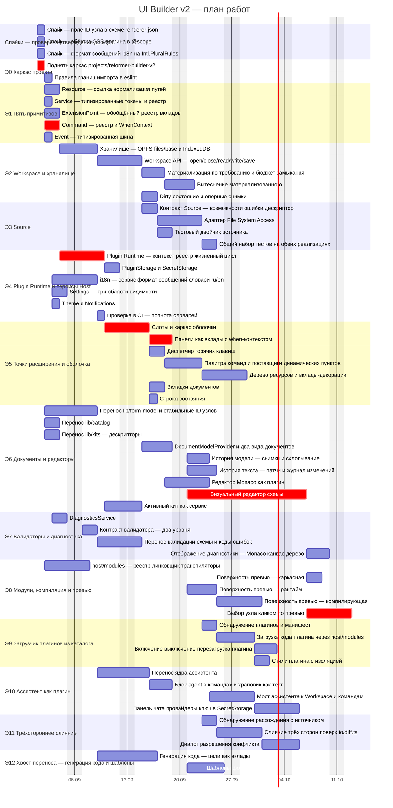

# План работ: последовательность, параллельность, сроки

> К [implementation-plan.md](implementation-plan.md). Задачи заведены в трекере с меткой
> `builder-v2`: 15 эпиков и 63 задачи, 95 связей.
>
> Расписание ниже **посчитано из графа зависимостей**, а не проставлено вручную, поэтому
> расходиться с трекером оно не может. Пересчитывать после правок графа обязательно.

## Оценка выросла вдвое, и это главный результат разбора

В плане стояла оценка **83–102 дня** до паритета. Она получена «сверху»: по этапам, целиком.
Сумма подробных оценок по 63 задачам даёт **184 дня**.

Расхождение не описка и не повод усреднять. Оценка по этапам оказалась оптимистичной там, где
этап выглядит одним делом, а разбирается на пять:

| Этап                           | Было «сверху» | Стало суммой задач |
| ------------------------------ | ------------- | ------------------ |
| Э1 Пять примитивов             | ~3–4д         | 8д                 |
| Э5 Точки расширения и оболочка | ~8–10д        | 19д                |
| Э6 Документы и редакторы       | ~15–20д       | 39д                |

Подробная оценка обычно завышена на padding отдельных задач, а укрупнённая — занижена
на забытых частях. Но двукратная разница означает, что забытого было больше, чем padding'а.
**Планировать стоит от 184 дней**, а 83–102 считать нижней границей при удачном стечении.

## Что это значит на практике

|                                                  | Дней    |
| ------------------------------------------------ | ------- |
| Суммарная трудоёмкость                           | **184** |
| Критический путь при неограниченном параллелизме | **30**  |

Отношение примерно шестикратное — это мера того, сколько работы можно вести одновременно.
Для одного человека число 30 не значит ничего: он всё равно пройдёт 184 дня последовательно.
Оно становится значимым при трёх-четырёх исполнителях и говорит, что упереться в зависимости
раньше этого предела не выйдет.

## Критический путь

Семь задач определяют минимальный срок:

| Задача   | Что это                                          | Дней   |
| -------- | ------------------------------------------------ | ------ |
| t0-1     | Каркас проекта                                   | 1      |
| t1-4     | Command: реестр и WhenContext                    | 2      |
| t4-1     | Plugin Runtime: контекст, реестр, жизненный цикл | 4      |
| t5-1     | Слоты и каркас оболочки                          | 4      |
| t5-2     | Панели как вклады с when-контекстом              | 3      |
| **t6-8** | **Визуальный редактор схемы**                    | **12** |
| t8-5     | Выбор узла кликом по превью                      | 4      |

Путь идёт через оболочку к визуальному редактору, и **редактор занимает 40% пути**. Сократить
срок можно только разбив его: сейчас это одна задача на 12 дней, переписывающая ~9k строк v1.
Разумное деление — канвас, палитра, инспектор, блочные операции — но делить стоит тогда,
когда появится второй исполнитель, иначе дробление даёт только учётную работу.

## Восемнадцать задач можно начать в первые три дня

Это и есть ширина параллелизма на старте:

| Когда  | Задачи                                                                                 |
| ------ | -------------------------------------------------------------------------------------- |
| День 0 | три спайка и каркас проекта                                                            |
| День 1 | границы импорта; все пять примитивов; перенос модели, каталога и китов; `host/modules` |
| День 2 | i18n, настройки, тема, служба диагностик                                               |

Три вещи стоит заметить отдельно.

**Перенос домена (t6-1, t6-2, t6-3) зависит только от каркаса и спайка** — он не ждёт ни ядра,
ни оболочки. Это самая длинная параллельная дорожка, и запускать её надо сразу, а не по очереди
с ядром.

**`host/modules` (t8-1) не зависит вообще ни от чего, кроме каркаса** — и разблокирует загрузчик
плагинов. То есть Э9 привязан не ко всему Э8, а к одной его задаче, и может идти параллельно
с поверхностями превью.

**Трёхстороннее слияние (Э11) независимо от редакторов** — ему нужен только Workspace с BASE.
Отдельная дорожка, которую можно вести в любой момент после Э2.

## Порядок дорожек

```text
спайки ─┐
        ├─→ ядро (Э1) ──→ Workspace (Э2) ──→ Source (Э3) ──┐
каркас ─┤                                                   ├─→ оболочка (Э5) ─→ редакторы (Э6)
        ├─→ плагины и сервисы (Э4) ────────────────────────┘                          │
        │                                                                              ├─→ диагностика (Э7)
        ├─→ перенос домена (t6-1..3) ──────────────────────────────────────────────────┤
        │                                                                              ├─→ превью (Э8)
        └─→ host/modules (t8-1) ──→ загрузчик плагинов (Э9)                            │
                                                                                       └─→ ассистент (Э10)
            Workspace ──→ слияние (Э11)                    домен ──→ хвост переноса (Э12)
```

## Диаграмма

Критический путь выделен. Даты условные: старт 1 сентября, выходные исключены.



## Как поддерживать

Граф работ лежит рядом: [work-graph.json](work-graph.json) — тот же файл, из которого задачи
заведены в трекер (`bd create --graph`). Диаграмма и оценки выведены из него скриптом. При изменении зависимостей или оценок
пересчитывать, а не править руками: расхождение между документом и трекером хуже отсутствия
документа.

Работа с задачами:

```bash
bd ready                       # что можно брать прямо сейчас
bd list --label builder-v2     # весь план
bd show <id>                   # задача с зависимостями
bd update <id> --claim         # взять в работу
```
