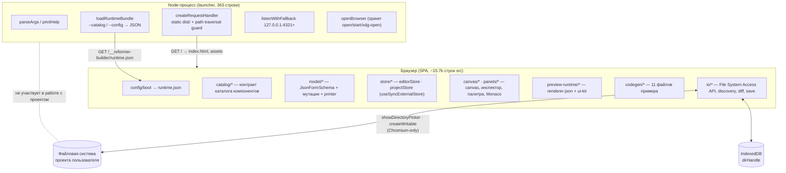
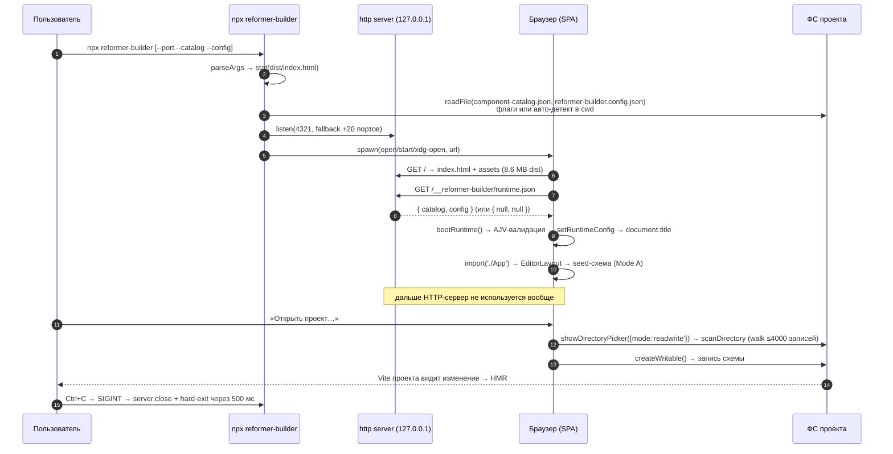
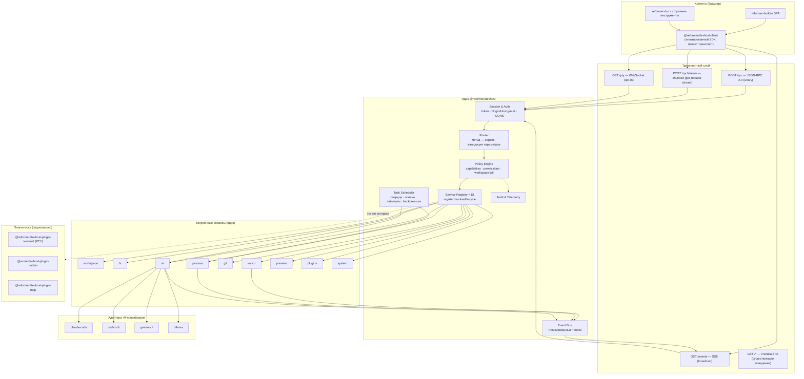
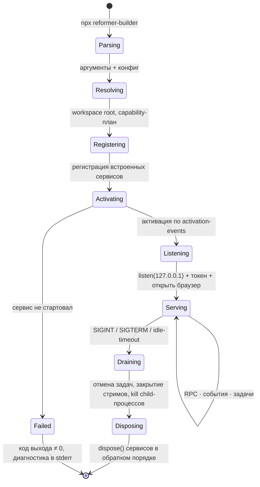
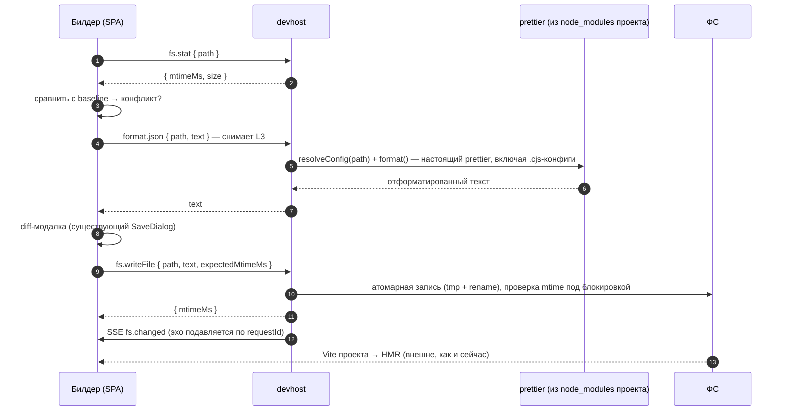
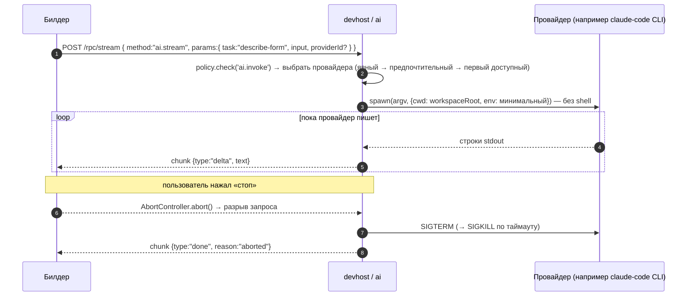
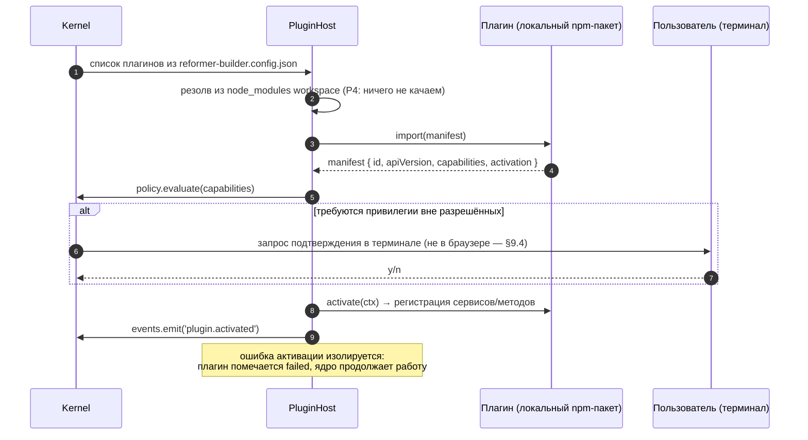

# RFC-0001 — ReFormer Builder как Local Development Runtime

**Статус:** 🟡 предложение (архитектурное исследование, к реализации не приступали)
**Дата:** 2026-08-03
**Автор:** Claude Code (по заданию [PROMT.md](../../PROMT.md))
**Скоуп:** `projects/reformer-builder` + предлагаемый новый пакет `@reformer/devhost`
**Опоры:** [спека MVP](../specs/reformer-builder-mvp.md) (read-only), [брейншторм](../brainstorms/reformer-builder.md), код `src/**`, `bin/reformer-builder.mjs`

---

## 0. TL;DR и вердикт

**Гипотеза задания:** билдер становится локальным процессом (`npx reformer-builder`), который даёт браузеру
безопасный API к локальной среде разработки — ФС, терминал, git, npm, Docker, процессы, AI.

**Вердикт — раздельный, и он не совпадает с гипотезой целиком:**

| Часть гипотезы                                                                 | Вердикт                   | Почему                                                                                                                                                                                      |
| ------------------------------------------------------------------------------ | ------------------------- | ------------------------------------------------------------------------------------------------------------------------------------------------------------------------------------------- |
| Локальный процесс с безопасным API для браузера, все привилегии через него     | ✅ **Принять**            | Снимает 4 из 6 главных ограничений текущей реализации (Chromium-only, нет watch, prettier-конфиги, скорость скана). Транспорт частично уже есть — launcher уже HTTP-сервер.                 |
| Билдер **сам** становится платформой                                           | ❌ **Отклонить**          | Билдер — приложение (редактор `JsonFormSchema`, 15.7k строк UI-логики). Платформа должна быть **отдельным пакетом**, а билдер — её первым потребителем. Иначе платформа не переиспользуема. |
| «Единая точка доступа ко **всем** возможностям компьютера» (Docker, терминал…) | ❌ **Отклонить как цель** | Это IDE-скоуп. Solo-maintainer + 0.0.0 версия билдера + класс уязвимостей «локальный RCE» ⇒ распыление фокуса и репутационный риск. Docker/Terminal — только как **опциональные плагины**.  |
| AI — один из сервисов, а не центр                                              | ✅ **Принять**            | Правильная постановка. Более того, в репо уже есть `@reformer/mcp` — его следует переиспользовать как адаптер, а не строить AI-слой с нуля.                                                 |

**Рекомендуемое решение:** вариант **V6 «Hybrid Runtime»** — тонкий микрокернел `@reformer/devhost`
(service registry + DI + policy) с транспортом «JSON-RPC поверх HTTP (unary) + SSE (события) +
WebSocket только для PTY», плагинной системой и **runtime-optional** контрактом: билдер обязан
продолжать работать как статический SPA без рантайма (hosted-режим на GitHub Pages уже существует и
деплоится в CI — ломать его нельзя).

**Ключевая мысль всего документа:** ценность даёт не «доступ ко всему компьютеру», а **снятие
конкретных ограничений браузерной песочницы, на которые билдер уже упирается** (§1.7). Порядок фаз в
roadmap выведен из этого, а не из привлекательности слова «платформа».

---

## 1. Анализ существующей архитектуры

### 1.1. Что это сейчас — карта системы

Билдер — **офлайн-SPA без бэкенда**. Node-процесс в поставке есть, но он не является сервером
приложения: это zero-dependency статик-раздатчик на встроенных модулях Node
([bin/reformer-builder.mjs](../../bin/reformer-builder.mjs), 363 строки, ноль npm-зависимостей).



Существенный факт: **между браузером и Node-процессом ровно один прикладной обмен** — `GET
/__reformer-builder/runtime.json`, один раз на бутстрапе, read-only. Всё остальное (открыть проект,
прочитать дерево, записать файл, экспортировать код) браузер делает **сам**, минуя Node.

### 1.2. Ответственность модулей

| Модуль                     | Строк\* | Ответственность                                                                                                   | Зависит от платформы?                     |
| -------------------------- | ------- | ----------------------------------------------------------------------------------------------------------------- | ----------------------------------------- |
| `bin/reformer-builder.mjs` | 363     | CLI-парсинг, чтение `--catalog`/`--config`, статик-раздача `dist/`, выбор свободного порта, открытие браузера     | Node (единственный Node-код в проекте)    |
| `src/config/*`             | ~250    | Бутстрап runtime-конфига: fetch bundle → AJV-валидация → `setRuntimeConfig` до рендера графа приложения           | fetch                                     |
| `src/catalog/*`            | ~700    | Контракт каталога компонентов (владелец JSON Schema), слияние вшитого/клиентского каталога, синтетические записи  | нет                                       |
| `src/model/*`              | ~1300   | `JsonFormSchema` как источник истины, иммутабельные мутации по JSON-path, `printer` (JSON → prettier/standalone)  | нет                                       |
| `src/store/*`              | ~1100   | `editorStore` (вкладки, история, выделение) + `projectStore` (каталог, дерево, printer) на `useSyncExternalStore` | нет                                       |
| `src/canvas/*`             | ~1500   | Схематичный canvas, Monaco-редакторы, diff-модалка, мок-данные                                                    | нет                                       |
| `src/panels/*`             | ~1400   | Палитра, инспектор свойств из props-схем, файловая панель                                                         | нет                                       |
| `src/preview-runtime/*`    | ~900    | Runtime-preview: `convertJsonToM1Tree` + `createForm` + registry ui-kit + синтез мок-данных                       | нет                                       |
| `src/codegen/*`            | ~1200   | Генерация 11-файлового примера (`derived` перезаписываются, `user` — один раз)                                    | нет                                       |
| `src/io/*`                 | ~900    | **Вся привилегированная работа**: FS Access API, обнаружение схем, prettier-конфиги, diff, save, IndexedDB        | **да — упирается в браузерную песочницу** |
| `src/app/*`                | ~1700   | Оркестрация (`save-actions`), оболочка, хоткеи, шаблоны файлов формы                                              | косвенно, через `io/*`                    |

\* округлённо, по `wc -l` без тестов; всего src ≈ 15.7k строк, из них ≈3.1k тестов.

**Вывод по ответственности:** платформенная поверхность сосредоточена в `src/io/*` (~900 строк) и
частично в `src/codegen/deliver.ts`. Это ≈6% кода. Остальные 94% — чистая доменная логика редактора,
которой безразлично, откуда пришли байты файла. **Это главный аргумент за реализуемость перехода:
менять надо один слой, а не архитектуру приложения.**

### 1.3. Механизм запуска и жизненный цикл



**Жизненный цикл процесса**: старт → чтение двух файлов конфигурации **один раз** → listen → open →
ожидание сигнала. Нет состояния, нет фоновых задач, нет реакции на изменение файлов, нет
graceful-таймаутов, кроме принудительного выхода.

**Жизненный цикл SPA**: `main.tsx` → `bootRuntime()` (fail-visible экран `BootError` при невалидном
файле) → динамический импорт графа приложения → `EditorLayout` → seed-схема → работа во вкладках;
persist: layout-панелей в `localStorage`, `dirHandle` — в IndexedDB.

### 1.4. Существующие API

**Внешние (стабильные контракты, уже опубликованные):**

1. **CLI**: `--port | --host | --open/--no-open | --catalog | --config | --help | --version`.
2. **HTTP**: `GET /*` — статика `dist/`; `GET /__reformer-builder/runtime.json` — bundle.
   Ограничения: только `GET`/`HEAD` (иначе 405), path-traversal guard, `Cache-Control: no-cache`.
3. **`runtime-config.schema.json`** — публикуемая JSON Schema конфига билдера (`$schema` для
   автодополнения у клиента).
4. **`component-catalog.schema.json`** — контракт каталога компонентов; билдер владеет схемой, ui-kit
   генерирует под неё (см. `catalog/contract.ts`, задача `ReFormer-mmy`).
5. **`JsonFormSchema`** — выходной артефакт (из `@reformer/renderer-json`).

**Внутренние (границы модулей):** `catalog/contract.ts` (`loadCatalogJson`/`buildCatalogFromJson`),
`config/state.ts` (`getRuntimeConfig`/`getClientCatalog`), `model/printer.ts` (`print`),
`io/save.ts` (`prepareSave`/`commitSave`), `preview-runtime/build-preview.ts` (`buildPreview`).

### 1.5. Модель взаимодействия Browser ↔ Builder (как есть)

**Односторонняя, разовая, read-only.** Формально — «push конфигурации через статический endpoint».

| Свойство                     | Текущее состояние                                                            |
| ---------------------------- | ---------------------------------------------------------------------------- |
| Направление                  | Browser → Node (pull), один запрос на бутстрапе                              |
| Формат                       | JSON, без версии протокола и без capability-негоциации                       |
| Аутентификация               | нет (не нужна: сервер отдаёт только статику и содержимое двух файлов из cwd) |
| Авторизация                  | нет                                                                          |
| Стриминг                     | нет                                                                          |
| Обратный канал               | нет                                                                          |
| Обработка отсутствия сервера | **есть и работает корректно** — `fetchRuntimeBundle()` → `null` → дефолты    |

Последняя строка важнее, чем кажется: **паттерн «рантайм может отсутствовать → деградируем к
дефолтам» уже реализован и покрыт тестами**. Это готовый прообраз capability-негоциации, на который
опирается предлагаемая архитектура (§3.2, принцип P1).

### 1.6. Существующие точки расширения

| #   | Точка                           | Механизм                                                                      | Кто расширяет        |
| --- | ------------------------------- | ----------------------------------------------------------------------------- | -------------------- |
| E1  | Каталог компонентов             | `--catalog` / авто-детект `component-catalog.json`; контракт-JSON Schema      | любая дизайн-система |
| E2  | Конфиг билдера                  | `--config`: `branding`, `palette`, `components`, `ui`, `project`              | клиент               |
| E3  | Синтетические записи палитры    | `components.synthetic.{html,htmlTags,formArray,wizard}`                       | клиент (тоглы)       |
| E4  | Whitelist/blacklist компонентов | `components.include` / `components.exclude`                                   | клиент               |
| E5  | Discovery-политика              | `project.{formSchemaMarkers,ignoreDirs,skipFiles}` (объединяются с дефолтами) | клиент               |
| E6  | Стартовая схема Mode A          | `project.seedSchema`                                                          | клиент               |
| E7  | Registry runtime-preview        | `buildRegistry()` — код, **не** конфигурация                                  | только форк          |
| E8  | Шаблоны генерируемых файлов     | `app/form-templates.ts`, `codegen/emit-*.ts` — код                            | только форк          |

**Оценка:** E1–E6 — настоящие runtime-точки расширения (данные, валидируемые по схеме). E7–E8 —
compile-time. **Плагинов в смысле «исполняемый сторонний код» нет вообще**, и это сейчас
плюс для безопасности. Все существующие точки расширения — декларативные и это удачный прецедент:
плагинная система в §8 сохраняет тот же принцип «манифест-first».

### 1.7. Ограничения текущей реализации

Пронумерованы — на них ссылается оценка вариантов.

| #   | Ограничение                                                                                                                                      | Источник                              | Больно?                              |
| --- | ------------------------------------------------------------------------------------------------------------------------------------------------ | ------------------------------------- | ------------------------------------ |
| L1  | **Chromium-only**. Firefox/Safari не имеют File System Access API для пользовательских каталогов → Mode B недоступен примерно половине аудитории | `io/fs-access.ts`, спека §4           | 🔴 да, это отсекает продукт          |
| L2  | **Нет file-watch**. Внешние изменения ловятся только сравнением `lastModified` в момент сохранения                                               | `io/save.ts:37-41`                    | 🟠 средне (конфликты, стейл)         |
| L3  | **Prettier-конфиги `.cjs/.js/.mjs/.ts` не читаются** — браузер не может их выполнить → форматирование по умолчанию + плашка                      | `io/prettier-config.ts:22-32,110-117` | 🔴 да, бьёт по риску №1 (round-trip) |
| L4  | **Скан — полный обход дерева при каждом открытии**, лимит `MAX_TREE_ENTRIES = 4000`, чтение и парсинг каждого `.json`                            | `io/discovery.ts:128-188`             | 🟠 средне (крупные монорепо)         |
| L5  | **Нет git-контекста**: нельзя показать «файл изменён», нельзя откатить, нет истории                                                              | —                                     | 🟡 nice-to-have                      |
| L6  | **Нет процессов**: нельзя запустить `npm run dev` проекта, `tsc --noEmit` на сгенерированном коде, тесты                                         | —                                     | 🟡 nice-to-have                      |
| L7  | **Нет AI**: MCP-сервер `@reformer/mcp` работает по stdio, браузер не может его запустить (зафиксировано в брейншторме, разд. 8)                  | брейншторм §8                         | 🟠 средне (v2-фича из спеки)         |
| L8  | **Persist-грант FS требует подтверждения** после каждой перезагрузки вкладки                                                                     | `io/handle-store.ts` + web-платформа  | 🟡 UX-трение                         |
| L9  | **Экспорт кода — второй пикер каталога**, «куда положить» не связано с открытым проектом                                                         | `codegen/deliver.ts:51`               | 🟡 UX-трение                         |
| L10 | **8.6 MB dist**, из них 2.6 MB — главный чанк (Monaco + ui-kit) — при `npx` это разовая загрузка пакета, при hosted — трафик                     | `dist/`                               | 🟡 терпимо                           |
| L11 | **Нет диагностики на реальных типах**: билдер не знает, компилируется ли то, что он сгенерировал                                                 | —                                     | 🟡 nice-to-have                      |
| L12 | **Launcher stateless**: не переживает смену конфига без рестарта, не знает о работе SPA                                                          | `bin/reformer-builder.mjs`            | 🟢 не больно сейчас                  |

Обратите внимание на распределение: **боль сконцентрирована в L1–L4 — это работа с файлами и
форматирование, а не AI/Docker/терминал.** Гипотеза задания предлагает строить платформу «сверху»
(AI, Docker, терминал), тогда как реальный дефицит — «снизу» (файлы, watch, формат). Roadmap (§12)
исходит из этого.

### 1.8. Пригодность текущей архитектуры к роли Local Development Runtime

Оценка по существу, без реверансов:

| Аспект                           | Оценка | Комментарий                                                                                                                                      |
| -------------------------------- | ------ | ------------------------------------------------------------------------------------------------------------------------------------------------ |
| Наличие локального процесса      | ✅     | Есть, живёт всё время сессии, уже слушает HTTP, уже читает файлы клиента, уже умеет искать свободный порт                                        |
| Транспорт до браузера            | 🟠     | Есть, но только `GET` статики; нет `POST`, нет протокола, нет версий                                                                             |
| Слоистость приложения            | ✅     | `io/*` — узкий изолированный слой (≈6% кода); замена источника файлов не затрагивает model/store/canvas                                          |
| Готовность к отсутствию рантайма | ✅     | `fetchRuntimeBundle → null → дефолты` — прецедент graceful degradation                                                                           |
| Контракты и валидация            | ✅     | Две публикуемые JSON Schema + AJV на бутстрапе + fail-visible экран — зрелая практика, переносится на API рантайма                               |
| Сервисная структура внутри Node  | ❌     | Launcher — один файл-скрипт: нет DI, реестра сервисов, событий, жизненного цикла, логирования, тестируемых границ (кроме 3 экспортов для юнитов) |
| Безопасность локального API      | ❌     | Отсутствует как понятие: нет токена, нет проверки `Origin`/`Host`, нет CORS-политики. Для раздачи статики это нормально; для API — блокер        |
| Плагины                          | ❌     | Нет; все точки расширения — декларативные данные                                                                                                 |
| Наблюдаемость                    | ❌     | `console.log` при старте, `console.debug` в SPA                                                                                                  |

**Итог:** архитектура **не мешает** переходу, но и **не содержит** платформенной части. Всё, что
есть — 363-строчный статик-сервер. Поэтому это не «эволюция билдера в платформу», а **добавление
нового слоя рядом**, где билдер остаётся приложением. Формулировка задания «Builder должен стать
единой точкой доступа к локальным возможностям компьютера» технически осуществима, но приведёт к
тому, что 15.7k строк редактора форм и платформенное ядро окажутся в одном пакете с одной версией и
одним релиз-циклом — это ошибка, которую дешевле не совершать сейчас, чем исправлять потом.

---

## 2. Исследование вариантов развития

Для каждого варианта: суть, что меняется, за что платим. Оценки — в §2.9.

### V0 — Status quo+ (остаться браузерным SPA)

Ничего не менять в модели; развивать клиента: улучшать эвристики discovery, кэшировать дерево в
IndexedDB, добавить OPFS-кэш, дожать UX грантов.

- **Снимает:** L4 частично (кэш), L8 частично.
- **Не снимает:** L1, L2, L3, L5, L6, L7, L11 — принципиально, это ограничения песочницы.
- **Плюс:** ноль новых рисков безопасности; hosted-режим остаётся первоклассным.
- **Минус:** продукт остаётся Chromium-only. Это стратегический потолок, а не косметика.

### V1 — Local HTTP Runtime (REST + SSE)

Launcher превращается в сервер с REST-эндпоинтами: `GET /api/fs/tree`, `GET /api/fs/file?path=`,
`PUT /api/fs/file`, `GET /api/git/status`, `POST /api/process/run`, `GET /api/events` (SSE).

- **Снимает:** L1–L6, L11 (при желании).
- **Плюс:** самый предсказуемый вариант; работают браузерные CORS/preflight; тривиально
  отлаживается `curl`; естественно ложится на существующий `createRequestHandler`.
- **Минус:** REST плохо описывает операции вроде «подписаться на изменения», «отменить задачу»,
  «интерактивный PTY». Эндпоинты расползаются, версионирование URL-ов болезненно. Для 30+ сервисов
  (§11) REST-поверхность станет неуправляемой без строгой дисциплины.

### V2 — WebSocket Runtime

Единый дуплексный канал; поверх — свой message-протокол (или JSON-RPC). Все вызовы и события — через
одно соединение.

- **Снимает:** те же L1–L7 + отлично ложится на PTY и стримы.
- **Плюс:** минимальная задержка, дуплекс, один коннект, естественные подписки.
- **Минус — существенный:** **WebSocket не подчиняется Same-Origin/CORS.** Браузер не блокирует
  cross-origin WS-рукопожатие; защита возможна только ручной проверкой `Origin` на сервере (класс
  атак «cross-site WebSocket hijacking»). Плюс всё, что HTTP даёт бесплатно — переподключение,
  кеширование, стандартные коды ошибок, отладка в DevTools/`curl` — придётся строить самим
  (heartbeat, reconnect с backoff, ordering, backpressure, correlation-id). Для **основного**
  транспорта это неоправданно; для PTY — оправдано.

### V3 — Plugin Runtime (микрокернел, транспорт вторичен)

Ядро — контейнер: реестр сервисов, DI, жизненный цикл, шина событий. Всё остальное (fs, git,
процессы, AI) — плагины, регистрирующие сервисы. Транспорт — деталь одного из плагинов.

- **Плюс:** максимальная расширяемость и «правильная» декомпозиция; лучший вариант для OSS-контрибуций.
- **Минус:** **инфраструктура до первой пользы**. Пока пишется контейнер, пользователь Firefox всё
  ещё не может открыть проект. Плюс плагин = сторонний код in-process ⇒ безопасность требует ответа
  сразу, а не потом.

### V4 — MCP Host

Билдер-процесс становится MCP-хостом: локальные возможности выражены как MCP-серверы (`filesystem`,
`git`, свой `reformer`), браузер ходит в хост, хост мультиплексирует в серверы. AI-провайдеры —
такие же MCP-клиенты.

- **Плюс:** готовый стандарт, готовая экосистема серверов, в репо **уже есть** `@reformer/mcp` (8
  инструментов, 12 промптов, ресурсы) — переиспользование вместо изобретения. Модно, помогает OSS-видимости.
- **Минус:** MCP спроектирован для контракта «LLM ↔ инструменты», а не «UI ↔ ОС». В нём нет
  типизированных подписок на файловые события, нет бинарных потоков, нет модели PTY, а каждый
  вызов — JSON-RPC поверх stdio с накладными расходами на процесс. Использовать MCP как **основной
  транспорт UI** — злоупотребление инструментом. Как **адаптер** (и внутрь — к AI, и наружу — чтобы
  внешний агент мог управлять билдером) — точное попадание.

### V5 — Event-Driven Runtime

Ядро — шина событий/очередь задач; сервисы общаются сообщениями; браузер подписан на топики,
команды — тоже события.

- **Плюс:** отличная развязка компонентов, естественный параллелизм, лёгкое добавление реакций.
- **Минус:** типовой сценарий билдера — **request/response** («прочитай файл», «сохрани», «дай
  статус git»). Реализация RPC поверх шины требует correlation-id, таймаутов, гарантий доставки —
  сложность без выигрыша. Отладка ухудшается. Событийность нужна как **часть** (для watch,
  прогресса, логов), а не как основа.

### V6 — Hybrid Runtime ⭐ (рекомендуется)

Комбинация лучших частей V1/V2/V3/V4 с явным разделением «что каким транспортом»:

- **Ядро** — микрокернел из V3: реестр сервисов + DI + жизненный цикл + policy + шина событий.
- **Unary-вызовы** — JSON-RPC 2.0 поверх `POST /rpc` (V1): работает CORS-preflight, отлаживается
  `curl`, версионируется в одном месте (`system.hello`), namespace-методы (`fs.read`, `git.status`).
- **Широковещательные события** — один SSE-канал `GET /events` (V1): изменения файлов, прогресс
  задач, жизненный цикл плагинов. Авто-reconnect даёт браузер.
- **Стрим одного ответа** — HTTP chunked на `POST /rpc/stream` (AI-ответ, вывод сборки): естественная
  отмена через `AbortController`, backpressure — от `fetch`.
- **Дуплекс** — WebSocket **только** для PTY-терминала (V2), off by default, с ручной проверкой `Origin`.
- **AI и внешние интеграции** — MCP-адаптер (V4) как плагин, в обе стороны.
- **Событийность** — внутренняя шина (V5) как деталь реализации ядра, не как публичный протокол.

- **Плюс:** каждая задача решается подходящим средством; безопасность опирается на браузерные
  механизмы там, где они есть; SPA билдера сохраняет hosted-режим через capability-негоциацию.
- **Минус:** три транспорта = больше кода в ядре и больше документации. Митигируется тем, что
  клиентский SDK прячет транспорт за одним `client.fs.read(...)` / `client.ai.stream(...)`.

### V7 — Desktop shell (Electron / Tauri)

Упаковать билдер в десктоп-приложение: полный доступ к ОС, нет проблемы localhost-порта.

- **Плюс:** снимает L1–L11 разом, лучший UX доступа к ФС, нет CORS/токенов.
- **Минус:** уничтожает главную дистрибуционную ценность (`npx` + hosted-страница), требует сборок
  под три ОС, подписи/нотаризации, автообновления. Для solo-maintainer — несоразмерно. Tauri
  дешевле Electron, но проблема дистрибуции остаётся.

### V8 — Vite-plugin embed (панель внутри dev-сервера проекта)

Плагин в проект пользователя открывает билдер как панель; ФС — через dev-middleware.

- **Плюс:** HMR «бесплатно», один процесс, нет второго сервера; безопасность наследуется от dev-сервера.
- **Минус:** инвазивно (правим конфиг чужого проекта), только Vite, не работает для не-Vite и для
  «просто открыть папку со схемами». Уже рассматривался и отклонён в брейншторме (Q2) — причины не
  изменились. **Но:** хорош как дополнительный adapter поверх V6 (тот же сервисный слой, другой хост).

### 2.9. Сравнительная таблица

Шкала 1–5, больше — лучше. Для «сложности реализации» 5 = дешевле всего.

| Критерий                             | V0 SPA | V1 HTTP | V2 WS | V3 Plugin | V4 MCP | V5 Event | **V6 Hybrid** | V7 Desktop | V8 Vite |
| ------------------------------------ | :----: | :-----: | :---: | :-------: | :----: | :------: | :-----------: | :--------: | :-----: |
| Простота реализации                  | **5**  |    4    |   3   |     2     |   3    |    2     |       3       |     2      |    4    |
| Масштабируемость (десятки сервисов)  |   1    |    3    |   4   |   **5**   |   4    |    5     |     **5**     |     5      |    2    |
| Безопасность                         | **5**  |    4    |   2   |     3     |   3    |    3     |       4       |     3      |    4    |
| Производительность                   |   2    |    4    | **5** |     4     |   2    |    4     |     **5**     |     5      |    4    |
| Расширяемость                        |   2    |    3    |   4   |   **5**   |   5    |    5     |     **5**     |     4      |    2    |
| Совместимость с текущей архитектурой | **5**  |    4    |   2   |     3     |   3    |    2     |       4       |     1      |    3    |
| Удобство поддержки                   | **5**  |    4    |   3   |     3     |   4    |    2     |       4       |     2      |    3    |
| Пригодность для Open Source          |   4    |    4    |   3   |     5     | **5**  |    3     |     **5**     |     3      |    3    |
| **Сумма**                            |   29   |   30    |  26   |    30     |   29   |    26    |    **35**     |     25     |   25    |
| **Снимает L1–L4 (реальная боль)**    |   ✗    |    ✓    |   ✓   |     ✓     |   ~    |    ✓     |     **✓**     |     ✓      |    ~    |

Комментарий к суммам: близость V0/V1/V3/V4 (29–30) показательна — ни один «чистый» вариант не
доминирует. V6 выигрывает не оригинальностью, а тем, что не платит слабостями каждого: берёт HTTP
там, где важна безопасность и отладка, WS — где важен дуплекс, микрокернел — где важна
расширяемость, MCP — где уже есть готовая экосистема.

### 2.10. Выбор и обоснование

**Выбран V6 (Hybrid Runtime)** со следующими уточнениями, без которых выбор был бы неверным:

1. **Платформа — отдельный пакет `@reformer/devhost`**, не часть билдера. Билдер зависит от него как
   потребитель. Иначе: связанные релизы, невозможность переиспользовать рантайм для `reformer-doc`
   или чужих инструментов, разрастание пакета, который сейчас весит 8.6 MB dist.
2. **Runtime-optional — жёсткое требование, а не «желательно».** GitHub Pages деплой билдера уже
   существует ([deploy-docs.yml](../../../../.github/workflows/deploy-docs.yml)); он не должен
   деградировать. Значит любой вызов рантайма в SPA проходит через capability-проверку с фолбэком на
   FS Access API / экспорт.
3. **Скоуп ядра фиксирован**: Workspace, File, Watch, Process, Git, AI, Plugin, System. Terminal —
   плагин, off by default. Docker, k8s, «просмотр логов», «генерация проектов», «управление
   workspace'ами» — **вне ядра**, только плагины сообщества. Это прямое несогласие с формулировкой
   «единая точка доступа ко всем возможностям компьютера» (см. §3.1).
4. **AI строится на существующем `@reformer/mcp`**, а не рядом с ним.

**Что отклонено и почему** (коротко, чтобы решение не пересматривали по кругу):

- V2 как основной транспорт — из-за отсутствия CORS у WebSocket и стоимости самодельной надёжности.
- V4 как основной транспорт — MCP не предназначен для UI↔ОС; остаётся как адаптер.
- V5 как основа — request/response поверх шины даёт сложность без выигрыша.
- V7 — убивает `npx`-дистрибуцию, несоразмерен ресурсам.
- V0 — оставляет продукт Chromium-only; это потолок, а не решение.

---

## 3. Видение платформы

### 3.1. Позиционирование (и явное сужение задания)

> **ReFormer DevHost** — локальный **capability-broker**: процесс, который даёт доверенным
> браузерным dev-инструментам узкий, версионированный, разрешённый пользователем доступ к рабочей
> копии проекта и к нескольким локальным возможностям, которых нет в браузере.

Чем DevHost **не является** (и это осознанный отказ от части задания):

- **не IDE и не замена VS Code** — нет редактирования произвольного кода как цели, нет LSP, нет
  отладчика;
- **не универсальный шлюз к компьютеру** — нет произвольного `exec`, доступ ограничен рабочей копией;
- **не удалённый сервис** — только loopback, только текущая пользовательская сессия;
- **не AI-агент** — AI-подсистема лишь нормализует доступ к уже установленным у пользователя
  провайдерам.

Причина сужения: заявленный в задании набор (AI, ФС, терминал, Git, npm, Docker, процессы, логи,
генерация проектов, workspace-менеджмент, preview-серверы, плагины) — это скоуп продукта класса
«локальная dev-платформа» на команду инженеров. У проекта: один мейнтейнер, билдер в версии `0.0.0`,
незакрытый MVP (эпик `ReFormer-7ie` открыт). Попытка накрыть весь список приведёт к тому, что ни
билдер, ни платформа не дойдут до качества «доверить свои исходники». **Ядро закрывает 8 сервисов,
всё остальное — плагины, которые пишутся, когда появится спрос.**

### 3.2. Принципы

| #   | Принцип                      | Формулировка                                                                                                               |
| --- | ---------------------------- | -------------------------------------------------------------------------------------------------------------------------- |
| P1  | **Runtime-optional**         | Любой клиент обязан работать без рантайма, деградируя функционально. Наличие рантайма — усиление, не предпосылка.          |
| P2  | **Workspace-jail**           | Все файловые операции — внутри корня workspace. Выход за границу (в т.ч. по симлинку) — ошибка, не предупреждение.         |
| P3  | **Deny by default**          | Возможность недоступна, пока явно не включена (флагом запуска, конфигом или подтверждением пользователя).                  |
| P4  | **No remote code**           | Рантайм никогда не скачивает и не выполняет код из сети. Плагины — только уже установленные в workspace/глобально пакеты.  |
| P5  | **Тонкое ядро**              | Ядро знает про реестр, DI, транспорт, политику, события. Оно не знает про git, npm, Docker и формы.                        |
| P6  | **Контракт-first**           | Каждый API описан схемой и версионирован; поведение при неизвестном методе/версии определено (продолжение практики E1–E6). |
| P7  | **Наблюдаемость привилегий** | Каждая привилегированная операция логируется в аудит-журнал сессии с указанием инициатора (клиент/плагин).                 |
| P8  | **Отменяемость**             | Любая долгая операция имеет `AbortSignal`-семантику сквозь весь стек: HTTP-запрос → сервис → дочерний процесс.             |

### 3.3. AI как сервис, а не центр

AI в DevHost — сервис `ai`, стоящий в одном ряду с `fs` и `git`, с тремя свойствами:

1. **Провайдер-агностичность**: браузер вызывает `ai.stream({ task, input })`, не зная, кто исполняет.
2. **Локальность**: провайдеры — уже установленные у пользователя CLI (Claude Code, Codex CLI, Gemini
   CLI) или локальный сервер (Ollama). Ключи и токены остаются на стороне провайдера; в браузер не
   передаются никогда.
3. **Заменяемость**: отсутствие AI-провайдеров не ломает ни один сценарий билдера — `ai` просто
   отсутствует в capability-списке, кнопки AI не рендерятся (следствие P1).

---

## 4. Архитектура платформы

### 4.1. Слои и компоненты



**Границы ответственности ядра:** ядро не знает ни одного доменного понятия. `git`, `ai`, `preview` —
такие же зарегистрированные сервисы, как плагинные; разница только в том, что они поставляются в
коробке и включены по умолчанию (кроме `ai`, см. §9).

### 4.2. Жизненный цикл процесса



Отличия от текущего launcher'а: появляются фазы регистрации/активации/дренажа и **обязательная**
утилизация ресурсов (сейчас — `setTimeout(() => process.exit(0), 500)`), а также опциональный
idle-timeout (процесс, к которому 30 минут не подключался ни один клиент, гасит себя — важно для
`npx`-сценария, где пользователи забывают Ctrl+C).

### 4.3. Реестр сервисов и DI

DI нужен, но **минимальный**: конструктор-инъекция через типизированный контейнер, без декораторов и
рефлексии (проект — ESM, без `reflect-metadata`, и это стоит сохранить).

```ts
// @reformer/devhost/kernel
export interface ServiceContext {
  readonly workspace: WorkspaceService; // всегда доступен
  readonly events: EventBus;
  readonly logger: Logger;
  readonly policy: PolicyEngine;
  readonly tasks: TaskScheduler;
  /** Резолв другого сервиса; кидает, если он не активирован или запрещён политикой. */
  resolve<T>(token: ServiceToken<T>): T;
}

export interface ServiceDefinition<T> {
  readonly token: ServiceToken<T>; // 'fs' | 'git' | …, брендированный тип
  readonly version: string; // semver контракта сервиса
  readonly requires?: ServiceToken<unknown>[];
  readonly capabilities: Capability[]; // что сервис хочет уметь (см. §9)
  readonly activation?: ActivationEvent[]; // ленивая активация
  create(ctx: ServiceContext): Promise<T> | T;
  dispose?(instance: T): Promise<void> | void;
}

export interface Kernel {
  register<T>(def: ServiceDefinition<T>): void;
  /** Топологическая сортировка по requires; циклы — ошибка старта. */
  activate(tokens?: ServiceToken<unknown>[]): Promise<void>;
  resolve<T>(token: ServiceToken<T>): T;
  dispose(): Promise<void>;
}
```

Правила: (1) циклические зависимости — ошибка на старте, не в рантайме; (2) `resolve` внутри
`create` разрешён только для объявленных в `requires`; (3) сервис, чьи `capabilities` не разрешены
политикой, не активируется и не появляется в `system.hello` (клиент видит его отсутствие как
отсутствие возможности — P1).

### 4.4. Метод-роутинг и внутренний API

Публичные методы — плоское пространство имён `<service>.<method>`; регистрация — декларативная:

```ts
export interface MethodDefinition<P, R> {
  readonly name: `${string}.${string}`; // 'fs.readFile'
  readonly params: JSONSchema; // валидация до вызова (AJV — уже в зависимостях билдера)
  readonly result?: JSONSchema; // валидация в dev-режиме
  readonly capability: Capability; // требуемое разрешение
  readonly kind: 'unary' | 'stream'; // stream → /rpc/stream
  handle(params: P, ctx: CallContext): Promise<R> | AsyncIterable<R>;
}
```

`CallContext` несёт `signal: AbortSignal`, `clientId`, `requestId`, `logger`, `audit()`.

### 4.5. Событийная система

```ts
type Topic =
  | 'fs.changed' // { path, kind: 'created'|'modified'|'deleted' }
  | 'workspace.opened'
  | 'process.output' // { taskId, stream: 'stdout'|'stderr', chunk }
  | 'process.exited'
  | 'task.progress'
  | 'plugin.activated'
  | 'plugin.failed'
  | 'ai.provider.changed'
  | 'system.shutdown';

interface EventBus {
  emit<T extends Topic>(topic: T, payload: PayloadOf<T>): void;
  on<T extends Topic>(topic: T, fn: (p: PayloadOf<T>) => void): Unsubscribe;
}
```

Внутренняя шина синхронная (для предсказуемости); наружу события уходят через SSE с
**коалесингом** (см. §10) и фильтрацией по подпискам клиента (`system.subscribe`).

### 4.6. Диаграммы последовательностей

**(а) Бутстрап и handshake**

```mermaid
sequenceDiagram
  autonumber
  participant CLI as devhost (Node)
  participant BR as Браузер (SPA)
  participant K as Kernel

  CLI->>K: register(встроенные сервисы) → activate(eager)
  CLI->>CLI: сгенерировать sessionToken (32 байта, crypto)
  CLI->>BR: open(http://127.0.0.1:PORT/#t=<token>)
  BR->>BR: прочитать токен из хеша → sessionStorage → history.replaceState (убрать из URL)
  BR->>CLI: POST /rpc {method:"system.hello", params:{client:"builder", apiVersion:"1"}}<br/>Authorization: Bearer <token>
  CLI->>K: policy.describe() + registry.list()
  K-->>BR: { runtime:"0.1.0", apiVersion:"1", workspace:{root,name},<br/>capabilities:["fs.read","fs.write","watch","git.read","process.run"],<br/>services:{fs:"1.0",git:"1.0",…} }
  BR->>BR: включить UI по capabilities; отсутствующие — деградировать (P1)
  BR->>CLI: GET /events (SSE, Bearer)
  Note over BR,CLI: дальше — обычная работа
```

**(б) Сохранение схемы (Mode B) через рантайм — сравните с текущим `prepareSave`**



**(в) AI-запрос со стримом**



**(г) Активация плагина**



---

## 5. Runtime API

### 5.1. Конверт и версионирование

- **JSON-RPC 2.0** в теле `POST /rpc`; батчи не поддерживаются (упрощает отмену и аудит).
- Заголовки: `Authorization: Bearer <sessionToken>`, `X-Devhost-Client: <clientId>`,
  `Content-Type: application/json`. Нестандартный заголовок форсирует preflight — полезно (§9).
- `apiVersion` — целое, растёт при несовместимом изменении. Клиент шлёт свою версию в
  `system.hello`; рантайм отвечает поддерживаемым диапазоном. Несовместимость — понятная ошибка,
  а не «странное поведение».
- Ошибки: JSON-RPC `code` + `data: { kind, path?, capability?, hint? }`. Реестр `kind`:
  `E_CAPABILITY_DENIED`, `E_OUTSIDE_WORKSPACE`, `E_CONFLICT`, `E_NOT_FOUND`, `E_PROVIDER_UNAVAILABLE`,
  `E_TIMEOUT`, `E_ABORTED`, `E_PLUGIN_FAILED`.

### 5.2. Сервисы и методы

**`system`** — метаданные, негоциация, подписки.

| Метод              | Параметры              | Результат                                                         |
| ------------------ | ---------------------- | ----------------------------------------------------------------- |
| `system.hello`     | `{client, apiVersion}` | `{runtime, apiVersion, workspace, capabilities[], services{}}`    |
| `system.subscribe` | `{topics[]}`           | `{subscriptionId}` — фильтр SSE-канала                            |
| `system.audit`     | `{limit?}`             | последние записи аудит-журнала (для UI «что тул делал с файлами») |
| `system.shutdown`  | —                      | корректное завершение (требует `system.control`)                  |

**`workspace`** — корень и его метаданные. Namespace отдельно от `fs`, потому что открытие/смена
корня — операция уровня политики, а не файловая.

| Метод                | Назначение                                                                    |
| -------------------- | ----------------------------------------------------------------------------- | -------------------------- | ------ | ------ | -------------------- |
| `workspace.describe` | `{root, name, vcs:'git'                                                       | null, packageManager:'npm' | 'pnpm' | 'yarn' | null, frameworks[]}` |
| `workspace.discover` | обнаружение схем форм — **перенос логики `io/discovery.ts` на сервер** (L4)   |
| `workspace.config`   | резолв конфигов проекта (prettier/editorconfig) с исполнением `.cjs/.js` (L3) |

**`fs`** — файлы внутри jail.

| Метод                                  | Параметры                                     | Примечание                                                |
| -------------------------------------- | --------------------------------------------- | --------------------------------------------------------- |
| `fs.list`                              | `{path, depth?, include?, exclude?}`          | серверный обход, снимает лимит 4000 (L4)                  |
| `fs.readFile`                          | `{path, encoding?}`                           | + `mtimeMs` в ответе (baseline для конфликтов)            |
| `fs.writeFile`                         | `{path, text, expectedMtimeMs?, createDirs?}` | атомарно (tmp+rename); mtime-mismatch → `E_CONFLICT`      |
| `fs.stat`                              | `{path}`                                      |                                                           |
| `fs.mkdir` / `fs.remove` / `fs.rename` | `{path, …}`                                   | `remove` — только с явным `recursive`, только внутри jail |
| `fs.search`                            | `{query, glob?, limit?}`                      | ripgrep-подобный поиск, если доступен; иначе — свой обход |

**`watch`** — подписки на изменения (снимает L2).

| Метод          | Параметры               | Результат / события                     |
| -------------- | ----------------------- | --------------------------------------- |
| `watch.add`    | `{glob[], debounceMs?}` | `{watchId}`; события → SSE `fs.changed` |
| `watch.remove` | `{watchId}`             |                                         |

**`git`** — только то, что нужно для доверия к правкам; **никаких `push`/`commit` в ядре**.

| Метод         | Назначение                                                             |
| ------------- | ---------------------------------------------------------------------- |
| `git.status`  | изменённые/неотслеживаемые файлы (бейджи в файловой панели, L5)        |
| `git.diff`    | diff файла против HEAD/индекса (усиливает diff-модалку)                |
| `git.blame`   | опционально, для «кто трогал эту схему»                                |
| `git.restore` | откат файла к HEAD — **требует подтверждения**, capability `git.write` |

**`process`** — запуск **декларативных** задач, не произвольных команд (§9.3).

| Метод            | Параметры               | Примечание                                                                 |
| ---------------- | ----------------------- | -------------------------------------------------------------------------- |
| `process.list`   | —                       | доступные задачи: скрипты из `package.json` + зарегистрированные плагинами |
| `process.run`    | `{taskId, args?, cwd?}` | `{taskId}` + события `process.output/exited`                               |
| `process.cancel` | `{taskId}`              | SIGTERM → SIGKILL                                                          |

**`ai`** — см. §6.

| Метод          | Назначение                                        |
| -------------- | ------------------------------------------------- |
| `ai.providers` | список обнаруженных провайдеров + их capabilities |
| `ai.stream`    | стриминговый вызов (`/rpc/stream`)                |
| `ai.cancel`    | отмена (или разрыв HTTP-запроса)                  |

**`preview`** — связь с dev-сервером проекта (L6, аккуратно).

| Метод            | Назначение                                                                 |
| ---------------- | -------------------------------------------------------------------------- |
| `preview.detect` | найти запущенный dev-сервер (по `package.json` + прослушиваемым портам)    |
| `preview.start`  | запустить dev-скрипт как `process.run` и вернуть URL, когда порт откроется |
| `preview.status` | состояние + последние строки лога                                          |

**`plugins`**

| Метод              | Назначение                                                    |
| ------------------ | ------------------------------------------------------------- |
| `plugins.list`     | id, версия, статус (`active`/`failed`/`denied`), capabilities |
| `plugins.activate` | ручная активация (если `activation: 'manual'`)                |

**`terminal`** (плагин, off by default) — `terminal.open` → апгрейд на WS `/pty`;
`terminal.resize`, `terminal.close`.

### 5.3. Клиентский SDK

```ts
const rt = await connectDevhost(); // null, если рантайма нет → P1
if (rt?.can('fs.write')) {
  await rt.fs.writeFile({ path, text, expectedMtimeMs });
} else {
  await saveViaFileSystemAccess();
} // существующий путь остаётся
```

SDK: типизация из тех же JSON Schema, авто-reconnect SSE, единый `AbortSignal`, буферизация событий
на время реконнекта.

---

## 6. AI Platform

### 6.1. Контракт провайдера

```ts
export interface AiProvider {
  readonly id: string; // 'claude-code' | 'codex' | 'gemini' | 'ollama' | …
  readonly displayName: string;
  /** Есть ли провайдер в системе: наличие бинаря/сервиса + версия. Кешируется, инвалидация по PATH. */
  detect(): Promise<{ available: boolean; version?: string; reason?: string }>;
  capabilities(): AiCapabilities; // { streaming, tools, files, sessions, maxInputBytes }
  stream(req: AiRequest, ctx: AiCallContext): AsyncIterable<AiEvent>;
  dispose?(): Promise<void>;
}

export type AiEvent =
  | { type: 'delta'; text: string }
  | { type: 'tool_call'; name: string; args: unknown }
  | { type: 'tool_result'; name: string; result: unknown }
  | { type: 'usage'; input?: number; output?: number }
  | { type: 'error'; message: string; retryable: boolean }
  | { type: 'done'; reason: 'complete' | 'aborted' | 'error' };

export interface AiRequest {
  /** Задача, а не сырой промпт: платформа сама подбирает шаблон/инструменты. */
  task: 'create-form' | 'explain-schema' | 'suggest-validation' | 'free-form';
  input: unknown;
  /** Контекстные файлы — пути внутри workspace; резолвит рантайм, браузер их не читает. */
  contextPaths?: string[];
  providerId?: string;
}
```

Важное следствие: **браузер посылает задачу, а не промпт.** Это (а) позволяет менять промпты без
релиза SPA, (б) не даёт клиенту произвольно управлять локальной моделью, (в) переиспользует уже
написанные промпты `@reformer/mcp` (`create-form`, `plan-form`, `add-validation`, …).

### 6.2. Адаптеры

| Провайдер       | Механизм                                              | Особенности                                                               |
| --------------- | ----------------------------------------------------- | ------------------------------------------------------------------------- |
| **Claude Code** | локальный CLI, non-interactive режим, потоковый вывод | у пользователя уже настроена авторизация; ключи не проходят через рантайм |
| **Codex CLI**   | локальный CLI                                         | аналогично                                                                |
| **Gemini CLI**  | локальный CLI                                         | аналогично                                                                |
| **Ollama**      | HTTP на `127.0.0.1:11434`                             | не CLI, а сервис; лучший fallback (полностью офлайн)                      |
| **Custom**      | плагин, реализующий `AiProvider`                      | точка расширения для корпоративных шлюзов                                 |

Конкретные флаги CLI и форматы вывода **не фиксируются в этом RFC намеренно** — они меняются между
версиями инструментов; адаптер обязан иметь `detect()` с проверкой версии и деградировать в
`available: false` с внятной причиной, а не падать.

### 6.3. Роль `@reformer/mcp`

Существующий MCP-сервер встраивается двумя способами:

1. **Внутрь**: сервис `ai` поднимает `@reformer/mcp` как MCP-сервер и передаёт его инструменты
   провайдеру, который умеет tool-use. Тогда AI, генерируя форму, сам вызывает
   `validate_json_schema`/`check_behaviors` — гейт качества встроен в цикл генерации.
2. **Наружу**: плагин `devhost-plugin-mcp` экспонирует **сервисы рантайма** как MCP-инструменты
   (`fs.readFile`, `workspace.discover`, `builder.openSchema`). Тогда внешний агент (Claude Code в
   терминале) может управлять открытым билдером. Это дёшево и даёт продукту заметную дифференциацию.

### 6.4. Ограничения и безопасность AI

- `ai` — **не** входит в дефолтный набор capability: включается флагом `--enable-ai` или конфигом.
- Файловый контекст — только пути внутри workspace, резолвятся рантаймом, проверяются jail-политикой.
- Бюджеты: максимум одновременных AI-задач (по умолчанию 1), таймаут, лимит размера входа/выхода.
- Вывод AI, попадающий в файлы, проходит те же гейты, что и ручные правки: `validateFormSchema` →
  diff-модалка → явное подтверждение. **Автозапись без подтверждения не предусмотрена.**

---

## 7. Streaming: сравнение и выбор

| Механизм                          | Направление            | Через прокси/CORS                               | Reconnect      | Бинарь | Отмена                | Отладка        |
| --------------------------------- | ---------------------- | ----------------------------------------------- | -------------- | ------ | --------------------- | -------------- |
| **SSE** (`EventSource`/fetch)     | S→C                    | обычный HTTP, подчиняется CORS                  | **встроенный** | нет    | закрыть соединение    | DevTools, curl |
| **HTTP chunked** (`fetch`+stream) | S→C (в рамках запроса) | обычный HTTP, CORS                              | нет (не нужен) | да     | **`AbortController`** | curl           |
| **WebSocket**                     | дуплекс                | **не подчиняется CORS** — Origin проверяем сами | самим          | да     | close-frame           | сложнее        |
| **WebTransport / HTTP-3**         | дуплекс                | требует TLS/сертификатов                        | частично       | да     | да                    | плохо          |
| **Long-polling**                  | S→C                    | CORS                                            | тривиальный    | нет    | да                    | просто         |

**Решение — три механизма по назначению, а не один «лучший»:**

1. **SSE для широковещательных событий сессии** (`fs.changed`, `plugin.activated`, `task.progress`).
   Один долгоживущий канал на клиента. Аргументы: браузер сам переподключается с `Last-Event-ID`;
   события естественно однонаправленные; на loopback ограничение HTTP/1.1 в 6 соединений на origin не
   мешает при **одном** канале (это как раз причина держать один канал, а не канал на подписку).
2. **HTTP chunked для стрима одного ответа** (AI-генерация, вывод сборки). Аргументы: отмена через
   `AbortController` семантически совпадает с «пользователь нажал стоп» и доводится до `SIGTERM`
   дочернего процесса; backpressure обеспечивает сам `fetch`; не нужен разбор «какому запросу
   принадлежит чанк» — соединение и есть корреляция.
3. **WebSocket только для PTY.** Терминал — единственный сценарий с настоящим дуплексом и
   посимвольной задержкой. Плата за него (ручная проверка `Origin`, свой heartbeat) оправдана только
   здесь, поэтому терминал и вынесен в opt-in плагин.

Что **не** выбрано и почему: WebSocket как единый транспорт — теряем CORS-защиту и отладку ради
удобства, которого в 95% вызовов нет (они unary); WebTransport — требует TLS и не даёт выигрыша на
loopback; long-polling — хуже SSE во всём, кроме поддержки древних браузеров, которая нам не нужна.

---

## 8. Plugin System

### 8.1. Модель

Плагин — **локально установленный npm-пакет** (P4) с манифестом и одной функцией активации:

```ts
export interface PluginManifest {
  id: string; // '@acme/devhost-plugin-docker'
  apiVersion: number; // против какой версии Runtime API написан
  displayName: string;
  capabilities: Capability[]; // что запрашивает — показывается пользователю дословно
  activation: ActivationEvent[]; // 'onStartup' | 'onCommand:x' | 'onFile:**/*.form.json' | 'manual'
  contributes?: {
    services?: string[]; // новые namespace-ы методов
    tasks?: TaskContribution[]; // задачи для process.run
    aiProviders?: string[];
  };
}

export interface Plugin {
  manifest: PluginManifest;
  activate(ctx: PluginContext): Promise<void> | void;
  deactivate?(): Promise<void> | void;
}
```

`PluginContext` — сужённый `ServiceContext`: только те сервисы, чьи capabilities плагину разрешены,
`registerMethod`, `registerService`, `events` (с префиксной изоляцией топиков), `logger` с id плагина.

### 8.2. Правила

1. **Никакого сетевого кода.** Плагины ставятся пользователем (`npm i -D`), объявляются в конфиге.
2. **Изоляция ошибок:** исключение в `activate` → плагин `failed`, событие в UI, ядро живёт.
3. **Изоляция версий:** `apiVersion` не совпал с диапазоном — плагин не активируется с внятным сообщением.
4. **Изоляция имён:** плагин не может переопределить встроенный метод; namespace-конфликт — ошибка.
5. **In-process в v1, out-of-process — путь роста.** Контракт (async-методы, сериализуемые
   параметры/результаты, события) специально таков, чтобы перенос плагина в дочерний процесс с
   IPC-мостом был реализацией, а не редизайном (см. §11).

### 8.3. Кандидаты в плагины (и явно НЕ в ядро)

`terminal` (PTY), `docker`, `k8s`, `database`, `http-client`, `figma-import`, `openapi-import`,
`storybook`, кастомные AI-провайдеры, `mcp-bridge`. Каждый — по мере реального спроса, не заранее.

---

## 9. Безопасность

### 9.1. Модель угроз

| #   | Угроза                                                                                                 | Вероятность | Ущерб       | Ответ                                                                                      |
| --- | ------------------------------------------------------------------------------------------------------ | ----------- | ----------- | ------------------------------------------------------------------------------------------ |
| T1  | Любая открытая вкладка (вредоносный сайт) шлёт запросы на `http://127.0.0.1:4321` и читает/пишет файлы | высокая     | критический | §9.2 (токен + Origin + preflight)                                                          |
| T2  | **DNS rebinding**: `evil.com` резолвится в `127.0.0.1`, Origin выглядит «своим» для наивной проверки   | средняя     | критический | проверка заголовка `Host` + токен                                                          |
| T3  | Утечка токена (в URL, в логах, в истории браузера, через `Referer`)                                    | средняя     | высокий     | токен в hash-фрагменте → `sessionStorage` → `replaceState`; `Referrer-Policy: no-referrer` |
| T4  | Path traversal / симлинк наружу workspace                                                              | средняя     | высокий     | нормализация + `realpath` + проверка префикса, отказ на симлинк-выход                      |
| T5  | Произвольное выполнение команд через `process.run`                                                     | средняя     | критический | §9.3 — декларативные задачи, никакого `shell: true`                                        |
| T6  | Вредоносный/скомпрометированный плагин                                                                 | низкая      | критический | P4 (только локально установленные) + capability-подтверждение + аудит                      |
| T7  | Слив исходников в облачную модель через AI-сервис                                                      | средняя     | высокий     | AI off by default, контекст только явные пути, аудит, предпочтение локальных провайдеров   |
| T8  | Порт занят чужим процессом / подмена сервера                                                           | низкая      | средний     | проверка `system.hello` (сигнатура рантайма) на клиенте                                    |
| T9  | Затирание чужих правок в файле                                                                         | высокая     | средний     | `expectedMtimeMs` + `E_CONFLICT` (усиление существующего механизма)                        |
| T10 | Разрастание capability со временем («ещё чуть-чуть привилегий»)                                        | высокая     | средний     | фиксированный список в ядре + ревью на добавление, всё новое — плагином                    |

### 9.2. Модель доверия браузер ↔ рантайм

Пять слоёв, каждый из которых должен пройти успешно:

1. **Bind только на loopback** (`127.0.0.1`), никогда `0.0.0.0` по умолчанию. Флаг `--host` для
   не-loopback значений требует явного `--i-know-what-i-am-doing` и печатает предупреждение.
2. **Session token**: 32 случайных байта из `crypto.randomBytes`, генерируется на старте, живёт в
   памяти процесса, передаётся браузеру только через hash-фрагмент открываемого URL (фрагмент **не
   отправляется на сервер и не попадает в логи**), клиент немедленно переносит его в `sessionStorage`
   и вычищает из адресной строки. Все запросы к `/rpc`, `/events`, `/pty` — с `Authorization: Bearer`.
3. **Origin allowlist**: разрешены только собственный origin рантайма и (опционально, флагом)
   `https://alexandrbukhtatyy.github.io` для hosted-билдера. Всё остальное — 403 без CORS-заголовков.
4. **Host header check** (против T2): `Host` обязан быть `127.0.0.1:<port>` или `localhost:<port>`;
   иначе 421/403.
5. **Форсированный preflight**: обязательный кастомный заголовок `X-Devhost-Client` делает все
   запросы «непростыми» ⇒ браузер обязан сделать OPTIONS-preflight, который мы можем отклонить до
   выполнения операции.

Дополнительно: `Access-Control-Allow-Origin` — точное значение (не `*`), `Vary: Origin`,
`Cache-Control: no-store` на всех API-ответах. Политики браузеров вокруг доступа публичных страниц к
localhost (Private/Local Network Access) находятся в развитии — **на них нельзя опираться как на
единственную защиту**, они учитываются как дополнительный барьер, а не как основной.

Для WebSocket (`/pty`) CORS не действует: проверяем `Origin` и токен вручную **до** апгрейда;
токен передаётся первым сообщением или через `Sec-WebSocket-Protocol` (не через query-строку — она
попадает в логи).

### 9.3. Процессы и терминал

- `process.run` принимает **`taskId`, а не команду.** Источники задач: (а) скрипты из
  `package.json#scripts` workspace, (б) задачи, зарегистрированные плагинами. Пользовательский ввод
  попадает только в `args`, которые передаются массивом (`spawn(file, args)`, **никогда**
  `shell: true`, никакой конкатенации строк).
- Окружение дочернего процесса — явный allowlist переменных (`PATH`, `HOME`, `LANG`, `NODE_ENV`),
  не весь `process.env` (снижает риск утечки секретов CI/локальных токенов).
- `cwd` всегда внутри workspace.
- Лимиты: максимум одновременных задач, таймаут по умолчанию, кольцевой буфер вывода (иначе `npm run
dev` на сутки съест память).
- **Terminal (PTY) — отдельная capability, отдельный плагин, off by default.** Это единственный
  сценарий, который эквивалентен «отдай мне shell», поэтому он включается флагом, логируется
  целиком, и в UI билдера ему не место без явного запроса пользователя.

### 9.4. Разрешения (capabilities)

```
fs.read · fs.write · watch · workspace.discover · git.read · git.write
process.run · process.spawn.custom · ai.invoke · terminal.pty · system.control · net.outbound
```

- **Дефолт для `npx reformer-builder`**: `fs.read`, `fs.write`, `watch`, `workspace.discover`,
  `git.read`, `process.run`. Остальное — off.
- Повышение — через флаги (`--enable-ai`, `--enable-terminal`) или `reformer-builder.config.json`.
- **Подтверждение опасных операций запрашивается в терминале, где запущен процесс**, а не в
  браузере: терминал — доверенный канал, который вредоносная страница подделать не может.
- Каждое использование capability пишется в аудит-журнал сессии (`system.audit`), доступный из UI —
  «покажи, что тул делал с моими файлами» напрямую усиливает то самое доверие, которое брейншторм
  назвал условием жизнеспособности dev-инструмента (§6.3 брейншторма).

### 9.5. Аутентификация и авторизация — итог

- **Аутентификация**: единственный субъект — локальный пользователь, владеющий терминалом, где
  запущен процесс. Носитель — session token. Никаких аккаунтов, паролей, OAuth. Мультипользовательский
  режим **вне скоупа навсегда** (это меняет продукт).
- **Авторизация**: capability-модель + workspace-jail + декларативные задачи. Проверка — в
  `PolicyEngine`, единой точке (не разбросана по сервисам), с обязательным юнит-тестом на каждое
  правило.

---

## 10. Производительность

| Тема                            | Решение                                                                                                                                                                                                                             |
| ------------------------------- | ----------------------------------------------------------------------------------------------------------------------------------------------------------------------------------------------------------------------------------- |
| **Многопоточность**             | Node однопоточен по JS: тяжёлое (обход дерева, поиск, парсинг сотен JSON) — в `worker_threads`-пул (размер = `cpus-1`, максимум 4). Ядро остаётся отзывчивым.                                                                       |
| **Очереди задач**               | `TaskScheduler` с приоритетами: интерактивные (`fs.read` для открытой вкладки) вытесняют фоновые (переиндексация). Отмена по `AbortSignal` сквозь весь стек.                                                                        |
| **Переиспользование процессов** | Долгоживущие: watcher, dev-сервер preview, Ollama-соединение. Разовые: git-команды. AI-CLI — по умолчанию per-request (безопаснее), с опциональным пулом сессий.                                                                    |
| **Кеширование**                 | (1) дерево файлов + результат discovery в памяти, инвалидация точечно по событиям watcher (вместо полного скана — снимает L4); (2) LRU на содержимое файлов с mtime-валидацией; (3) prettier-конфиг резолвится один раз на каталог. |
| **Стриминг**                    | Чанки не мельче ~4 KB или 16 мс (агрегация), иначе SSE-канал превращается в поток крошечных сообщений и парсинг на клиенте становится узким местом.                                                                                 |
| **Коалесинг событий**           | `fs.changed` дебаунсится (по умолчанию 50 мс) и схлопывается по пути; `npm install` в workspace не должен породить 30 000 событий (плюс игнор-лист `node_modules`, `dist`, `.git` — переиспользуем `DEFAULT_IGNORE_DIRS`).          |
| **Backpressure**                | SSE: ограниченная очередь на клиента; переполнение → «пропущено N событий, сделайте refresh» вместо роста памяти. HTTP-стримы: `pipeline()` с уважением `drain`.                                                                    |
| **Память**                      | Кольцевые буферы вывода процессов (например, последние 2 МБ), лимиты на размер читаемого файла (по умолчанию 10 МБ, дальше — потоково), периодическая ревизия кешей.                                                                |
| **Жизненный цикл сервисов**     | Ленивая активация по `activation events` (сервис `git` не стартует в не-git-папке; `ai` — пока не нажали «сгенерировать»); авто-деактивация неиспользуемых плагинов.                                                                |
| **Старт**                       | Цель — «время до интерактивного UI не хуже, чем сейчас». Значит: тяжёлые сервисы не активны на старте, статика отдаётся с тем же кодом, что и сегодня.                                                                              |

Отдельно: перенос discovery на сервер даёт не только снятие лимита 4000, но и качественно другой
профиль — параллельное чтение в воркерах + инкрементальное обновление по watcher вместо O(дерево) на
каждое открытие.

---

## 11. Масштабирование до десятков сервисов

Проверка на горизонте «через несколько лет — десятки встроенных сервисов»:

| Риск роста                                    | Есть ли ответ в архитектуре                                                                                                   |
| --------------------------------------------- | ----------------------------------------------------------------------------------------------------------------------------- |
| Разрастание API-поверхности                   | ✅ namespace `<service>.<method>` + схемы параметров + `system.hello` как единственная точка версий                           |
| Конфликты имён и зависимостей                 | ✅ реестр с проверкой уникальности, топологическая активация, запрет переопределения встроенных методов                       |
| Время старта растёт линейно с числом сервисов | ✅ activation events (ленивая активация) — прямая аналогия с расширениями VS Code                                             |
| Один упавший сервис роняет всё                | ✅ изоляция ошибок активации; ⚠️ in-process плагин всё ещё может уронить процесс необработанным `throw` в асинхронном колбэке |
| Память растёт с числом сервисов               | 🟠 частично: деактивация неиспользуемых + лимиты кешей; при 30+ активных сервисах потребуется out-of-process host             |
| CPU-контention                                | ✅ пул воркеров + приоритеты очередей                                                                                         |
| Совместимость версий плагинов                 | ✅ `apiVersion` + semver сервисов + отказ в активации с диагностикой                                                          |
| Сложность поддержки контрактов                | 🟠 требуется дисциплина: генерация типов и документации из схем, contract-тесты на каждый метод                               |

**Путь роста, заложенный заранее:** контракт плагина (async, сериализуемые данные, события) позволяет
перенести исполнение плагина в дочерний процесс без изменения API — так же, как VS Code вынес
extension host. Это делается **тогда**, когда реально появится ≥10 сторонних плагинов, а не сразу.

**Честный вывод:** архитектура выдержит десятки сервисов **при условии**, что ядро останется тонким
(P5) и «десятки» будут набраны плагинами, а не встроенными сервисами. Если через два года окажется,
что в ядре 25 сервисов — архитектура не виновата, нарушен принцип P5.

---

## 12. Roadmap

Каждая фаза — самостоятельная ценность и точка остановки: если после фазы решено не продолжать,
проект остаётся в консистентном состоянии.

| Фаза   | Содержание                                                                                                                                                                                                          | Снимает         | Оценка\* | Точка остановки                    |
| ------ | ------------------------------------------------------------------------------------------------------------------------------------------------------------------------------------------------------------------- | --------------- | -------- | ---------------------------------- |
| **F0** | Пакет `@reformer/devhost`: kernel (registry+DI+lifecycle), `POST /rpc`, `system.hello`, безопасность §9.2 целиком, аудит. Launcher переезжает на ядро; `runtime.json` — сервис `system.config`. Билдер не меняется. | —               | 2–3 нед. | Рантайм есть, ничего не сломано    |
| **F1** | `workspace` + `fs` + `watch` + `format`. В билдере — `devhost-client` с фолбэком на FS Access API. **Mode B начинает работать в Firefox/Safari.** Настоящий prettier из проекта.                                    | **L1,L2,L3,L4** | 3–4 нед. | Главная ценность получена          |
| **F2** | `git.read` (бейджи изменений, diff против HEAD), `process.run` для скриптов `package.json`, `preview.detect/start`.                                                                                                 | L5, L6          | 2–3 нед. | Инструмент знает контекст проекта  |
| **F3** | Plugin API: манифест, activation events, изоляция ошибок, `plugins.*`. Первый плагин — `terminal` (PTY, opt-in), как проверка контракта на самом требовательном случае.                                             | —               | 3 нед.   | Расширяемость доказана на практике |
| **F4** | `ai`: контракт провайдера, адаптеры (Ollama → Claude Code → остальные), стриминг, встраивание `@reformer/mcp` внутрь; затем `devhost-plugin-mcp` наружу.                                                            | L7              | 3–4 нед. | AI-фича спеки (v2) закрыта         |
| **F5** | По спросу: `git.write`, `fs.search`, out-of-process plugin host, `docker`-плагин, диагностика типов (L11).                                                                                                          | L11 и др.       | —        | —                                  |

\* Оценки — порядок величины для одного разработчика, не обязательство.

**Definition of Done для F1** (пример строгости, которую стоит держать для каждой фазы):
Mode B полностью работает в Firefox; открытие и сохранение схемы идемпотентно (существующий
identity-гейт зелёный **и** через рантайм); `.prettierrc.cjs` резолвится; внешнее изменение файла
приводит к предупреждению до записи; при остановленном рантайме билдер работает как сегодня (тест на
оба пути); аудит-журнал содержит все записи файлов.

---

## 13. Риски

| #   | Риск                                                                              | Вероятность | Влияние | Митигация                                                                                                                             |
| --- | --------------------------------------------------------------------------------- | ----------- | ------- | ------------------------------------------------------------------------------------------------------------------------------------- |
| R1  | **Расфокус**: платформа съедает ресурсы, а MVP билдера (`ReFormer-7ie`) не закрыт | высокая     | высокое | F0–F1 обязаны давать пользу самому билдеру; после F1 — пауза и переоценка. Не начинать с AI/терминала.                                |
| R2  | **Уязвимость класса «локальный RCE»** в популярном `npx`-пакете                   | средняя     | критич. | §9 целиком; security-тесты как гейт CI (Origin/Host/токен/traversal); `SECURITY.md` с процессом; никаких «временно отключим проверку» |
| R3  | Ломается hosted-режим (GitHub Pages) при добавлении рантайм-путей                 | средняя     | среднее | P1 как контракт + e2e-тест «SPA без рантайма» в CI                                                                                    |
| R4  | Нативные зависимости (`node-pty`, watcher) ломают `npx` на части платформ         | средняя     | среднее | ядро — только встроенные модули Node + опционально `chokidar`; PTY — отдельный opt-in плагин                                          |
| R5  | Windows-специфика (пути, права, отсутствие `realpath`-семантики симлинков, EOL)   | высокая     | среднее | целевая платформа разработки — Windows (см. окружение репо); тесты путей/EOL с первого дня                                            |
| R6  | Дублирование существующих решений (VS Code, MCP-серверы) без выигрыша             | средняя     | среднее | не строить универсальную платформу (§3.1); в §6.3 явно переиспользовать MCP, а не конкурировать                                       |
| R7  | Дрейф API между рантаймом и SPA (разные релиз-циклы)                              | средняя     | среднее | `apiVersion` + contract-тесты + capability-негоциация вместо «версии обязаны совпадать»                                               |
| R8  | Поддержка растёт быстрее, чем один мейнтейнер                                     | высокая     | высокое | тонкое ядро (P5), плагины сообщества, отказ от Docker/k8s/БД в ядре                                                                   |
| R9  | Пользователь оставляет рантайм включённым надолго (порт открыт часами)            | высокая     | среднее | idle-timeout, индикация в UI, `system.shutdown` из браузера                                                                           |

---

## 14. Рекомендации

1. **Начинать с F0+F1, а не с AI.** Реальная боль — L1–L4 (Chromium-only, watch, prettier, скорость).
   AI — v2-фича, которая без файлового фундамента не даёт пользы.
2. **Сразу отдельный пакет `@reformer/devhost`.** Даже если первый релиз — только `fs`. Слияние
   потом дешевле, чем расщепление.
3. **Безопасность — в F0, не «потом».** Токен + Origin + Host + jail пишутся один раз в ядре и
   покрываются тестами; добавить их позже к десятку сервисов будет дороже и надёжность будет ниже.
4. **Зафиксировать список ядра письменно** (8 сервисов, §3.1) и требовать RFC на любое добавление.
   Это единственная реальная защита от превращения в «локальный швейцарский нож» (R8, T10).
5. **Не строить Terminal и Docker, пока их не попросят.** Terminal в F3 — как тест плагинного
   контракта, не как продуктовая фича; в UI билдера его по умолчанию нет.
6. **Переиспользовать `@reformer/mcp`**, а не писать AI-слой с нуля (§6.3) — там уже 8 инструментов и
   12 промптов, включая гейт `validate_json_schema`.
7. **Держать `P1 runtime-optional` как тестируемый инвариант**: e2e-набор гоняется в двух режимах.
8. **Завести решения этого RFC в трекер** после утверждения: эпик «devhost F0/F1» + связи с
   `ReFormer-7ie` (MVP билдера) и `ReFormer-mmy` (генерация каталога).

### Если платформу решено не делать (альтернативное направление)

Честная альтернатива, которая закрывает главную боль в 3–4 раза дешевле: **не платформа, а «project
bridge»** — расширение существующего launcher'а ровно тремя эндпоинтами (`fs.list`, `fs.read`,
`fs.write` + `format`) с той же моделью безопасности §9.2, без ядра, DI, плагинов, событий и AI. Это
снимает L1–L3 и оставляет продукт узким и поддерживаемым. Технически это подмножество F0+F1, поэтому
**даже при выборе этого пути следует писать код так, будто дальше будет ядро** — тогда переход
остаётся открытым, а не потребует переписывания.

Признаки, что платформу делать **не надо**: если после F1 у билдера всё ещё нет пользователей, кроме
автора; если поддержка F1 съедает больше времени, чем развитие самого редактора; если появляется
второй мейнтейнер-владелец только рантайма — но нет ни одного стороннего плагина.

---

## 15. Приложения

### 15.1. Глоссарий

| Термин               | Значение                                                                     |
| -------------------- | ---------------------------------------------------------------------------- |
| **DevHost**          | предлагаемый пакет `@reformer/devhost` — локальный рантайм-процесс           |
| **Capability**       | именованное разрешение (`fs.write`, `ai.invoke`), проверяемое `PolicyEngine` |
| **Workspace**        | корневой каталог, за пределы которого не выходит ни одна операция            |
| **Jail**             | правило P2 — резолв+`realpath`+проверка префикса                             |
| **Runtime-optional** | принцип P1 — клиент обязан работать без рантайма                             |
| **Mode A / Mode B**  | режимы билдера из спеки: standalone-дизайнер / проектно-связанный редактор   |

### 15.2. Полная матрица оценок

См. §2.9. Методика: критерии из [PROMT.md](../../PROMT.md), шкала 1–5, «простота реализации» —
инвертированная сложность. Оценки экспертные, назначение — сравнение вариантов между собой, не
абсолютное измерение.

### 15.3. Что этот RFC сознательно оставляет открытым

1. Точный формат манифеста плагина (нужен прототип на `terminal`, прежде чем фиксировать).
2. Конкретные CLI-контракты AI-провайдеров (меняются между версиями инструментов; фиксируются в
   адаптерах с `detect()`).
3. Нужен ли `fs.search` в ядре или он плагин.
4. Стратегия распространения рантайма: отдельный `npx @reformer/devhost` или зависимость билдера.
5. Формат аудит-журнала (файл в `.reformer/` рабочей копии vs только в памяти сессии).
