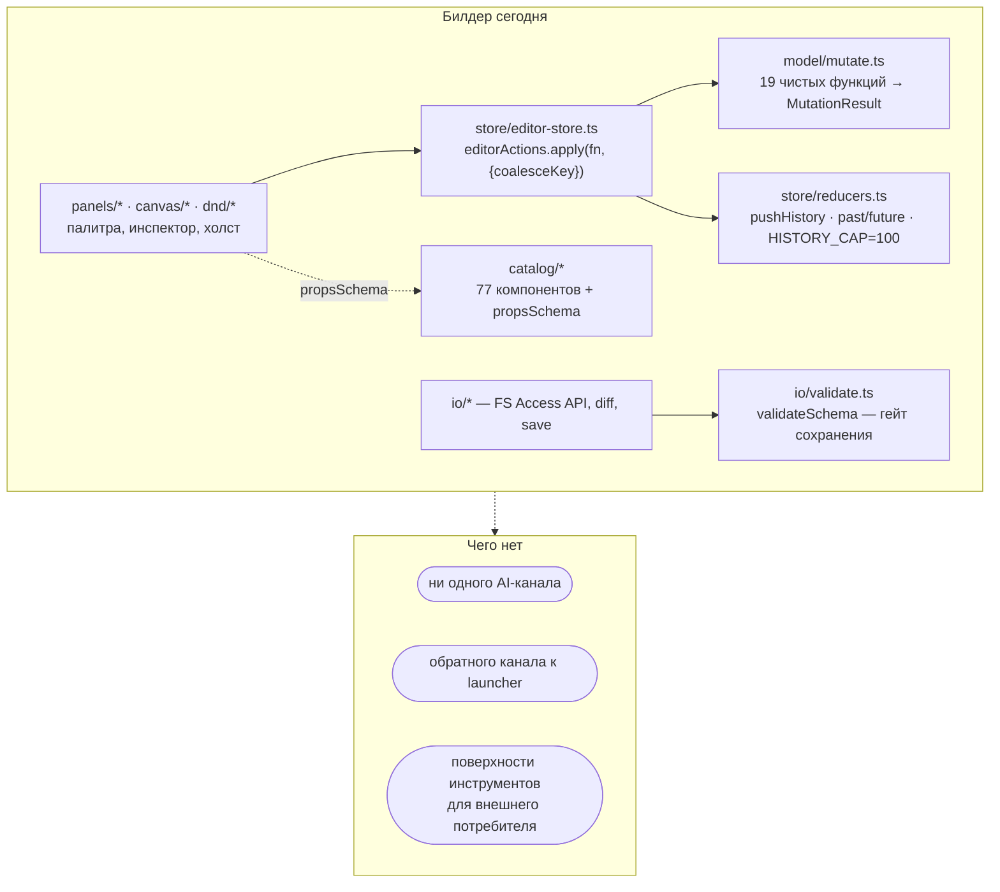
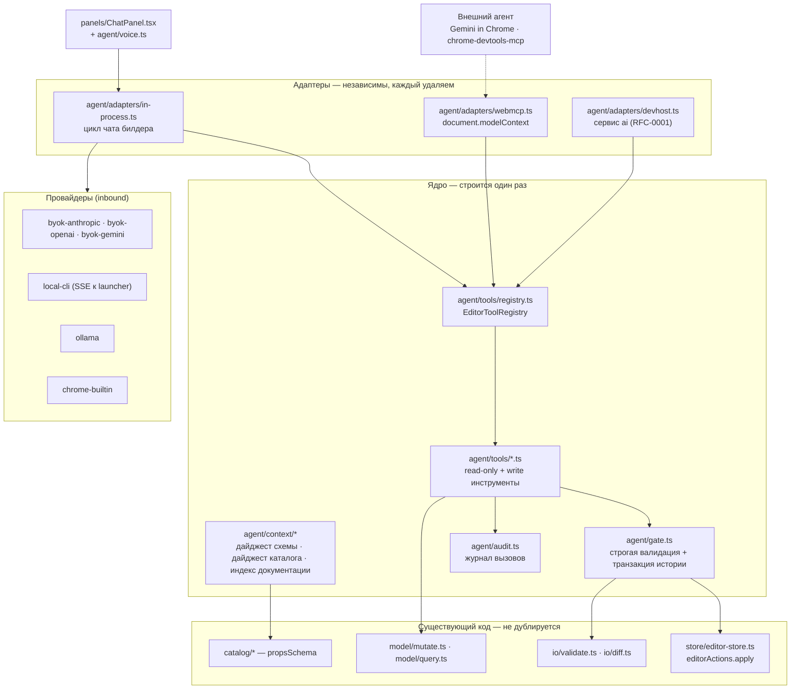
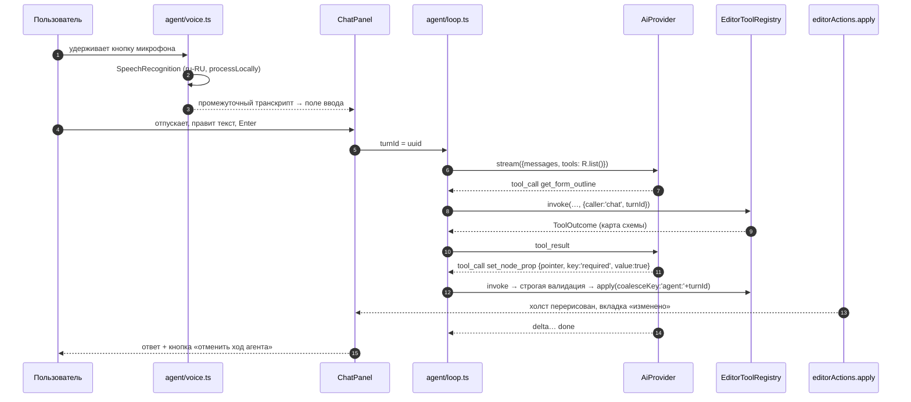

# RFC-0002 — Чат с ИИ-агентом и поддержка WebMCP в ReFormer Builder

**Статус:** 🟡 предложение (архитектурное исследование, к реализации не приступали)
**Дата:** 2026-08-06
**Автор:** Claude Code (по заданию пользователя)
**Скоуп:** `projects/reformer-builder` (новый слой `src/agent/*`), `bin/reformer-builder.mjs`; опорно — `@reformer/mcp`, предлагаемый в [RFC-0001](./0001-local-development-runtime.md) `@reformer/devhost`
**Опоры:** [RFC-0001](./0001-local-development-runtime.md), [спека MVP](../specs/reformer-builder-mvp.md) (read-only), [брейншторм](../brainstorms/reformer-builder.md) §8, код `src/**`, черновик WebMCP (W3C Web Machine Learning CG)

---

## 0. TL;DR и вердикт

**Запрос:** чат с ИИ в билдере; поддержать стандарт WebMCP; «чат должен быть возможен с любым агентом»; четыре сценария — правка схем чатом с голосовым вводом, форма из файла постановки, форма из картинки/макета, справка по редактору.

**Вердикт — раздельный:**

| Часть запроса                | Вердикт                                                      | Почему                                                                                                                                                                                                                                                                    |
| ---------------------------- | ------------------------------------------------------------ | ------------------------------------------------------------------------------------------------------------------------------------------------------------------------------------------------------------------------------------------------------------------------- |
| Поддержать WebMCP            | ✅ **Принять — но как удаляемый outbound-адаптер за флагом** | Черновик CG, не standards-track; за год поверхность ломали дважды (`provideContext` удалён, `navigator.modelContext` → `document.modelContext`); origin trial истекает на Chrome 156. Ставить на него чат нельзя, экспонировать через него редактор — дёшево и правильно. |
| «Чат с любым агентом»        | ⚠️ **Переформулировать**                                     | Буквально недостижимо и внутренне противоречиво: WebMCP **не даёт модели**. Достижимо: (а) провайдер-агностичный чат внутри билдера, (б) возможность вообще не иметь своего чата, когда билдером управляет внешний агент. Это **два разных механизма**, а не один.        |
| Создание и правка схем чатом | ✅ **Принять**                                               | Главная ценность. Ложится на существующую воронку `editorActions.apply` + чистый словарь `model/mutate.ts` без дублирования логики.                                                                                                                                       |
| Голосовой ввод               | ✅ **Принять**                                               | Web Speech API с `processLocally`, `ru-RU` поддержан, ноль байт бандла, работает ровно в тех браузерах, которые билдер и так требует. Самая дешёвая позиция во всём RFC.                                                                                                  |
| Форма из файла постановки    | ✅ **Принять**                                               | Промпт `plan-form` в `@reformer/mcp` уже написан ровно под это; нужен парсер входа и приземление результата через diff.                                                                                                                                                   |
| Форма из картинки/макета     | ⚠️ **Принять с понижением ожиданий**                         | Требует vision-провайдера и по факту даёт **черновик раскладки**, а не готовую схему: модель не знает ваш каталог и придумывает имена компонентов. Ценность есть, но она ниже, чем звучит в постановке.                                                                   |
| Справка по редактору         | ✅ **Принять — самый дешёвый сценарий**                      | `llms.txt` уже генерируется в каждом пакете; локальный индекс работает офлайн, без ключей и без провайдера вообще.                                                                                                                                                        |

**Рекомендуемое решение — вариант V5 «Единая поверхность инструментов + слой провайдеров»:** один реестр типизированных операций редактора (`EditorToolRegistry`), экспонируемый через **три независимых адаптера** — внутренний агентский цикл чата, `document.modelContext` (WebMCP) и, когда появится, сервис `ai` из RFC-0001. Ни один адаптер не является фундаментом для другого; удаление любого не ломает остальные.

**Ключевая мысль всего документа:** запрос смешивает **два ортогональных направления**.

> **Inbound** — билдеру нужна _модель_; билдер выступает клиентом. Решается **слоем провайдеров**.
> **Outbound** — билдер _публикует свои возможности как инструменты_; билдер выступает сервером. Это и есть **WebMCP**, и модели он не даёт.

Общее у них ровно одно — **поверхность инструментов редактора**. Она строится один раз, и именно она, а не чат и не WebMCP, является настоящим предметом этого RFC. Всё остальное — адаптеры вокруг неё.

---

## 1. Анализ: что есть сейчас

### 1.1. Где в билдере вообще есть место для агента

Билдер — офлайн-SPA без бэкенда, ≈22.3k строк `src/`. Существенно для этого RFC: **все правки схемы проходят через одну воронку**, а вся привилегированная работа сосредоточена в `io/*`.



Ключевой факт: **`editorActions.apply(fn, opts)` — единственная точка входа для правок схемы** ([editor-store.ts:70-74](../../src/store/editor-store.ts#L70-L74)). Всё, что через неё проходит, автоматически получает историю, отметку «изменено», перевод выделения на затронутый узел и снятие preview-режима. Агенту не нужно ничего из этого реализовывать заново — ему нужно попасть в эту воронку.

Второй ключевой факт: `model/mutate.ts` — **19 чистых функций**, каждая `(schema, …) => MutationResult`, каждая иммутабельна и сохраняет порядок ключей ради round-trip. Это готовый словарь инструментов; проектировать его заново незачем.

### 1.2. Три физические точки подключения

| Точка                    | Где                                                                          | Что придётся сделать                                                                                                                                                                                                                                                                                              |
| ------------------------ | ---------------------------------------------------------------------------- | ----------------------------------------------------------------------------------------------------------------------------------------------------------------------------------------------------------------------------------------------------------------------------------------------------------------- |
| **Воронка правок**       | [editor-store.ts:63-77](../../src/store/editor-store.ts#L63-L77)             | Ничего менять не нужно, кроме группировки истории на ход агента (см. L4).                                                                                                                                                                                                                                         |
| **Правая зона оболочки** | [EditorLayout.tsx:438-457](../../src/app/EditorLayout.tsx#L438-L457)         | Сейчас там жёстко один инспектор, а `ui.rightOpen` — булево. Нужен `RIGHT_PANELS` по образцу `LEFT_PANELS` ([:37](../../src/app/EditorLayout.tsx#L37)). Зона `data-rb-zone="right"` уже размечена, поэтому обход фокуса по F6 ([:100-141](../../src/app/EditorLayout.tsx#L100-L141)) переиспользуется без правок. |
| **Контракт конфига**     | [runtime-config.schema.json:54-65](../../runtime-config.schema.json#L54-L65) | Секция `ui` объявлена с `additionalProperties: false`, `leftPanel` — enum из трёх значений. Любой новый флаг требует правки **публикуемой** схемы, то есть это версионируемое изменение контракта, а не локальная правка.                                                                                         |

### 1.3. Ограничения

| #       | Ограничение                                                                                                                                                                                                                                                                                                                                                                                                                                                       | Больно? |
| ------- | ----------------------------------------------------------------------------------------------------------------------------------------------------------------------------------------------------------------------------------------------------------------------------------------------------------------------------------------------------------------------------------------------------------------------------------------------------------------- | ------- |
| **L1**  | В билдере нет ни одного AI-канала: в `src/` ноль вхождений `mcp`/`llm`/`ai`/`chat`/`openai`/`anthropic`. Единственный «Чат» — категория палитры для чат-компонентов ui-kit, к делу не относится.                                                                                                                                                                                                                                                                  | 🟠      |
| **L2**  | `@reformer/mcp` работает по stdio — браузер не может его поднять. Это ровно тот вопрос, который [брейншторм §8](../brainstorms/reformer-builder.md) оставил открытым: «MCP-сервер работает в stdio — как билдер к нему обращается». Он же — **L7** в RFC-0001.                                                                                                                                                                                                    | 🔴      |
| **L3**  | Гейт `validateSchema` **намеренно мягкий**: `componentNames` собирается как имена, встреченные **в самой схеме**, объединённые с `KNOWN_COMPONENT_NAMES` ([io/validate.ts:41-48](../../src/io/validate.ts#L41-L48)). Проверка имён при таком входе самоисполняющаяся ⇒ **галлюцинированное имя компонента гейт не поймает**. Для ручных правок это осознанный выбор (в standalone-режиме имена project-specific источников знать неоткуда), для AI-выхода — дыра. | 🔴      |
| **L4**  | Нет транзакций. `coalesceKey` схлопывает только **подряд идущие** правки с тем же ключом; `undo`/`redo` сбрасывает `lastCoalesceKey` в `null`. Многошаговый ход агента, разорванный правкой пользователя, распадётся на несколько записей истории, и «отменить, что сделал агент» станет многократным Ctrl+Z.                                                                                                                                                     | 🟠      |
| **L5**  | Правая зона — один инспектор, `ui.rightOpen: boolean`; аналога `LEFT_PANELS` нет ([EditorLayout.tsx:438-457](../../src/app/EditorLayout.tsx#L438-L457)).                                                                                                                                                                                                                                                                                                          | 🟡      |
| **L6**  | `runtime-config.schema.json` → `ui` с `additionalProperties: false` ⇒ новый флаг = правка публикуемого контракта.                                                                                                                                                                                                                                                                                                                                                 | 🟡      |
| **L7**  | Нет хранилища ни для истории чата, ни для секретов: IndexedDB `reformer-builder` v3 содержит `handles`, `templates`, `drafts` — и всё.                                                                                                                                                                                                                                                                                                                            | 🟡      |
| **L8**  | Хостед-сборка на GitHub Pages не имеет локального процесса ⇒ канал модели там может быть **только браузерным**.                                                                                                                                                                                                                                                                                                                                                   | 🟠      |
| **L9**  | `dist` уже ≈8.6 МБ. Любой парсер документов, любая локальная модель, любой SDK провайдера обязаны быть отдельными lazy-чанками, иначе первый экран деградирует у всех, включая тех, кто чатом не пользуется.                                                                                                                                                                                                                                                      | 🟡      |
| **L10** | Launcher — статик-раздатчик без состояния: `createRequestHandler` ([bin/reformer-builder.mjs:222](../../bin/reformer-builder.mjs#L222)) отвечает `405` на всё, кроме `GET`/`HEAD` ([:224-227](../../bin/reformer-builder.mjs#L224-L227)); обратного канала нет вообще.                                                                                                                                                                                            | 🟠      |
| **L11** | WebMCP локально включается **флагом браузера** (`chrome://flags/#enable-webmcp-testing`), а публичный origin trial истекает на Chrome 156. Сценарий «просто работает» не достигается ни в локальном режиме, ни в хостед-сборке.                                                                                                                                                                                                                                   | 🟠      |
| **L12** | **Ни один канал к модели не покрывает все требования сразу**: у встроенного ИИ браузера нет русского языка и tool-calling; у BYO-ключа проблема секретов и неподтверждённый CORS у части провайдеров; у локального агента нет хостед-сборки. Отсюда неизбежность слоя провайдеров, а не выбора «одного лучшего».                                                                                                                                                  | 🟠      |

**Вывод по анализу:** узкое место не в UI и не в модели. Оно в том, что у редактора **нет описанной машиночитаемой поверхности**, а единственный имеющийся гейт качества (L3) для машинного входа не годится. Это и определяет порядок фаз в §13: поверхность и строгий гейт — раньше, чем чат.

---

## 2. WebMCP: что это и чего он не делает

### 2.1. Поверхность API

```js
const controller = new AbortController();

await document.modelContext.registerTool(
  {
    name: 'insert_node',
    description: 'Вставить компонент в контейнер по JSON Pointer…',
    inputSchema: {
      type: 'object',
      properties: {
        slot: { type: 'string', description: 'JSON Pointer контейнера' },
        component: { type: 'string' },
        index: { type: 'integer' },
      },
      required: ['slot', 'component'],
    },
    annotations: { readOnlyHint: false, untrustedContentHint: false },
    async execute({ slot, component, index }) {
      return { content: [{ type: 'text', text: '…' }] };
    },
  },
  { signal: controller.signal, exposedTo: [] }
);
```

Существенные детали контракта:

| Свойство                     | Значение                                                                                                                                  |
| ---------------------------- | ----------------------------------------------------------------------------------------------------------------------------------------- |
| Точка входа                  | `document.modelContext`. `navigator.modelContext` deprecated в Chrome 150 (переезд 21.07.2026).                                           |
| Снятие регистрации           | Через `AbortSignal` в опциях, не отдельным методом.                                                                                       |
| Возврат `execute`            | Строка либо `{ content: [{ type: 'text', text }] }`.                                                                                      |
| Бюджеты                      | Имя ≤ 30 символов, описание инструмента ≤ 500, описание параметра ≤ 150, вывод инструмента ≤ 1.5 КБ.                                      |
| Аннотации                    | `readOnlyHint`, `untrustedContentHint`. `destructiveHint`/`idempotentHint` есть в community-типах (`@mcp-b/webmcp-types`), но не в спеке. |
| `exposedTo`                  | Список доверенных origin для кросс-оригинного доступа. По умолчанию — только свой origin.                                                 |
| iframes                      | Кросс-оригинным нужен Permissions Policy `allow="tools"`.                                                                                 |
| Обнаружение                  | `getTools()` / `executeTool()` в черновике помечены как TODO.                                                                             |
| **Ошибки**                   | **Нормативного контракта нет.** Ни `isError`, ни типа результата-ошибки; валидация входа/выхода — в открытых вопросах.                    |
| **`outputSchema`**           | **В спеке отсутствует**, только в community-типах.                                                                                        |
| **`requestUserInteraction`** | В тексте спецификации отсутствует; «user prompting and elicitation» — открытый вопрос.                                                    |

Последние три строки означают: **подтверждение опасных операций и структурированный ответ надо делать своим UI и своим соглашением**, а не полагаться на спеку. Это прямо влияет на §11.

### 2.2. Статус и история ломающих правок

- W3C Web Machine Learning **Community Group**, **Draft Community Group Report** (первая публикация 13.08.2025, отчёт CG 12.02.2026). Не standards-track. Порядка 108 открытых issue.
- Chrome: ранний preview в 146 Canary (февраль 2026), dev trial 18.05.2026, **публичный origin trial Chrome 149–156**. **Edge 147 — нативная поддержка.** Firefox и Safari участвуют в обсуждении без обязательств.
- Ломающие правки за 12 месяцев: удалены `provideContext()`/`clearContext()` (март 2026); перенос `navigator.modelContext` → `document.modelContext` (июль 2026).

**Честная оценка:** две ломающие правки за год при отсутствии второго независимого потребителя — это не «стандарт, который можно закладывать в архитектуру», а **интерфейс, который надо уметь выбросить**. Отсюда требование к адаптеру в §5.4.

### 2.3. Кто сегодня может вызвать инструменты страницы

| Потребитель                                                                  | Статус         | Как                                                                                                                                                        |
| ---------------------------------------------------------------------------- | -------------- | ---------------------------------------------------------------------------------------------------------------------------------------------------------- |
| Gemini in Chrome                                                             | заявлен первым | нативно                                                                                                                                                    |
| Расширение браузера                                                          | работает       | content script; заметьте — расширение с `host_permission` и без WebMCP может делать со страницей всё что угодно, WebMCP тут не расширяет поверхность атаки |
| **CLI-агент (Claude Code, Codex, …)**                                        | **работает**   | `chrome-devtools-mcp` по CDP                                                                                                                               |
| MCP-B (расширение + native messaging + streamable-HTTP на `127.0.0.1:12306`) | **deprecated** | исторический путь, упоминается как отклонённая альтернатива                                                                                                |

Рабочая цепочка для CLI-агента — **без своего расширения и без своего сервера**:

```
Claude Code / Codex ──stdio──▶ chrome-devtools-mcp ──CDP──▶ Chrome (--enable-features=WebMCP)
                                                             └─▶ вкладка http://127.0.0.1:4321
```

Требуется Chrome 150+, флаг `--categoryExperimentalWebmcp=true` у `chrome-devtools-mcp` и подключение к уже запущенному браузеру через `--browser-url=http://127.0.0.1:9222`.

Это важно на двух уровнях. Во-первых, это конкретный абзац для README вместо обещания «когда-нибудь появится агент». Во-вторых, **это снимает необходимость плагина `devhost-plugin-mcp`** для сценария «агент из терминала правит открытую схему», который RFC-0001 §6.3 планировал строить отдельно — конкретное упрощение относительно предыдущего RFC.

### 2.4. Почему WebMCP не решает задачу чата

Это главное недопонимание, ради снятия которого написан раздел.

|                                | Inbound (чат)                    | Outbound (WebMCP)                            |
| ------------------------------ | -------------------------------- | -------------------------------------------- |
| Кто инициирует                 | пользователь в панели билдера    | внешний агент                                |
| Кто держит цикл рассуждения    | билдер                           | агент                                        |
| Кто платит за токены           | пользователь билдера             | владелец агента                              |
| Что нужно билдеру              | **модель + агентский цикл + UI** | **реестр инструментов**                      |
| Даёт ли WebMCP модель          | —                                | **нет**                                      |
| Работает ли без второй стороны | да, если есть провайдер          | нет: без агента инструменты никто не вызовет |

Вывод: «поддержать WebMCP» и «сделать чат» — **непересекающиеся работы**, объединённые общим реестром инструментов. RFC планирует их как отдельные фазы (§13), которые можно останавливать независимо.

### 2.5. Локальный запуск: токен origin trial не нужен

Опасение, что origin trial привязан к origin **включая порт**, а launcher делает fallback по портам (`4321` + 20), — снимается:

- WebMCP помечен `[SecureContext]`; `http://127.0.0.1` и `http://localhost` — potentially-trustworthy origins, поэтому обычный HTTP локально проходит.
- Включается **флагом профиля**: `chrome://flags/#enable-webmcp-testing` (Chrome ≥ 146.0.7672.0) либо `--enable-features=WebMCP`. Флаг **per-profile, не per-origin** — покрывает любой порт и переживает окончание origin trial.
- Токен для `localhost` технически выпустить можно, но смысла нет.

Цена: пользователь обязан включить флаг, и это надо честно написать в README (L11).

---

## 3. Каналы к модели

### 3.1. Сводная таблица

| Канал                              |    Tool-calling     | Картинки | Офлайн |             GitHub Pages             | Русский | Секреты в браузере                |
| ---------------------------------- | :-----------------: | :------: | :----: | :----------------------------------: | :-----: | --------------------------------- |
| BYO-ключ Anthropic                 |         ✅          |    ✅    |   ❌   |                  ✅                  |   ✅    | 🔴 ключ у пользователя в браузере |
| BYO-ключ OpenAI                    |         ✅          |    ✅    |   ❌   |      ⚠️ CORS **не подтверждён**      |   ✅    | 🔴                                |
| BYO-ключ Gemini                    |         ✅          |    ✅    |   ❌   | ⚠️ preflight официального SDK падает |   ✅    | 🔴                                |
| Локальный CLI-агент через launcher |         ✅          |    ✅    |   ❌   |                  ❌                  |   ✅    | 🟢 нет                            |
| Ollama на `127.0.0.1:11434`        |     ~ по модели     |  ~ VLM   |   ✅   | ⚠️ `OLLAMA_ORIGINS` + разрешение LNA |   ✅    | 🟢 нет                            |
| Chrome Prompt API (Gemini Nano)    |         ❌          |    ✅    |   ✅   |                  ✅                  |   ❌    | 🟢 нет                            |
| Внешний агент через WebMCP         | н/п — цикл у агента |   н/п    |  н/п   |                  ✅                  |   ✅    | 🟢 нет                            |

### 3.2. Встроенный ИИ браузера — разбор, который меняет ожидания

Chrome Prompt API включён по умолчанию в десктопном Chrome 148 (в расширениях стабилен с 138). Он бесплатен, офлайн и не требует ключей — на бумаге идеальный кандидат.

**Три ограничения, которые дисквалифицируют его как канал чата в этом продукте:**

1. **Нет русского языка.** Поддержаны `en`, `es`, `ja`; с Chrome 149 добавлены `de`, `fr`. Для продукта, где документация, спеки и пользователи русскоязычные, это не деталь, а блокер.
2. **Нет tool-calling.** Модель может _сказать_, что нужно вызвать, но механизма вызова в API нет — агентский цикл правок схемы на нём не строится.
3. **Недоступен в Web Workers.** Инференс идёт в главном потоке, а оболочка билдера держит Monaco и живой рендер формы.

**Что ему остаётся честно:** офлайновая классификация и извлечение сущностей на английском, короткие подсказки, черновая нормализация текста перед отправкой в основной канал. Это полезная, но вспомогательная роль.

> Это прямое расхождение с постановкой: канал был назван обязательным для первой фазы **до** того, как выяснились его ограничения. RFC не предлагает его выбросить — он предлагает переназначить ему роль (§8.3) и не строить на нём ни один из четырёх сценариев целиком.

### 3.3. BYO-ключ — и осознанное расхождение с RFC-0001

RFC-0001 §3.3 формулирует жёстко: «Ключи и токены остаются на стороне провайдера; **в браузер не передаются никогда**».

Требование «чат обязан работать в хостед-сборке на GitHub Pages» (L8) делает это правило невыполнимым: локального процесса там нет, встроенный ИИ браузера не говорит по-русски и не умеет инструменты, значит остаётся только ключ в браузере.

**Расхождение признаётся, а не маскируется**, и ограничивается так:

- Anthropic в собственной документации явно разрешает прямой вызов из браузера для «internal tools … used solely within a controlled internal environment where the users are trusted» и для «development or debugging purpose». Локальный dev-инструмент с ключом пользователя укладывается в эту оговорку; **публичная витрина — нет**.
- Отсюда правило: в локальном режиме BYO-ключ — приемлемый вариант по умолчанию; в хостед-сборке он доступен только после **явного экрана согласия** с прямым текстом о том, что ключ уходит в браузерное хранилище и что трафик идёт напрямую к провайдеру мимо инфраструктуры проекта.
- CORS у OpenAI — **противоречивые свидетельства**, у Gemini официальный JS SDK не проходит preflight из-за собственных заголовков. Оба помечены как непроверенные и должны быть проверены до реализации, а не обещаны.

### 3.4. Локальный агент — и как его получить, не дожидаясь devhost

Требование иметь локальный канал в первой фазе конфликтует с тем, что `@reformer/devhost` из RFC-0001 не существует (его фазы F0–F4 — это ≈10–14 недель).

**Предлагаемое разрешение:** launcher уже является HTTP-сервером ([bin/reformer-builder.mjs:222](../../bin/reformer-builder.mjs#L222)). В него добавляется **один эндпоинт** `POST /__reformer-builder/ai/stream` (SSE), который спавнит уже установленный у пользователя CLI-агент и транслирует его вывод. Это ≈150 строк, включаемых флагом `--enable-ai` (deny-by-default, принцип **P3** RFC-0001), и требует снять безусловный `405` на не-`GET` ([:224-227](../../bin/reformer-builder.mjs#L224-L227)).

Это **не** devhost и не претендует им быть. Когда devhost появится, эндпоинт мигрирует в сервис `ai` **без изменения браузерного контракта** — потому что браузер уже разговаривает с ним через `AiProvider` (§8.1), а не с эндпоинтом напрямую. Миграция описана заранее именно для того, чтобы решение не выглядело срезанным углом.

Конкретные флаги CLI (`codex app-server` как долгоживущий JSON-RPC-процесс, `--output-format stream-json` у Gemini CLI, headless-режим Claude Code) **в этом RFC не фиксируются намеренно** — по той же причине, что и в RFC-0001 §6.2: они меняются между версиями, адаптер обязан иметь `detect()` и деградировать в `available: false` с внятной причиной.

### 3.5. Что доступно в каком режиме

| Режим                                  | Доступные каналы                                                                        | Что деградирует                                                                                                                                                        |
| -------------------------------------- | --------------------------------------------------------------------------------------- | ---------------------------------------------------------------------------------------------------------------------------------------------------------------------- |
| **Локальный** (`npx reformer-builder`) | локальный CLI-агент, Ollama, BYO-ключ, встроенный ИИ браузера, WebMCP (с флагом)        | —                                                                                                                                                                      |
| **Хостед** (GitHub Pages)              | BYO-ключ (за экраном согласия), встроенный ИИ браузера, WebMCP (пока идёт origin trial) | локальный агент и Ollama недоступны; Ollama теоретически достижим, но требует `OLLAMA_ORIGINS` и разрешения Local Network Access (Chrome 148+) — как дефолт не годится |
| **Без провайдеров**                    | справка на локальном индексе документации                                               | панель чата рендерится, но с явным сообщением «провайдер не выбран» и ссылкой на настройку — не пустой заглушкой                                                       |

Последняя строка — это принцип **P1** RFC-0001 («runtime-optional») в применении к AI: **отсутствие провайдера не ломает ни один существующий сценарий билдера**.

---

## 4. Варианты

### V0 — Не делать чат; усилить внешний воркфлоу

Пользователь и так держит рядом Claude Code или Codex. Вместо чата: следить за файлом схемы, давать «перечитать с диска», и подключить агента через `chrome-devtools-mcp` (§2.3).

- **Снимает:** L2 частично.
- **Плюс:** почти бесплатно; ноль секретов; ноль зависимости от черновиков; агент пользователя уже настроен и оплачен.
- **Минус:** не закрывает голосовой ввод и справку внутри редактора; сценарии 2 и 3 остаются полностью на стороне агента; продукт не получает дифференциации.

### V1 — Только outbound WebMCP

Регистрируем инструменты, своего чата нет.

- **Снимает:** L2.
- **Плюс:** самая дешёвая реализация; ноль секретов; открывает продукт агентской экосистеме.
- **Минус:** сценарий «голосовой ввод в панели чата» не реализуется в принципе; ценность нулевая, пока у пользователя нет агента и включённого флага (L11).

### V2 — Только чат на BYO-ключе

- **Снимает:** L1, L8.
- **Плюс:** работает везде, включая хостед-сборку; полноценный tool-calling и картинки.
- **Минус:** секреты в браузере; расхождение с RFC-0001 §3.3 без компенсации; CORS у двух из трёх провайдеров не подтверждён; требование «поддержать WebMCP» не выполнено вовсе.

### V3 — Только рантайм-канал (ждать RFC-0001)

- **Снимает:** L1, L2, L10.
- **Плюс:** архитектурно чистейший вариант; ключи не попадают в браузер; переиспользует `@reformer/mcp` внутри цикла генерации.
- **Минус:** блокируется на 10–14 недель чужой работы; **не работает в хостед-сборке вообще** — прямое нарушение согласованного требования.

### V4 — Только встроенный ИИ браузера

- **Плюс:** ноль ключей, ноль сети, ноль стоимости.
- **Минус:** **нет русского языка и нет tool-calling** (§3.2). Ни один из четырёх сценариев не закрывается целиком. Отклоняется как самостоятельный вариант.

### V5 — Единая поверхность инструментов + слой провайдеров ⭐ (рекомендуется)

Один реестр операций редактора; три адаптера поверх него (внутренний чат, WebMCP, будущий devhost); `AiProvider` как контракт канала, совместимый с RFC-0001 §6.1.

- **Снимает:** L1, L2, L3, L4, L8, L11 (частично), L12.
- **Плюс:** каждая часть шипится и останавливается независимо; WebMCP становится удаляемым адаптером, а не фундаментом; переиспользует `apply`/`mutate`/`catalog`/`validate` вместо дублирования; прямо ложится на `AiProvider` из RFC-0001 без переписывания.
- **Минус:** самая широкая поверхность из всех вариантов; требует дисциплины, чтобы реестр инструментов не расползся; три канала в первой фазе утраивают поверхность отладки.

### V6 — Полноценный агентский рантайм внутри билдера

Свой оркестратор, RAG по проекту, долговременная память, планировщик.

- **Плюс:** потолок возможностей выше всех.
- **Минус:** это отдельный продукт. Один мейнтейнер, билдер в версии `0.0.0`, незакрытый MVP. **Отклоняется как выход за скоуп** — по той же логике, по которой RFC-0001 §3.1 отказался от «универсального шлюза к компьютеру».

### 4.1. Сравнительная таблица

Шкала 1–5, больше — лучше.

| Критерий                                 |   V0   |   V1   |   V2   |   V3   |   V4   |  **V5**   |   V6   |
| ---------------------------------------- | :----: | :----: | :----: | :----: | :----: | :-------: | :----: |
| Простота реализации                      |   5    |   5    |   4    |   2    |   4    |     2     |   1    |
| Безопасность                             |   5    |   4    |   2    |   5    |   5    |     3     |   2    |
| Работает без рантайма (P1)               |   5    |   5    |   5    |   1    |   5    |     5     |   3    |
| Покрытие 4 сценариев                     |   1    |   2    |   4    |   4    |   1    |     5     |   5    |
| Выполняет требование «поддержать WebMCP» |   2    |   5    |   1    |   1    |   1    |     5     |   4    |
| Устойчивость к смене черновика WebMCP    |   5    |   1    |   5    |   5    |   5    |     4     |   3    |
| Стоимость поддержки                      |   5    |   4    |   3    |   3    |   4    |     2     |   1    |
| Ценность для OSS-видимости               |   2    |   4    |   2    |   3    |   2    |     5     |   4    |
| **Сумма**                                | **30** | **30** | **26** | **24** | **27** | **31 ⭐** | **23** |

Таблица честнее, чем выглядит: V5 выигрывает **с минимальным отрывом** и проигрывает V0/V1 по простоте и стоимости поддержки почти вдвое. Его преимущество целиком в двух строках — покрытие сценариев и выполнение поставленного требования. Если приоритет сместится в сторону «минимум поддержки», V0 остаётся рациональным выбором (§15).

### 4.2. Выбор и обоснование

**Выбран V5**, потому что:

1. Он **единственный** удовлетворяет обе половины запроса одновременно, не превращая одну в фундамент другой.
2. Он строится на существующих швах (`apply`, `mutate`, `catalog`, `validate`, `diff`), а не рядом с ними — то есть код фичи мал по сравнению с её ценностью.
3. Он переживает смерть WebMCP: адаптер `webmcp.ts` удаляется одним коммитом, реестр и чат продолжают работать.
4. Он переживает появление devhost: адаптер провайдера меняется, браузерный контракт нет.

**Что отклонено и почему** (коротко, чтобы решение не пересматривали по кругу):

- **WebMCP как транспорт для чата** — WebMCP не даёт модели; это категориальная ошибка, а не компромисс.
- **Ставка на встроенный ИИ браузера как основной канал** — нет русского и нет tool-calling.
- **Ожидание devhost перед началом (V3)** — нарушает согласованное требование работать в хостед-сборке и блокирует работу на месяцы.
- **Собственный агентский рантайм (V6)** — скоуп отдельного продукта при одном мейнтейнере.
- **Расширение браузера / native messaging (MCP-B)** — путь deprecated, а роль закрывается `chrome-devtools-mcp`.
- **Браузер как MCP-клиент по Streamable HTTP** — спецификация MCP предписывает серверам валидировать `Origin` и слушать только loopback именно против такого обращения; плюс OAuth-редиректы на динамический порт launcher'а.

---

## 5. Архитектура

### 5.1. Слои



Правило, определяющее всю схему: **адаптер не содержит доменной логики**. Он умеет только переводить чужой контракт вызова в `EditorToolRegistry.invoke()` и обратно. Поэтому удаление любого адаптера — механическая операция.

### 5.2. Контракты

```ts
/** Одна операция редактора, описанная машиночитаемо. */
export interface EditorTool<P = unknown> {
  /** ≤30 символов — ограничение WebMCP; используется как идентификатор во всех адаптерах. */
  readonly name: string;
  /** ≤500 символов — ограничение WebMCP. */
  readonly description: string;
  /** JSON Schema параметров; описание каждого параметра ≤150 символов. */
  readonly inputSchema: object;
  /** Не меняет состояние редактора. Влияет на readOnlyHint и на политику подтверждения. */
  readonly readOnly: boolean;
  /**
   * Требует явного подтверждения пользователя перед исполнением, когда вызов пришёл
   * из внешнего адаптера. Спека WebMCP механизма подтверждения не даёт (§2.1) — это наш контракт.
   */
  readonly requiresConfirmation?: boolean;
  run(params: P, ctx: ToolContext): Promise<ToolOutcome>;
}

export interface ToolContext {
  /** Кто вызвал: свой чат, WebMCP-агент, devhost. Пишется в аудит и влияет на политику. */
  readonly caller: 'chat' | 'webmcp' | 'devhost';
  /** Идентификатор хода агента — ключ группировки истории (см. §7.3). */
  readonly turnId: string;
  readonly signal: AbortSignal;
}

/** Ответ инструмента. `text` обязан укладываться в 1.5 КБ (бюджет WebMCP). */
export interface ToolOutcome {
  ok: boolean;
  text: string;
  /** Структурированная часть — для своего чата; во внешние адаптеры не уходит:
   *  outputSchema в спеке WebMCP отсутствует (§2.1). */
  data?: unknown;
}

export interface EditorToolRegistry {
  list(filter?: { readOnly?: boolean }): readonly EditorTool[];
  invoke(name: string, params: unknown, ctx: ToolContext): Promise<ToolOutcome>;
}
```

Контракт канала намеренно **совместим с RFC-0001 §6.1** — это тот же `AiProvider`, расширенный полем `origin`, чтобы UI мог объяснить пользователю, где именно исполняется запрос:

```ts
export interface AiProvider {
  readonly id:
    | 'byok-anthropic'
    | 'byok-openai'
    | 'byok-gemini'
    | 'local-cli'
    | 'ollama'
    | 'chrome-builtin'
    | (string & {});
  readonly displayName: string;
  /** Где исполняется запрос — определяет предупреждения UI и допустимость в хостед-сборке. */
  readonly origin: 'browser' | 'loopback' | 'cloud';
  detect(): Promise<{ available: boolean; version?: string; reason?: string }>;
  capabilities(): AiCapabilities;
  stream(req: AiRequest, ctx: AiCallContext): AsyncIterable<AiEvent>;
  dispose?(): Promise<void>;
}

export interface AiCapabilities {
  streaming: boolean;
  /** false у Chrome Prompt API — агентский цикл на таком провайдере не запускается (§3.2). */
  tools: boolean;
  images: boolean;
  /** Коды языков; отсутствие 'ru' — основание не предлагать провайдер как канал чата. */
  languages: readonly string[];
  maxInputBytes?: number;
}

export type AiEvent =
  | { type: 'delta'; text: string }
  | { type: 'tool_call'; id: string; name: string; args: unknown }
  | { type: 'tool_result'; id: string; result: ToolOutcome }
  | { type: 'usage'; input?: number; output?: number }
  | { type: 'error'; message: string; retryable: boolean }
  | { type: 'done'; reason: 'complete' | 'aborted' | 'error' };
```

`AiEvent` намеренно повторяет union из RFC-0001 §6.1: все три CLI-агента и все три облачных провайдера отдают его надмножество, поэтому нормализация к нему возможна без потерь.

### 5.3. Как это ложится на существующий код

| Слой RFC          | Существующий символ                                                         | Что делает новый код                                                                  |
| ----------------- | --------------------------------------------------------------------------- | ------------------------------------------------------------------------------------- |
| write-инструменты | [`editorActions.apply`](../../src/store/editor-store.ts#L70-L74)            | только вызывает; логики истории не содержит                                           |
| словарь операций  | `model/mutate.ts` (19 функций, `MutationResult`)                            | оборачивает 1:1, ничего не переписывает                                               |
| адресация узлов   | `model/paths.ts` — `toPointer`/`fromPointer` (RFC 6901)                     | **JSON Pointer как внешний адрес узла** — стабильная строка вместо массива `JsonPath` |
| дайджест схемы    | `model/query.ts` — `walkNodes`, `collectModelPaths`, `collectOperatorNames` | собирает компактное представление (§7.1)                                              |
| дайджест каталога | `catalog/` — `getCatalog()`, `CatalogEntry.propsSchema`                     | инструменты `list_components` / `describe_component`                                  |
| гейт качества     | [`io/validate.ts`](../../src/io/validate.ts#L40-L50)                        | **добавляет строгий режим** (§7.4), мягкий остаётся для ручных правок                 |
| ревью правок      | `io/diff.ts`, `io/save.ts`, `SaveDialog`                                    | переиспользует для подтверждения крупных правок агента                                |
| справка           | `packages/*/llms.txt`, промпты `@reformer/mcp`                              | локальный индекс, без сети                                                            |

Оценка объёма: собственно новый код — реестр, адаптеры, цикл, панель, дайджесты. Доменной логики в нём нет; это соединительная ткань поверх уже написанного.

### 5.4. Требование к WebMCP-адаптеру

Адаптер обязан быть **удаляемым за один коммит**. Практически:

1. Единственный файл, знающий про `document.modelContext` — `agent/adapters/webmcp.ts`. Ни одно слово `modelContext` не встречается больше нигде.
2. Обнаружение поверхности — динамическое, с поддержкой обоих мест: `document.modelContext ?? navigator.modelContext`, оба необязательны, отсутствие обоих = адаптер не активируется и ничего не логирует громко.
3. Снятие регистрации — через `AbortController`, привязанный к жизненному циклу приложения.
4. Никакой другой модуль не зависит от типов WebMCP; типы объявляются структурно внутри адаптера (тем же приёмом, что и FS Access API в `io/fs-ops.ts`, где `lib.dom` неполон).

---

## 6. Поверхность инструментов редактора

Имена ≤ 30 символов, описания ≤ 500, вывод ≤ 1.5 КБ — бюджеты WebMCP (§2.1) применяются **ко всем** адаптерам, чтобы поверхность была одна.

### 6.1. Read-only

| Инструмент             | Назначение                                                                                                                                    | Опирается на                                        |
| ---------------------- | --------------------------------------------------------------------------------------------------------------------------------------------- | --------------------------------------------------- |
| `get_form_outline`     | Карта открытой схемы: дерево узлов с JSON Pointer, именем компонента и `$model`-путём, без `componentProps`. Основной способ «увидеть» форму. | `model/query.ts#walkNodes`                          |
| `get_form_node`        | Полный JSON одного узла по JSON Pointer — когда дайджеста недостаточно.                                                                       | `model/query.ts#findByPath`, `paths.ts#fromPointer` |
| `list_components`      | Имена, роли (`field`/`container`/`array`) и категории компонентов каталога. **Единственный легальный источник имён** — лечит галлюцинации.    | `catalog#getCatalog`                                |
| `describe_component`   | Props-схема одного компонента: свойства, типы, допустимые значения.                                                                           | `CatalogEntry.propsSchema`                          |
| `validate_form`        | Прогнать текущую или предложенную схему через строгий гейт и вернуть ошибки списком.                                                          | `io/validate.ts` + строгий режим (§7.4)             |
| `get_selection`        | Что сейчас выделено и в какой вкладке — контекст для «сделай это поле обязательным».                                                          | `store` селекторы                                   |
| `search_reformer_docs` | Поиск по документации ReFormer в локальном индексе: разделы `llms.txt` всех пакетов. Работает офлайн и без провайдера.                        | `packages/*/llms.txt`                               |

### 6.2. Write

Все без исключения проходят через `editorActions.apply` и потому попадают в историю.

| Инструмент            | Отображается на                                                              |
| --------------------- | ---------------------------------------------------------------------------- |
| `set_node_prop`       | `mutate.setComponentProp`                                                    |
| `set_node_component`  | `mutate.setComponent`                                                        |
| `insert_node`         | `mutate.insertNode` / `mutate.appendNode`                                    |
| `remove_node`         | `mutate.removeNode`                                                          |
| `move_node`           | `mutate.moveNode`                                                            |
| `duplicate_node`      | `mutate.duplicateNode`                                                       |
| `group_nodes`         | `mutate.groupBlock`                                                          |
| `wrap_nodes_in_row`   | `mutate.wrapInRow` / `mutate.wrapPairInRow`                                  |
| `select_node`         | `editorActions.select` — правит только UI, в историю не идёт                 |
| `propose_form_schema` | целая схема; **не коммитится напрямую** — уходит в diff-подтверждение (§7.2) |
| `undo_agent_turn`     | откат всего хода агента одним действием (§7.3)                               |

**Чего в поверхности сознательно нет:** записи на диск, чтения произвольных файлов, запуска процессов, установки пакетов. Всё это — скоуп `@reformer/devhost` (RFC-0001 §9.4), и втягивать его сюда означало бы повторить ошибку «универсального шлюза», от которой RFC-0001 отказался в §3.1. Сохранение на диск остаётся ручным действием пользователя через существующую модалку.

---

## 7. Как агент видит схему и как её правит

### 7.1. Дайджест вместо полного JSON

Отдавать модели весь `JsonFormSchema` — плохая идея на трёх основаниях: реальные формы (например, кредитная заявка в `react-playground`) занимают тысячи строк; `componentProps` содержит много шума, не влияющего на структурные решения; вложенные деревья внутри `componentProps.steps` у мастера ломают наивную оценку размера.

`get_form_outline` возвращает построчную карту:

```
/root                      Box
/root/children/0           Wizard            steps: 4
/root/children/0/…/0       Input             $model(applicant.firstName)   required
/root/children/0/…/1       Select            $model(loan.type)             $dataSource(LOAN_TYPES)
```

Полный узел запрашивается точечно через `get_form_node`. Это же даёт естественную защиту от переполнения контекста (§12).

### 7.2. Два режима правки

| Режим           | Когда                                                                   | Как приземляется                                                                                                                                                                                          |
| --------------- | ----------------------------------------------------------------------- | --------------------------------------------------------------------------------------------------------------------------------------------------------------------------------------------------------- |
| **Гранулярный** | правка существующей формы («сделай телефон обязательным», «добавь шаг») | каждый вызов write-инструмента идёт в `apply` сразу; пользователь видит изменения на холсте по мере хода агента                                                                                           |
| **Целиком**     | генерация с нуля (сценарии 2 и 3)                                       | `propose_form_schema` **не коммитит**: результат проходит строгую валидацию, затем показывается как diff против текущей схемы, и только подтверждение пользователя вызывает `editorActions.replaceSchema` |

Второй режим переиспользует уже существующий механизм ревью: `io/diff.ts` и модалку сохранения. Брейншторм §8 предлагал ровно это — «Ассист-редактирование … → предложение diff».

### 7.3. Транзакция хода агента

Проблема — L4: `coalesceKey` схлопывает только подряд идущие правки, а `undo`/`redo` сбрасывает `lastCoalesceKey`.

Предлагаемое решение — **минимальное изменение в сторе, а не новая подсистема**:

1. Все правки одного хода используют `coalesceKey = 'agent:' + turnId`.
2. На время хода панель чата держит **мягкую блокировку холста**: правки пользователя не запрещены, но при первой такой правке ход агента помечается как «прерван», и `undo_agent_turn` честно сообщает, что откатит только часть.
3. Альтернатива, если п.2 окажется недостаточным — снимок схемы на начало хода в состоянии чата и откат через `replaceSchema`. Это дороже по памяти, но не требует правок в `reducers.ts`.

Выбор между 2 и 3 сознательно оставлен открытым (§16.3): он зависит от того, насколько часто пользователи реально правят холст во время работы агента, а этих данных сейчас нет.

### 7.4. Строгий режим валидации

Существующий `validateSchema` подаёт в валидатор имена компонентов, **собранные из самой проверяемой схемы** ([io/validate.ts:41-48](../../src/io/validate.ts#L41-L48)). Для ручных правок это правильно: в standalone-режиме имена project-specific источников знать неоткуда, и строгая проверка давала бы ложные срабатывания.

Для машинного входа это ровно наоборот. Добавляется второй режим:

```ts
validateSchema(schema, { strict: true });
// strict: componentNames — ТОЛЬКО имена каталога (getCatalog()), без объединения
//         с именами из схемы; неизвестное имя компонента = ошибка, а не молчание.
```

Дополнительно в строгом режиме проверяется, что каждый `$model(path)` разрешается против модели вкладки, а не является выдуманным путём.

Строгий режим применяется к **любому** выходу агента до того, как он попадёт в `apply` или в diff. Мягкий режим остаётся дефолтом для ручного сохранения — поведение существующих сценариев не меняется.

---

## 8. Провайдеры и «любой агент»

### 8.1. Разрешение формулировки

«Чат с любым агентом» распадается на два выполнимых утверждения:

1. **Любой провайдер модели** — за счёт `AiProvider` (§5.2): чтобы добавить канал, пишется один файл с `detect`/`capabilities`/`stream`, остальной код не меняется.
2. **Любой внешний агент** — за счёт WebMCP-адаптера: агент, умеющий WebMCP (нативно или через `chrome-devtools-mcp`), управляет билдером, и своя панель чата в этом сценарии не участвует вовсе.

Чего **не** будет: универсального моста к произвольному агенту без адаптера. Такого механизма не существует ни в MCP, ни в WebMCP, и обещать его нельзя.

### 8.2. Негоциация и деградация

На старте панели выполняется `detect()` всех зарегистрированных провайдеров, результат кешируется. UI показывает список доступных с указанием `origin` (`browser` / `loopback` / `cloud`) — пользователь всегда видит, куда уходит его текст. Провайдер без `capabilities().tools` **не предлагается** как канал для правок схемы: агентский цикл на нём не запускается, и это объясняется прямо в интерфейсе, а не молчаливым отказом.

Отсутствие всех провайдеров не ломает ничего: справка (§9.4) работает на локальном индексе, WebMCP-адаптер регистрируется независимо от провайдеров, остальной билдер не знает о существовании чата.

### 8.3. Честная роль встроенного ИИ браузера

Учитывая §3.2, ему отводится вспомогательная роль: офлайновая работа на английском (классификация, извлечение полей, нормализация), но не роль канала чата и не роль исполнителя правок схемы. Это отличается от исходной постановки, и отличие названо здесь явно, а не спрятано в примечание.

---

## 9. Сценарии

### 9.1. Правка схемы чатом + голос



Фаза: базовый цикл — F2, голос — F3.

### 9.2. Форма из файла постановки

Пользователь бросает `.md`/`.docx`/`.pdf` в панель. Текст извлекается **в браузере** ленивым чанком, затем в модель уходит: текст постановки + дайджест каталога (`list_components`) + требование отвечать вызовом `propose_form_schema`. Результат проходит строгий гейт, показывается diff, применяется по подтверждению.

Здесь переиспользуется промпт `plan-form` из `@reformer/mcp` — он написан ровно под «прочитать спеку и выдать план формы». Что берётся: текст промпта; чего не берётся: stdio-транспорт (L2).

Бюджет бандла (L9): `.md`/`.txt` — бесплатно; `.docx` — `mammoth`; `.pdf` — `pdfjs-dist`, где основная цена не в основном модуле, а в воркере (~1.4 МБ несжатого). Все три — отдельные динамические импорты, загружаемые в момент броска файла соответствующего типа, и `.pdf` стоит включать последним. Фаза: F4.

### 9.3. Форма из картинки или макета

Изображение попадает через вставку из буфера, drag&drop или файловый пикер, ужимается до разумного размера и уходит в vision-провайдер вместе с дайджестом каталога.

**Понижение ожиданий, которое обязано быть в документе:** модель по картинке уверенно распознаёт _раскладку_ — сколько полей, как сгруппированы, что где подписано. Она **не знает вашего каталога** и будет предлагать имена компонентов, которых нет. Поэтому выход этого сценария — **черновик структуры**, который строгий гейт (§7.4) обязательно отклонит хотя бы частично, после чего агент чинит имена через `list_components`. Это работающий цикл, но это не «загрузил макет — получил форму». Фаза: F4.

### 9.4. Справка по редактору

Самый дешёвый и самый устойчивый сценарий: `search_reformer_docs` ищет по локальному индексу, собранному из `llms.txt` всех пакетов (они уже генерируются в сборке каждого пакета). Работает офлайн, без ключей, без провайдера — а с провайдером ответ дополнительно пересказывается своими словами. Фаза: F3.

---

## 10. Голосовой ввод

| Аспект                       | Решение                                                                                                                                                                                                                  |
| ---------------------------- | ------------------------------------------------------------------------------------------------------------------------------------------------------------------------------------------------------------------------ |
| API                          | Web Speech API `SpeechRecognition`                                                                                                                                                                                       |
| Локальное распознавание      | `SpeechRecognition.available({ langs:['ru-RU'], processLocally:true })`, при необходимости `install({ langs:['ru-RU'], quality:'dictation' })`, затем `rec.processLocally = true`                                        |
| Поддержка                    | `processLocally` — Chrome/Edge 139+, десктоп. Билдер и так требует Chromium из-за File System Access API, поэтому новых ограничений не вносится                                                                          |
| Русский                      | `ru-RU` входит в список языков on-device-распознавания                                                                                                                                                                   |
| Секретность                  | По умолчанию (без `processLocally`) Chrome отправляет аудио на серверы Google. Это должно быть написано в интерфейсе, а не подразумеваться                                                                               |
| Контекст                     | Требуется secure context: `http://localhost` и HTTPS-хостинг оба подходят                                                                                                                                                |
| Паттерн                      | Push-to-talk с показом промежуточного транскрипта; отпускание кнопки **не отправляет** сообщение — текст остаётся в поле для правки                                                                                      |
| Деградация                   | Нет API или нет языкового пакета — кнопка микрофона не рендерится                                                                                                                                                        |
| Бандл                        | 0 байт                                                                                                                                                                                                                   |
| Чего не делаем в первой фазе | Whisper в браузере (`@huggingface/transformers` — сотни КБ JS плюс мегабайты wasm и модели). При `dist` 8.6 МБ (L9) это не проходит по цене; возвращаемся к вопросу, только если `processLocally` окажется недостаточным |

---

## 11. Безопасность

### 11.1. Модель угроз

| #       | Угроза                                                                                                                             | Митигация                                                                                                                                                                                                               |
| ------- | ---------------------------------------------------------------------------------------------------------------------------------- | ----------------------------------------------------------------------------------------------------------------------------------------------------------------------------------------------------------------------- |
| **T1**  | **Prompt injection из содержимого схемы**: пользователь открывает чужую форму, в `label`/`text` которой встроены инструкции агенту | Весь контент схемы помечается `untrustedContentHint`; агентский цикл не выполняет write-инструменты без явного намерения из сообщения пользователя; лимит шагов на ход                                                  |
| **T2**  | **Prompt injection из загруженного документа или картинки** (сценарии 2, 3)                                                        | То же плюс: выход всегда идёт через diff-подтверждение, автозапись отсутствует                                                                                                                                          |
| **T3**  | **Утечка BYO-ключа** из браузерного хранилища (XSS, расширение, чужой профиль)                                                     | Отдельное хранилище, никогда не попадает в контекст модели и в аудит; в хостед-сборке — экран согласия с прямым текстом; в UI всегда видно, какой `origin` у активного провайдера                                       |
| **T4**  | **Внешний агент правит редактор без ведома пользователя** через WebMCP                                                             | `exposedTo` пуст по умолчанию (только свой origin); write-инструменты помечены `requiresConfirmation` и требуют подтверждения при `caller !== 'chat'`; спека механизма подтверждения не даёт (§2.1) — значит это наш UI |
| **T5**  | **Расширение браузера вызывает инструменты** через content script                                                                  | Принимается как данность: расширение с `host_permission` и без WebMCP может всё то же самое. Компенсация — аудит-журнал, а не запрет                                                                                    |
| **T6**  | **Порча схемы галлюцинацией** (несуществующий компонент, невалидный `$model`)                                                      | Строгий режим валидации (§7.4) как обязательный гейт перед `apply`                                                                                                                                                      |
| **T7**  | **Потеря работы пользователя** из-за неудачного хода агента                                                                        | Всё идёт через историю; `undo_agent_turn`; запись на диск остаётся ручной                                                                                                                                               |
| **T8**  | **Переполнение контекста и утечка лишнего** при отправке всей схемы                                                                | Дайджест вместо полного JSON (§7.1); точечный `get_form_node`                                                                                                                                                           |
| **T9**  | **Локальный эндпоинт `ai/stream` как вектор** — сторонняя страница шлёт запросы на `127.0.0.1:4321`                                | Deny-by-default (`--enable-ai`); проверка `Origin`; только loopback-биндинг; спавн **только** заранее известных бинарей, никакого произвольного `exec`                                                                  |
| **T10** | **Обход jail через контекстные файлы** для локального агента                                                                       | Пути резолвит процесс, не браузер; проверка принадлежности workspace — принцип **P2** RFC-0001                                                                                                                          |

### 11.2. Аудит

Каждый вызов инструмента пишется в журнал сессии: имя, `caller`, `turnId`, время, успех, размер выхода. Журнал доступен из UI. Это прямое продолжение принципа **P7** RFC-0001 («наблюдаемость привилегий») и единственная реальная компенсация для T5.

### 11.3. Что не делается

Аутентификации нет и не будет: единственный субъект — локальный пользователь. Мультипользовательский режим вне скоупа навсегда — как и в RFC-0001 §9.5.

---

## 12. Производительность и бандл

| Тема                | Решение                                                                                                                                     |
| ------------------- | ------------------------------------------------------------------------------------------------------------------------------------------- |
| Бандл (L9)          | Панель чата, каждый провайдер, каждый парсер документов — отдельные динамические импорты. Пользователь, не открывший чат, не платит ничем   |
| Контекст            | Дайджест схемы вместо полного JSON; дайджест каталога — только имена и роли, `propsSchema` подтягивается точечно через `describe_component` |
| Цикл агента         | Жёсткий лимит шагов на ход и общий таймаут; `AbortSignal` доводится до `fetch` провайдера и до дочернего процесса                           |
| Стриминг            | Чанки агрегируются (не мельче ~16 мс), иначе перерисовка панели становится узким местом — то же соображение, что в RFC-0001 §10             |
| Главный поток       | Встроенный ИИ браузера недоступен в Web Worker (§3.2) — ещё один довод не делать его основным каналом при живом Monaco                      |
| Индекс документации | Строится лениво при первом обращении к `search_reformer_docs`, кешируется на сессию                                                         |

---

## 13. Roadmap

Каждая фаза — самостоятельная ценность и точка остановки.

| Фаза   | Содержание                                                                                                                                                                                  | Снимает                     | Оценка\* | Точка остановки                                                       |
| ------ | ------------------------------------------------------------------------------------------------------------------------------------------------------------------------------------------- | --------------------------- | -------- | --------------------------------------------------------------------- |
| **F0** | `EditorToolRegistry` + read-only инструменты + строгий режим валидации + аудит-журнал. **AI не участвует вообще.** Покрывается юнит-тестами так же, как сегодня покрыты `model/` и `store/` | L3                          | 1–2 нед. | Поверхность описана и протестирована, поведение билдера не изменилось |
| **F1** | WebMCP-адаптер за флагом, только read-only инструменты. README с инструкцией по `chrome://flags` и `chrome-devtools-mcp`                                                                    | L2, L11                     | 1 нед.   | Внешний агент может читать открытую схему                             |
| **F2** | Панель чата (`RIGHT_PANELS`), `AiProvider` + адаптеры BYO-ключа, мини-эндпоинт `ai/stream` в launcher'е, агентский цикл, write-инструменты, транзакция хода                                 | L1, L4, L5, L6, L7, L8, L10 | 4–5 нед. | Сценарий 1 работает                                                   |
| **F3** | Голосовой ввод; справка на локальном индексе `llms.txt`; встроенный ИИ браузера в отведённой ему роли (§8.3)                                                                                | —                           | 1–2 нед. | Сценарии 1 и 4 закрыты                                                |
| **F4** | Файл постановки и картинка/макет: ленивые парсеры, vision-провайдеры, `propose_form_schema` через diff                                                                                      | —                           | 2–3 нед. | Все четыре сценария закрыты                                           |
| **F5** | Провайдер `devhost` вместо мини-эндпоинта; write-инструменты в WebMCP с подтверждением; расширение поверхности по спросу                                                                    | —                           | —        | —                                                                     |

\* Порядок величины для одного разработчика, не обязательство.

**Definition of Done для F2:** ход агента откатывается одним действием; ни один выход агента не попадает в схему, минуя строгий гейт; при отсутствии всех провайдеров билдер работает ровно как сегодня (тест на оба пути); ключ не появляется ни в одном сообщении к модели и ни в одной записи аудита; хостед-сборка собирается и открывается без локального процесса; размер начального чанка не вырос.

---

## 14. Риски

| #       | Риск                                                                                       | Вероятность | Влияние     | Митигация                                                                                                                           |
| ------- | ------------------------------------------------------------------------------------------ | ----------- | ----------- | ----------------------------------------------------------------------------------------------------------------------------------- |
| **R1**  | Черновик WebMCP снова ломает поверхность                                                   | **высокая** | среднее     | Адаптер изолирован в одном файле и удаляем за коммит (§5.4); никакой другой модуль не знает про `modelContext`                      |
| **R2**  | Origin trial истекает на Chrome 156 и хостед-сборка теряет WebMCP                          | высокая     | низкое      | Хостед-режим и так не полагается на WebMCP как на основной канал; локально работает флаг профиля                                    |
| **R3**  | Три канала в первой фазе утраивают поверхность отладки                                     | **высокая** | среднее     | Контракт `AiProvider` фиксируется в F0, адаптеры аддитивны; внутри F2 порядок появления разводится, а не делается параллельно       |
| **R4**  | Прямой вызов из браузера не проходит CORS у OpenAI и/или Gemini                            | средняя     | среднее     | Проверка до реализации (§16.3); Anthropic как заведомо работающий дефолт; при провале — только через локальный эндпоинт             |
| **R5**  | Качество генерации схемы окажется низким и фича будет «для демо»                           | средняя     | **высокое** | Строгий гейт + `list_components` как единственный источник имён; честная формулировка сценария 3 как «черновик»                     |
| **R6**  | Утечка BYO-ключа у пользователя хостед-сборки                                              | низкая      | **высокое** | Экран согласия; хранилище отдельно от всего остального; рекомендация ключей с ограниченным бюджетом                                 |
| **R7**  | Секреты и prompt injection дискредитируют инструмент репутационно                          | низкая      | высокое     | Аудит-журнал; отсутствие автозаписи; `untrustedContentHint` на весь пользовательский контент                                        |
| **R8**  | Мини-эндпоинт в launcher'е «прирастает» и превращается в теневой devhost                   | средняя     | среднее     | Жёсткое ограничение: один эндпоинт, спавн только известных бинарей, никакого `fs`/`exec`. Расширение — только в `@reformer/devhost` |
| **R9**  | Роста бандла не заметят до релиза                                                          | средняя     | среднее     | Бюджет начального чанка в Definition of Done F2                                                                                     |
| **R10** | Часть внешних фактов проверялась по третьим источникам (блоги, dev.to) и окажется неточной | средняя     | низкое      | Такие утверждения помечены как непроверенные (§16.3) и подлежат проверке до кода                                                    |

---

## 15. Рекомендации

1. **Начать с F0 и не начинать с чата.** Реестр инструментов и строгий гейт валидации полезны сами по себе: они дают машиночитаемое описание редактора и закрывают реальную дыру L3 независимо от того, появится ли ИИ вообще.
2. **Считать WebMCP экспериментом, а не обязательством.** Один файл, флаг, инструкция в README. Если через полгода потребителей так и не будет — удалить без сожаления.
3. **Разнести три канала внутри F2 по времени**, начав с Anthropic (единственный с подтверждённой работой из браузера и явной оговоркой в документации для dev-инструментов).
4. **Проверить CORS у OpenAI и Gemini до написания адаптеров**, а не после.
5. **Переназначить роль встроенного ИИ браузера** (§8.3): он не может быть каналом чата в русскоязычном продукте, и планировать его так — значит заложить разочарование.
6. **Не втягивать файловые и процессные операции** в поверхность инструментов. Это скоуп RFC-0001; смешение вернёт нас к «универсальному шлюзу», от которого там уже отказались.
7. **Сформулировать сценарий 3 честно** в интерфейсе: «распознать раскладку макета» вместо «создать форму по картинке».

### Если чат решено не делать (альтернативное направление)

Вариант V0 остаётся рациональным и почти бесплатным: реализовать F0 и F1 (реестр + WebMCP read-only), добавить наблюдение за файлом схемы и действие «перечитать с диска», и задокументировать связку с `chrome-devtools-mcp`. Пользователь работает в своём агенте, который у него уже настроен и оплачен, а билдер становится для этого агента прозрачным. Это закрывает половину ценности за примерно десятую часть стоимости — и, что важнее, **не создаёт ни одной проблемы с секретами**.

---

## 16. Приложения

### 16.1. Глоссарий

| Термин                 | Значение                                                                                                                                      |
| ---------------------- | --------------------------------------------------------------------------------------------------------------------------------------------- |
| **MCP**                | Model Context Protocol — протокол «LLM ↔ инструменты». В репозитории реализован как `@reformer/mcp` (stdio)                                   |
| **WebMCP**             | Черновик W3C Web ML CG: браузерный API, которым **страница** объявляет инструменты для внешнего агента. Точка входа — `document.modelContext` |
| **Inbound / Outbound** | Inbound — билдер вызывает модель (нужен провайдер). Outbound — внешний агент вызывает билдер (нужен реестр инструментов)                      |
| **Tool-calling**       | Способность модели вернуть структурированный вызов инструмента. Отсутствует у Chrome Prompt API                                               |
| **BYO-ключ**           | Bring Your Own key — ключ API вводит сам пользователь, он хранится на его стороне                                                             |
| **Origin trial**       | Механизм Chrome для пробного включения фичи на конкретном origin по токену. Для `localhost` заменяется флагом профиля                         |
| **LNA**                | Local Network Access — разрешение Chrome 148+ на обращение страницы к loopback                                                                |
| **Дайджест схемы**     | Компактное построчное представление формы для модели вместо полного JSON                                                                      |
| **Строгий гейт**       | Режим `validateSchema`, где имена компонентов берутся только из каталога                                                                      |

### 16.2. Полная матрица оценок

См. §4.1. Веса критериев не применялись сознательно: любая расстановка весов здесь была бы подгонкой под уже выбранный ответ, а разрыв между V5 (31) и V0/V1 (30) настолько мал, что смена приоритетов действительно должна менять решение.

### 16.3. Что этот RFC сознательно оставляет открытым

1. **Механизм транзакции хода агента** — мягкая блокировка холста (§7.3 п.2) против снимка схемы (п.3). Решается данными о том, как пользователи ведут себя во время работы агента; сейчас таких данных нет.
2. **CORS у OpenAI и Gemini при прямом вызове из браузера.** Свидетельства противоречивы; проверяется одним `curl` с preflight до написания адаптеров.
3. **Достаточность `processLocally` для русского в реальных условиях** — задержка, качество, поведение при длинных фразах. Проверяется вручную; от результата зависит, вернёмся ли мы к whisper-в-браузере.
4. **Формат структурированного ответа инструментов для внешних адаптеров.** `outputSchema` в спеке WebMCP отсутствует; пока весь ответ — текст в пределах 1.5 КБ. Пересматривается, если спека закроет открытый вопрос про валидацию входа/выхода.
5. **Нужен ли `@reformer/mcp` внутри цикла генерации** (RFC-0001 §6.3, «внутрь»). В браузерном режиме он недостижим (L2), а его инструменты `validate_json_schema`/`check_behaviors` мы и так воспроизводим локально. Вопрос имеет смысл только для канала `devhost` и откладывается до F5.
6. **Поведение при нескольких открытых вкладках билдера** — какая из них видна внешнему агенту через WebMCP. Сейчас предполагается активная, но это не проверялось.
7. **Стоимость для пользователя.** RFC не делает предположений о ценах и лимитах провайдеров: они меняются быстрее, чем документ.
