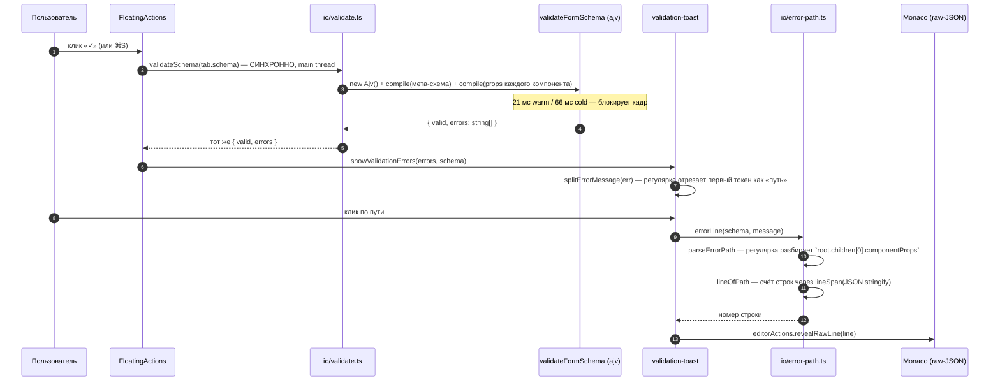
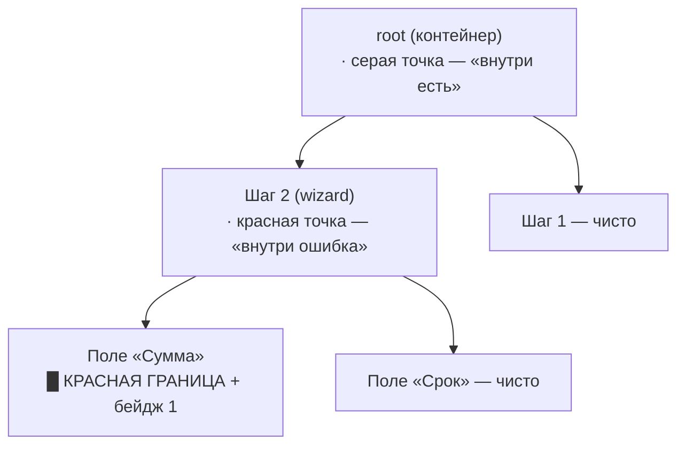
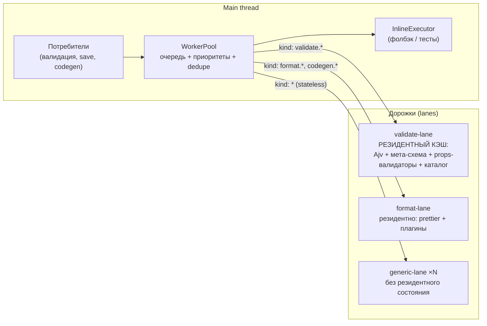

# RFC-0003 — Валидация схем, подсветка ошибок в UI и пул веб-воркеров

**Статус:** 🟡 предложение (архитектурное исследование, к реализации не приступали)
**Дата:** 2026-08-08
**Автор:** Claude Code (по заданию пользователя)
**Скоуп:** `projects/reformer-builder` (новые слои `src/diagnostics/*`, `src/workers/*`), пакет `@reformer/renderer-json` (контракт `validateFormSchema`)
**Опоры:** код `src/**` (проверено), `packages/reformer-renderer-json/src/validate.ts`, [RFC-0001](./0001-local-development-runtime.md), [RFC-0002](./0002-ai-chat-and-webmcp.md), [спека MVP](../specs/reformer-builder-mvp.md) (read-only), собственные замеры (§1.5)

---

## 0. TL;DR и вердикт

**Запрос:** подсвечивать элементы UI с ошибками; валидировать JSON-схемы; валидация через веб-воркеры; заложить механизм пула веб-воркеров для дорогих операций.

**Вердикт — раздельный:**

| Часть запроса                         | Вердикт                                                                               | Почему                                                                                                                                                                                                                                                                                                                                                                                                                                    |
| ------------------------------------- | ------------------------------------------------------------------------------------- | ----------------------------------------------------------------------------------------------------------------------------------------------------------------------------------------------------------------------------------------------------------------------------------------------------------------------------------------------------------------------------------------------------------------------------------------- |
| Подсвечивать элементы UI с ошибками   | ✅ **Принять — но это в первую очередь задача КОНТРАКТА**                             | Сегодня ошибка — это строка (`"root.children[0].componentProps has unknown property \"x\""`), а путь из неё выковыривается регулярным выражением в [error-path.ts](../../src/io/error-path.ts). Подсветить узел на canvas по такой «диагностике» нельзя надёжно ни при каком раскладе. Нужен структурный `JsonPath` в самом результате валидации.                                                                                         |
| Валидировать JSON-схемы               | ⚠️ **Принять с уточнением: «валидация» — это 6 разных проверок**                      | В билдере их уже пять, они не связаны между собой, у них нет severity, и **одна из них (проверка имён операторов) фактически холостая** — см. §1.4/L9. Прежде чем ускорять, надо развести виды и решить, что блокирует сохранение, а что — только подсвечивает.                                                                                                                                                                           |
| Валидация через веб-воркеры           | ⚠️ **Принять — но не ради скорости**                                                  | Замер (§1.5): полная валидация реальной 68-КБ схемы — **21 мс warm / 66 мс cold**, из которых **~95 % — компиляция ajv, которая полностью кэшируема**, а сам обход дерева — **<1 мс**. Воркер без кэша внутри просто перенесёт те же 66 мс в другой поток. Воркер оправдан бандлом, cold-джанком, отменяемостью и ростом нагрузки — но не «валидация тормозит».                                                                           |
| Пул веб-воркеров под дорогие операции | ✅ **Принять — но пул generic-инфраструктурой, а валидация лишь первым потребителем** | Одной валидации пул не нужен (одна задача, latest-wins — хватило бы одного воркера). Пул окупается набором: prettier-печать (14–25 мс/файл), codegen (10+ файлов ⇒ 250+ мс), диффы, будущие линт-правила. **Важное уточнение: пул безликих воркеров здесь вреден** — валидатор держит резидентный кэш скомпилированных ajv-функций, и миграция задачи на «свободный» воркер этот кэш обнуляет. Нужен пул с _дорожками_ и affinity (§6.7). |

**Ключевая мысль всего документа:**

> **Диагностика — не строка, а адресуемый объект.** Всё остальное — подсветка, воркеры, пул — следствия этого решения и без него не работают. Сначала `Diagnostic { code, severity, path, prop }`, потом уже вопрос «в каком потоке его считать».

**Второй по важности вывод — против интуиции задания:**

> Валидация в билдере сегодня медленная **не потому, что она тяжёлая**, а потому что `validateFormSchema` создаёт `new Ajv()` и компилирует мета-схему (плюс props-схему каждого встреченного компонента) **заново на каждый вызов**. Кэш даёт ×20 и правится за час — это баг-фикс, а не архитектура. Воркеры нужно вводить _после_ него и _по другим причинам_, иначе получится карго-культ: тот же самый разогрев, только в другом потоке.

**Рекомендуемое решение:** **V0 + V2** — немедленно кэш скомпилированных валидаторов (Ф0), затем целевая архитектура: контракт диагностик (Ф1) → пул воркеров с типизированными дорожками и inline-фолбэком (Ф2) → подсветка на четырёх поверхностях + панель «Проблемы» (Ф3) → перенос prettier/codegen в пул (Ф4) → растущий набор линт-правил (Ф5).

---

## 1. Что есть сейчас

### 1.1. Пять валидаций, которые уже существуют

| #   | Что проверяет                                                                 | Где                                                                                                                                     | Когда запускается                                                                        | Где виден результат                                                                |
| --- | ----------------------------------------------------------------------------- | --------------------------------------------------------------------------------------------------------------------------------------- | ---------------------------------------------------------------------------------------- | ---------------------------------------------------------------------------------- |
| 1   | Структура form-DSL + синтаксис операторов + имена + `componentProps` (4 фазы) | [`validateFormSchema`](../../../../packages/reformer-renderer-json/src/validate.ts), обёртка [io/validate.ts](../../src/io/validate.ts) | Кнопка «✓» в [FloatingActions](../../src/canvas/FloatingActions.tsx), гейт `triggerSave` | Тост со списком строк ([validation-toast.tsx](../../src/app/validation-toast.tsx)) |
| 2   | JSON-синтаксис + структура по мета-схеме (enum-вариант)                       | Monaco `json.worker`, настройка в [monaco-setup.ts](../../src/canvas/monaco-setup.ts)                                                   | Непрерывно, при вводе                                                                    | Squiggle в raw-JSON / code-вкладке                                                 |
| 3   | Покрытие `$model`-путей моком, резолвимость компонентов                       | [validate-exportable.ts](../../src/codegen/validate-exportable.ts)                                                                      | Перед экспортом проекта                                                                  | Предупреждения в диалоге                                                           |
| 4   | Неизвестные `$component(...)` относительно реестра превью                     | [unknown.ts](../../src/preview-runtime/unknown.ts)                                                                                      | При построении превью                                                                    | Placeholder-компонент в превью                                                     |
| 5   | Каталог кита против `component-catalog.schema.json`                           | [catalog/contract.ts](../../src/catalog/contract.ts)                                                                                    | При загрузке каталога                                                                    | Исключение/лог                                                                     |

Пять механизмов, три разных представления результата, ноль общей модели. Пользователь видит их как несвязанные явления: тост, squiggle, серый placeholder, предупреждение в модалке.

### 1.2. Как ошибка сегодня доходит до пользователя



Три места, где структурная информация о положении ошибки сначала **уничтожается** (склейка в строку в `formatAjvErrors`), а затем **восстанавливается регуляркой** (`parseErrorPath`) и эвристикой подсчёта строк (`lineOfPath` воспроизводит раскладку `JSON.stringify(schema, null, 2)`).

### 1.3. Что уже работает и на что можно опереться

Не всё надо строить с нуля — три готовых механизма прямо ложатся под задачу:

| Механизм                                                                                     | Файл                                                                                                                         | Почему важен                                                                                                                                                                                                                                                 |
| -------------------------------------------------------------------------------------------- | ---------------------------------------------------------------------------------------------------------------------------- | ------------------------------------------------------------------------------------------------------------------------------------------------------------------------------------------------------------------------------------------------------------ |
| **Класс-токен `rbnode-*`** — кодек «`JsonPath` ⇄ CSS-класс», доезжающий до DOM живого превью | [node-token.ts](../../src/preview-runtime/node-token.ts), [annotate-schema.ts](../../src/preview-runtime/annotate-schema.ts) | Подсветка ошибки в runtime-превью делается **тем же способом, что уже сделана подсветка выделения** — CSS-правилом по токену, без карт «id → DOM» и без ре-навешивания атрибутов после ре-рендера.                                                           |
| **Structural sharing в `model/paths.ts`** — `updateAt` клонирует только узлы вдоль пути      | [paths.ts](../../src/model/paths.ts)                                                                                         | Нетронутые поддеревья сохраняют ссылочную идентичность ⇒ инкрементальная валидация и мемоизация правил в main-потоке технически возможны (§5.3) — но не переживают границу воркера (structured clone теряет идентичность). Это влияет на выбор дизайна кэша. |
| **Стор с селекторными подписками**                                                           | [create-store.ts](../../src/store/create-store.ts), [hooks.ts](../../src/store/hooks.ts)                                     | Диагностики можно положить рядом с состоянием вкладки, а подписку сделать точечной — узел перерисуется только при изменении _своих_ диагностик.                                                                                                              |

И один прецедент: **воркеры в билдере уже есть**. Monaco поднимает `editor.worker` (273 КБ) и `json.worker` (404 КБ) через Vite `?worker` ([monaco-setup.ts](../../src/canvas/monaco-setup.ts)). То есть «валидация в воркере» в билдере уже происходит — просто она структурная, живёт в чужой инфраструктуре и её результат виден только внутри Monaco.

### 1.4. Ограничения текущей реализации

| #      | Ограничение                                                                                                                                                                                                                                                                                                                    | Следствие                                                                                                                                                                                                                                                                                                                            |
| ------ | ------------------------------------------------------------------------------------------------------------------------------------------------------------------------------------------------------------------------------------------------------------------------------------------------------------------------------ | ------------------------------------------------------------------------------------------------------------------------------------------------------------------------------------------------------------------------------------------------------------------------------------------------------------------------------------ |
| **L1** | **Строка как контракт диагностики.** `formatAjvErrors` склеивает путь и сообщение в одну строку; получатель разбирает её регуляркой                                                                                                                                                                                            | Подсветить узел на canvas нельзя надёжно: путь восстанавливается эвристикой, ломается на любом сообщении нестандартной формы, теряет тип сегмента (`"0"` ключ vs `0` индекс)                                                                                                                                                         |
| **L2** | **Нет severity.** Всё — `errors: string[]`                                                                                                                                                                                                                                                                                     | Отсутствие `initialValue` у array-узла блокирует сохранение наравне с опечаткой в пропе, хотя это предупреждение о будущем поведении                                                                                                                                                                                                 |
| **L3** | **Гейт «всё или ничего».** `triggerSave` при `!valid` показывает тост и молча возвращается                                                                                                                                                                                                                                     | Нельзя сохранить черновик с известной проблемой; нет «сохранить всё равно»                                                                                                                                                                                                                                                           |
| **L4** | **Подсветки нет ни на одной поверхности редактирования.** Только тост и переход на строку raw-JSON                                                                                                                                                                                                                             | Пользователь правит форму на canvas/в превью, а ошибку ему показывают в JSON — то есть требуют переключить ментальную модель                                                                                                                                                                                                         |
| **L5** | **Валидация ручная.** Запускается по кнопке и на сохранении; любая правка сбрасывает статус в `idle` ([FloatingActions.tsx:36-41](../../src/canvas/FloatingActions.tsx#L36-L41))                                                                                                                                               | Между «сломал» и «узнал» — произвольное время                                                                                                                                                                                                                                                                                        |
| **L6** | **ajv и prettier — в главном чанке.** `dist/assets/App-*.js` = **1.78 МБ**, и `grep` находит в нём и `validateFormSchema`, и `prettier`                                                                                                                                                                                        | Известный баг (bd `ReFormer-s0j.15`): ленивый чанк `validate.js` (~132 КБ) слился с `App` при рефакторе. Каждый пользователь платит за валидатор и форматтер на старте                                                                                                                                                               |
| **L7** | **Синхронный вызов в main-потоке, без отмены.** `validateSchema` — обычный синхронный вызов                                                                                                                                                                                                                                    | 66 мс cold — четыре пропущенных кадра; при непрерывной валидации (L5) это станет постоянным джанком                                                                                                                                                                                                                                  |
| **L8** | **Дублирование с Monaco.** `json.worker` валидирует по `buildFormSchemaMetaSchema` (enum-версия с именами и props-схемами), `validateFormSchema` — по `formSchemaMetaSchema` + обходам                                                                                                                                         | Две реализации почти одной проверки, расходящиеся сообщения, двойная работа                                                                                                                                                                                                                                                          |
| **L9** | **Проверка имён операторов (фаза b) в билдере холостая.** [io/validate.ts:42-48](../../src/io/validate.ts#L42-L48) передаёт `componentNames: [...ops.components, ...knownComponentNames()]`, `dataSourceNames: ops.dataSources`, `fnNames: ops.fns`, `localeKeys: ops.locales` — **списки собраны из самой проверяемой схемы** | Ни одна ошибка вида «unknown component/dataSource/fn/locale» не может сработать в билдере по построению. Это осознанный компромисс (в standalone-режиме имена project-specific источников знать неоткуда), но цена — потеря ровно той проверки, которая нужнее всего для подсветки: «этого компонента нет в каталоге активного кита» |

L9 — самый неочевидный из списка и важен для §2: информация о неизвестном компоненте **в билдере есть** ([`collectUnknownComponentNames`](../../src/preview-runtime/unknown.ts)), но живёт в другом модуле, возвращает только имена без путей и не доходит до валидации.

### 1.5. Замеры: сколько это стоит на самом деле

Node 24, прогретый V8, схемы из `projects/react-playground/src/pages/examples/**`. Каталог — `packages/reformer-ui-kit/component-catalog.json` (168 компонентов). Медиана из 20–30 прогонов.

**Валидация:**

| Сценарий                                                                                              | cold (1-й вызов) | warm (медиана) |
| ----------------------------------------------------------------------------------------------------- | ---------------- | -------------- |
| `validateFormSchema` без `propSchemas`, схема 68 КБ                                                   | 29.1 мс          | **6.9 мс**     |
| `validateFormSchema` без `propSchemas`, схема 10 КБ                                                   | 6.2 мс           | 4.9 мс         |
| `validateFormSchema` **с `propSchemas`** (режим билдера), 68 КБ, 22 уникальных компонента (9 в карте) | **65.8 мс**      | **20.6 мс**    |
| `validateFormSchema` с `propSchemas`, 10 КБ, 7 компонентов (5 в карте)                                | 15.4 мс          | 13.0 мс        |

**Разложение warm-цены (схема 68 КБ, 20.6 мс):**

| Составляющая                                                                      | Цена         | Кэшируема?                                                |
| --------------------------------------------------------------------------------- | ------------ | --------------------------------------------------------- |
| `new Ajv().compile(formSchemaMetaSchema)` — фаза (a)                              | **~6.5 мс**  | ✅ полностью (мета-схема статична)                        |
| Фаза (d): компиляция props-валидатора для каждого встреченного компонента (9 шт.) | **~15.2 мс** | ✅ полностью (props-схемы меняются только при смене кита) |
| Фазы (b)+(c)+(d) — собственно обход дерева                                        | **< 1 мс**   | — (и не нужно)                                            |
| `structuredClone` схемы 68 КБ (цена передачи в воркер)                            | **0.20 мс**  | —                                                         |

Составляющие — независимые медианы (цена фазы (d) получена как разность «с `propSchemas`» и «без»), поэтому их сумма не обязана совпадать с 20.6 мс точно. Порядок величин от этого не меняется: **кэшируемая компиляция — практически всё время, обход — доли миллисекунды.**

**Другие кандидаты в фон:**

| Операция                                                                                       | cold    | warm                             |
| ---------------------------------------------------------------------------------------------- | ------- | -------------------------------- |
| `prettier` JSON-печать 68 КБ ([model/printer.ts](../../src/model/printer.ts), путь сохранения) | 47.8 мс | 14.5 мс                          |
| `prettier` TS-печать сгенерированного файла ([codegen/format.ts](../../src/codegen/format.ts)) | 59.6 мс | 24.7 мс                          |
| Codegen целиком — 10+ файлов через `formatFiles`                                               | —       | **250+ мс** (оценка: 10 × 25 мс) |

**Что из этого следует — три вывода, и они задают всю остальную часть RFC:**

1. **Валидация как вычисление — дешёвая.** Обход 68-КБ дерева со всеми проверками стоит меньше миллисекунды. Дорога только компиляция ajv, и она кэшируется на 100 %.
2. **Поэтому воркер не «ускорит валидацию».** Он перенесёт те же 66 мс в другой поток. С кэшем — что в main, что в воркере — станет ~1–2 мс. Обосновывать воркер скоростью валидации было бы неправдой.
3. **Но prettier и codegen — настоящие: 250+ мс.** Вот они действительно требуют выноса, и они же оправдывают пул. Валидация в этой конструкции — правильный первый потребитель (простая, чистая, легко тестируемая задача), но не главный бенефициар.

Браузерная поправка: замеры сделаны в Node на прогретом V8. В Chrome тот же движок, но холоднее JIT; на слабом ноутбуке/мобильном множитель ×2–4. То есть cold-путь в билдере реалистично **100–200 мс** — это уже заметная «залипшая» кнопка.

---

## 2. Что значит «валидировать»: таксономия

«Валидация схемы» в задании — зонтичный термин. Разложим на уровни; у каждого свой источник истины, своя цена и своя разумная severity.

| Уровень | Что проверяет                                                                                                                  | Чем                           | Severity           | Блокирует save?     | Статус                                               |
| ------- | ------------------------------------------------------------------------------------------------------------------------------ | ----------------------------- | ------------------ | ------------------- | ---------------------------------------------------- |
| **V-0** | JSON-синтаксис текста                                                                                                          | Monaco `json.worker`          | error              | да (нечего парсить) | ✅ есть                                              |
| **V-1** | Структура form-DSL: форма узлов, обязательные поля, синтаксис операторов                                                       | ajv + `formSchemaMetaSchema`  | error              | да                  | ✅ есть                                              |
| **V-2** | **Имена**: `$component/$dataSource/$fn/$locale` против каталога активного кита и реестра превью; `$html(tag)` против whitelist | обход + каталог               | **warning**        | нет                 | ⚠️ есть в пакете, **в билдере холостая (L9)**        |
| **V-3** | `componentProps` против props-схемы компонента (опечатки в именах пропов, типы)                                                | ajv по `propSchemas` каталога | error              | да                  | ✅ есть (фаза d)                                     |
| **V-4** | **Семантика/линт**: смысловые дефекты валидной схемы                                                                           | правила (чистые функции)      | error/warning/info | по правилу          | ❌ **нет** (кроме одного правила про `initialValue`) |
| **V-5** | Готовность к экспорту: покрытие `$model` моком, резолвимость компонента в импорт                                               | `validate-exportable`         | warning            | нет (диалог)        | ✅ есть, но отдельно                                 |

### 2.1. V-4 — точка роста, ради которой всё и затевается

Именно V-4 делает «подсветку элементов UI» осмысленной: структурные ошибки (V-1/V-3) в 90 % случаев видны в JSON и ловятся Monaco, а вот смысловые дефекты не видны нигде и проявляются как «форма собралась, но ведёт себя не так». Стартовый набор правил, выводимый из уже известных этому репозиторию граблей:

| Код правила                             | Что ловит                                         | Severity | Откуда известно, что это реальная проблема                                                                                                                                                 |
| --------------------------------------- | ------------------------------------------------- | -------- | ------------------------------------------------------------------------------------------------------------------------------------------------------------------------------------------ |
| `lint/array-missing-initial-value`      | array-узел без `initialValue`                     | error    | Уже реализовано в [validate.ts](../../../../packages/reformer-renderer-json/src/validate.ts) как фаза (c) — с подробным объяснением «кнопка Добавить создаст `{}`, листья не отрендерятся» |
| `lint/array-initial-value-missing-keys` | `initialValue` без ключей, требуемых шаблоном     | error    | Там же (§8 спеки)                                                                                                                                                                          |
| `lint/duplicate-model-path`             | два поля привязаны к одному `$model(...)`         | warning  | Классическая причина «поля дублируют друг друга»                                                                                                                                           |
| `lint/duplicate-testid`                 | одинаковый `componentProps.testId` у разных полей | warning  | Конвенция iter-цикла (`data-testid="input-{testId}"`) — дубль ломает e2e                                                                                                                   |
| `lint/unknown-component`                | `$component(X)` вне каталога активного кита       | warning  | Уже детектится [unknown.ts](../../src/preview-runtime/unknown.ts) → placeholder в превью; L9 мешает довести до диагностики                                                                 |
| `lint/empty-container`                  | контейнер без детей                               | info     | Обычно недостроенный узел; в превью получает `rb-empty`                                                                                                                                    |
| `lint/unreachable-wizard-step`          | шаг мастера, на который нет перехода / пустой шаг | warning  | Wizard — самая частая композиция в примерах                                                                                                                                                |
| `lint/orphan-data-source`               | `$dataSource(X)` без значения в mock-реестре      | info     | Уже видно в нижней панели «Registry», но не как диагностика                                                                                                                                |
| `lint/field-without-label`              | поле без `label`/`aria-label`                     | info     | Доступность                                                                                                                                                                                |

Правило = чистая функция `(schema, ctx) => Diagnostic[]`, где `ctx` несёт каталог, реестр имён и мок. Это делает V-4 растущим и полностью тестируемым без DOM — и это же превращает валидацию из «одного вызова ajv» в реальную нагрузку, которой фон уже оправдан.

### 2.2. Правило severity

- **error** — схема не соберётся или соберётся заведомо сломанной. Блокирует сохранение по умолчанию, но должно быть перекрываемо («Сохранить всё равно») — снимает L3.
- **warning** — схема соберётся, но, скорее всего, не так, как задумано. Не блокирует, подсвечивает.
- **info** — стилистика/полнота. Подсвечивает мягко, по умолчанию не в тосте.

Отдельно: **V-2 в standalone-режиме обязана быть warning, а не error** — прямое следствие L9. Каталог в браузере знает только компоненты активного кита; project-specific `$dataSource`/`$fn` билдеру принципиально неизвестны. Диагностика формулируется как «неизвестно билдеру ⇒ в превью будет placeholder», а не «ошибка».

---

## 3. Контракт диагностики

### 3.1. Тип

```ts
/** Уровень серьёзности. */
export type Severity = 'error' | 'warning' | 'info';

/** Источник — какой слой её выдал (нужен для фильтра, дедупликации с Monaco и телеметрии). */
export type DiagnosticSource = 'structure' | 'names' | 'props' | 'lint' | 'export';

export interface Diagnostic {
  /** Машинный код: `schema/unknown-property`, `props/type-mismatch`, `lint/duplicate-testid`. */
  code: string;
  severity: Severity;
  source: DiagnosticSource;
  /** Человекочитаемое сообщение БЕЗ пути (путь рисует UI сам, из `path`). */
  message: string;
  /** Структурный путь до УЗЛА-виновника — тот же адрес, что у выделения и `rbnode-*`-токена. */
  path: JsonPath;
  /** RFC 6901 до конкретного значения внутри узла (`/componentProps/clearable`). */
  pointer?: string;
  /** Имя пропа в `componentProps` — чтобы инспектор подсветил конкретное поле. */
  prop?: string;
  /** Связанные места (например, второй узел с тем же `testId`). */
  related?: { path: JsonPath; message: string }[];
  /** Предлагаемая правка (Ф5) — мутация в терминах `model/mutate`. */
  fix?: { title: string; apply: (schema: JsonFormSchema) => MutationResult };
}
```

Три поля несут всю адресацию, и каждое отвечает за свою поверхность:

- `path` → canvas (`NodeView`), runtime-превью (`rbnode-*`-токен), панель «Проблемы», агрегаты по поддереву;
- `pointer` → Monaco (`setModelMarkers` — точная позиция в тексте);
- `prop` → инспектор (подсветка конкретного поля).

### 3.2. Что менять в `@reformer/renderer-json` (обратно совместимо)

`validateFormSchema` уже строит путь — просто теряет его при склейке. Правка локальная:

```ts
export interface FormSchemaValidationResult {
  valid: boolean;
  /** СУЩЕСТВУЮЩЕЕ поле — остаётся, вычисляется из diagnostics. Ничей код не ломается. */
  errors: string[];
  /** НОВОЕ: структурированные диагностики. */
  diagnostics: Diagnostic[];
}
```

Механика:

1. `walkOperatorNames`, `walkComponentProps`, `walkArrayInitialValue` уже носят `path` — но как строку (`` `${path}.${k}` ``). Заменить на массив сегментов, строку собирать только на выходе. Изменение чисто внутреннее.
2. `formatAjvErrors` получает `e.instancePath` (JSON-pointer) — из него сегменты получаются разбором по `/` без эвристик, в отличие от нынешнего обратного парсинга готового сообщения.
3. `errors` собирается как `diagnostics.map(d => renderLegacyMessage(d))` — существующие потребители (MCP-сервер `validate_json_schema`, тесты пакета, `JsonFormRenderer validateSchema`) не замечают изменения.

Версия — minor. **`error-path.ts` после этого удаляется целиком**: `parseErrorPath`/`splitErrorMessage` больше не нужны, а `lineOfPath` остаётся (он полезен сам по себе — двойной клик по узлу canvas прыгает в JSON).

### 3.3. Индекс и агрегаты

Для UI нужны два запроса, и оба должны быть O(1) на узел:

```ts
export interface DiagnosticIndex {
  /** Диагностики САМОГО узла. */
  own(path: JsonPath): readonly Diagnostic[];
  /** Худшая severity в ПОДДЕРЕВЕ (не считая самого узла) — для «внутри что-то сломано». */
  descendant(path: JsonPath): Severity | null;
  /** Диагностики конкретного пропа узла (инспектор). */
  forProp(path: JsonPath, prop: string): readonly Diagnostic[];
  readonly all: readonly Diagnostic[];
  readonly counts: Record<Severity, number>;
}
```

Строится за один проход: ключ узла — `JSON.stringify(path)` (или уже существующий `encodeNodeToken`); для агрегата каждый префикс пути диагностики получает пометку. Глубина схем ≤ ~12, диагностик — десятки, так что построение измеряется микросекундами и делается в main-потоке из плоского списка, приехавшего из воркера.

Агрегат `descendant` — то, что делает подсветку осмысленной на свёрнутом дереве: контейнер показывает «внутри есть ошибка», не заставляя раскрывать всё.

### 3.4. Стабильность: эпохи и «недрожание»

Схема иммутабельна, валидация асинхронна ⇒ результат может приехать к уже изменившейся схеме.

- У каждой вкладки — монотонный `validationEpoch`, инкремент на каждый `commit`.
- Запрос в воркер несёт эпоху; результат с эпохой меньше текущей **отбрасывается молча**.
- До прихода свежего результата **старые диагностики остаются на экране** и помечаются как `stale` (полупрозрачные). Альтернатива — очищать на каждый keystroke — даёт мигание, которое хуже слегка устаревшей подсветки.
- Перед отрисовкой диагностики UI проверяет, что `path` всё ещё резолвится (`getAt(schema, path) !== undefined`). Не резолвится ⇒ диагностика не рисуется (но и не удаляется — приедет свежая).

---

## 4. Подсветка в UI

### 4.1. Поверхности

| Поверхность                                                                      | Механизм                                                                                                        | Что показывает                                                                           |
| -------------------------------------------------------------------------------- | --------------------------------------------------------------------------------------------------------------- | ---------------------------------------------------------------------------------------- |
| **Схематичный canvas** ([SchematicCanvas](../../src/canvas/SchematicCanvas.tsx)) | класс на боксе узла + бейдж в шапке                                                                             | Своя ошибка — сплошная красная граница; ошибка в поддереве — красная точка у бейджа типа |
| **Runtime-превью** ([RuntimePreview](../../src/canvas/RuntimePreview.tsx))       | CSS-правило по `rbnode-*`-токену, как [preview-highlight-style.ts](../../src/canvas/preview-highlight-style.ts) | Рамка вокруг реального поля формы                                                        |
| **Инспектор** ([Inspector](../../src/panels/Inspector.tsx))                      | подсветка поля по `diagnostic.prop`                                                                             | Красная рамка поля + текст диагностики под ним                                           |
| **Monaco** (raw-JSON и code-вкладки)                                             | `monaco.editor.setModelMarkers(model, 'reformer', markers)`                                                     | Squiggle прямо в JSON, вместо нынешнего «прыжка на строку»                               |
| **Таб-бар** ([TabBar](../../src/canvas/TabBar.tsx))                              | бейдж с числом ошибок                                                                                           | Какая вкладка сломана, без переключения                                                  |
| **Панель «Проблемы»** — новая вкладка нижней панели                              | список с группировкой                                                                                           | Навигация ⌘F8 / F8, клик → выделение узла + reveal                                       |
| **FloatingActions**                                                              | существующая кнопка «✓»                                                                                         | Сводка `3 ⨯ · 5 ⚠` вместо бинарного ok/error                                             |

### 4.2. Два конфликта в визуальном языке — и их разрешение

Это не косметика: оба обнаруживаются прямо в коде и оба сломают подсветку, если сделать «как обычно».

**Конфликт 1 — `ring` на canvas уже занят.** В [SchematicCanvas.tsx:209-218](../../src/canvas/SchematicCanvas.tsx#L209-L218) `ring-2 ring-primary/40` означает активное выделение, `ring-primary/15` — групповое, и тот же `ring` используется для drop-зоны `into`. Красить ошибку кольцом нельзя — выделенный узел с ошибкой станет неотличим от невыделенного. **Решение:** ошибка занимает `border` (`border-solid border-destructive` вместо `border-dashed border-border`) плюс счётчик-бейдж в шапке узла. `border` у неошибочных узлов — пунктирный служебный, его не жалко; `ring` целиком остаётся выделению и drop-зонам. Так узел может одновременно быть выделенным (кольцо), ошибочным (граница) и целью дропа (кольцо + фон) без взаимного затирания.

**Конфликт 2 — `::after` в превью уже занят.** [preview-highlight-style.ts](../../src/canvas/preview-highlight-style.ts) рисует рамку выделения именно псевдоэлементом `::after` (осознанно — `outline` уходил под соседние узлы у HexaUI). Второй `::after` на том же элементе физически невозможен. **Решение:** ошибка рисуется `::before` с тем же приёмом (`position: relative` на узле, `inset`, `pointer-events: none`), но своим `z-index` ниже выделения и своим `inset` (на 2 px шире), чтобы обе рамки читались концентрически. Ограничение честно фиксируется: **третьего псевдоэлемента не будет**, поэтому hover+selection+error — потолок этого механизма; всё сверх — только оверлеем.

### 4.3. Свои и унаследованные ошибки

Правило одно: **узел показывает свою диагностику ярко, чужую (из поддерева) — намёком.** Иначе при ошибке в глубоком листе загорится вся цепочка контейнеров до корня, и подсветка перестанет что-либо значить.



### 4.4. Monaco: маркеры вместо прыжка на строку

Сейчас клик по пути в тосте вычисляет строку через `lineOfPath` — воспроизведение раскладки `JSON.stringify` в уме. С `pointer` в диагностике задача решается прямо: текст JSON парсится с позициями (у Monaco JSON-режим это уже умеет; в крайнем случае — `jsonc-parser`, ~10 КБ), pointer → `{startLineNumber, startColumn, endLineNumber, endColumn}`, `setModelMarkers(model, 'reformer', …)`. Дальше всё бесплатно: squiggle, ховер с текстом, список проблем Monaco, переход F8 — штатное поведение редактора.

Дедупликация с Monaco (L8): наши маркеры идут под owner `'reformer'`, встроенные JSON-диагностики — под своим. Мы **не выключаем** встроенную валидацию (она даёт V-0 бесплатно и работает, даже когда наш валидатор ещё не прогрелся), но снимаем с неё `propSchemas`-часть мета-схемы, чтобы одна и та же опечатка в пропе не подчёркивалась дважды с разными формулировками.

### 4.5. Производительность отрисовки

- Индекс лежит в сторе рядом с вкладкой; `NodeView` подписан селектором на _свою_ запись (`own(path)` + `descendant(path)`), т. е. перерисовывается только при изменении собственных диагностик.
- Для превью CSS-правила генерируются одной строкой на всё дерево (как уже делает `selectionCss`) — один `<style>`, а не N подписок.
- Порог: при > 200 диагностик подсветка узлов переключается в «только счётчики + панель», иначе холст превращается в красное полотно и тормозит.

---

## 5. Почему воркер (честный разбор)

### 5.1. Чего воркер НЕ даёт

Из §1.5: warm-цена валидации — 20.6 мс, и практически вся она — компиляция ajv (мета-схема ~6.5 мс + props-валидаторы ~15 мс), тогда как обход дерева стоит меньше миллисекунды. Отсюда:

> **Перенос `validateFormSchema` «как есть» в воркер не ускорит ничего.** Воркер заплатит те же 66 мс на холодном старте и те же 20 мс на каждом последующем вызове. Единственное отличие — эти миллисекунды не будут в main-потоке.

Более того: **без кэша воркер даже хуже** — новый воркер начинает с холодного V8, у него нет прогретого JIT, и первый вызов там дороже, чем в main.

### 5.2. Что воркер даёт

| Выигрыш                                      | Величина                   | Комментарий                                                                                                                                                                          |
| -------------------------------------------- | -------------------------- | ------------------------------------------------------------------------------------------------------------------------------------------------------------------------------------ |
| **Вынос ajv из главного бандла**             | ~132 КБ                    | Чинит L6 гарантированно: воркер — отдельная точка входа, у него отдельный граф модулей; «чанк слился с App» (bd `ReFormer-s0j.15`) в такой конструкции повториться не может          |
| **Устранение cold-джанка**                   | 66 мс (в браузере 100–200) | Кнопка «Сохранить» перестаёт залипать; прогрев уходит в idle                                                                                                                         |
| **Отменяемость**                             | —                          | Непрерывная валидация (снятие L5) без отмены — это очередь из устаревших вычислений; в main-потоке отменить синхронный ajv невозможно в принципе, в воркере есть хотя бы `terminate` |
| **Изоляция падений**                         | —                          | Кривая props-схема кита сегодня ловится `try/catch` внутри `getComponentPropsValidator`; в воркере даже необработанное падение не уносит редактор                                    |
| **Место для роста**                          | —                          | V-4 (§2.1) — растущий набор правил; каждое правило добавляет обход. Десять правил × <1 мс — ещё терпимо в main, тридцать правил с перекрёстными проверками — уже нет                 |
| **Готовая площадка для настоящего тяжёлого** | 250+ мс                    | Codegen и prettier (§1.5) — вот где выигрыш измеряется сотнями миллисекунд                                                                                                           |

### 5.3. Отвергнутые альтернативы

| Альтернатива                                        | Почему нет                                                                                                                                                                                                                                                                                                                  |
| --------------------------------------------------- | --------------------------------------------------------------------------------------------------------------------------------------------------------------------------------------------------------------------------------------------------------------------------------------------------------------------------- |
| **Только кэш ajv, без воркера (V0)**                | Снимает 95 % цены — но не снимает L6 (бандл) и не даёт отменяемости; и всё равно оставляет prettier/codegen в main. Как _первый шаг_ — обязателен (Ф0), как целевое решение — недостаточен                                                                                                                                  |
| **`requestIdleCallback`**                           | Не решает: валидация нужна не «когда-нибудь», а сразу после правки; и `rIC` не разрезает синхронный `ajv.compile`                                                                                                                                                                                                           |
| **`scheduler.yield()` / `isInputPending()`**        | Позволяют резать цикл — но у нас нет цикла: 95 % цены внутри одного неделимого вызова `ajv.compile`                                                                                                                                                                                                                         |
| **Инкрементальная валидация по structural sharing** | Красиво (нетронутые поддеревья сохраняют идентичность ⇒ мемоизация через `WeakMap`), но: (1) не переживает границу воркера — structured clone теряет идентичность; (2) экономит то, что и так стоит <1 мс; (3) ajv-фазы работают от корня. Оставить как возможную оптимизацию V-4 внутри воркера, не как основу архитектуры |
| **Отдать валидацию devhost'у (RFC-0001)**           | Нарушает принцип **P1 runtime-optional** RFC-0001: hosted-режим на GitHub Pages обязан работать без локального процесса. Валидация — базовая функция редактора, она не может зависеть от рантайма                                                                                                                           |

### 5.4. Вердикт

Воркер — **да**, но с обязательным условием: **кэш скомпилированных валидаторов живёт внутри воркера и переживает вызовы**. Воркер без резидентного кэша — это тот же разогрев, только в другом потоке, и это единственный способ сделать здесь неправильно.

---

## 6. Пул воркеров

### 6.1. Требования

| #   | Требование                                                                                                            | Откуда                                                                                    |
| --- | --------------------------------------------------------------------------------------------------------------------- | ----------------------------------------------------------------------------------------- |
| R1  | Типизированный реестр задач: `kind` → `{ payload, result }`, ошибка типов на этапе компиляции                         | Задач будет ≥5 разных                                                                     |
| R2  | Приоритеты: `interactive` (гейт сохранения — пользователь ждёт) > `background` (фоновая валидация) > `bulk` (codegen) | Иначе экспорт проекта заморозит подсветку                                                 |
| R3  | Latest-wins по ключу: новая валидация той же вкладки отменяет предыдущую                                              | Прямое следствие непрерывной валидации                                                    |
| R4  | Отмена — кооперативная, с жёстким фолбэком                                                                            | Синхронный ajv не прерывается извне                                                       |
| R5  | **Affinity**: задачи с резидентным кэшем закреплены за своим воркером                                                 | §5.4 — иначе кэш обнуляется                                                               |
| R6  | Inline-фолбэк с тем же интерфейсом                                                                                    | vitest (`environment: 'node'`), браузеры без module-workers, циркуитбрейкер после падений |
| R7  | Прогрев в idle                                                                                                        | Чтобы первое сохранение не стоило 66 мс                                                   |
| R8  | Бюджет пула с учётом чужих воркеров                                                                                   | Monaco уже держит 2                                                                       |
| R9  | Таймауты и рестарт                                                                                                    | Зависшая задача не должна отравлять дорожку навсегда                                      |
| R10 | Нулевые внешние зависимости                                                                                           | В проекте есть прецедент: свой `createStore`, «в проекте нет state-либы»                  |

### 6.2. Модель



**Дорожка** — это специализация воркера, а не отдельный класс. Воркер один и тот же (один бандл, регистрирующий все обработчики); при первом назначении он «прилипает» к `kind`-группе и с этого момента получает только её задачи. Так резидентный кэш не теряется, но при этом не нужно N разных worker-файлов.

Именно этим предлагаемый пул отличается от наивного «N безликих воркеров, задача уходит первому свободному»: последнее для валидации **вредно** — каждая миграция стоит 20 мс переразогрева.

### 6.3. Протокол

Минимальный конверт, без Comlink (R10):

```ts
// main → worker
type Request =
  | { t: 'job'; id: string; kind: JobKind; payload: unknown; epoch?: number }
  | { t: 'cancel'; id: string }
  | { t: 'init'; kind: JobKind; context: unknown }; // каталог, версия кита, опции

// worker → main
type Response =
  | { t: 'ready'; kinds: JobKind[] }
  | { t: 'progress'; id: string; done: number; total: number }
  | { t: 'ok'; id: string; result: unknown; epoch?: number }
  | { t: 'err'; id: string; error: { name: string; message: string; stack?: string } }
  | { t: 'cancelled'; id: string };
```

`epoch` возвращается нетронутой — main отбрасывает устаревшее, не зная деталей задачи (§3.4).

### 6.4. Планировщик

```
enqueue(job):
  если job.dedupeKey уже в очереди  → заменить payload, оставить позицию   (R3)
  если job.dedupeKey уже выполняется → послать cancel, поставить новый следом
  вставить по приоритету (interactive → background → bulk), FIFO внутри уровня
  разбудить дорожку по affinity(kind); нет свободного слота — ждать
```

`dedupeKey` для валидации — `validate:${tabId}`. Одна вкладка ⇒ максимум одна валидация в полёте плюс одна в очереди; быстрая печать не создаёт хвоста.

### 6.5. Отмена

Задача синхронна внутри — прервать её извне нельзя. Поэтому две политики на уровень `kind`:

- **`cooperative`** (по умолчанию): обработчик проверяет флаг отмены в чекпойнтах — между фазами (a)/(b)/(c)/(d) валидации, между файлами в `formatFiles`, между правилами V-4. Гранулярность — единицы миллисекунд, этого достаточно.
- **`terminate`**: если после `cancel` воркер не ответил `cancelled` за `hardCancelMs` (по умолчанию 2 000 мс), он убивается и поднимается заново. Дорожка теряет резидентный кэш — но это исключительная ветка, а не рабочий режим.

Честное ограничение: **`ajv.compile` не разрезается**. Значит худший случай кооперативной отмены ≈ длительность одной компиляции (~6 мс) — приемлемо.

### 6.6. Жизненный цикл и размер

| Параметр        | Значение                                                                           | Обоснование                                                                                    |
| --------------- | ---------------------------------------------------------------------------------- | ---------------------------------------------------------------------------------------------- |
| Размер пула     | `clamp(1, hardwareConcurrency - 2, 4)`                                             | «−2» — Monaco уже держит `editor.worker` и `json.worker` (R8); потолок 4 — больше нечем занять |
| Спавн           | ленивый, при первой задаче дорожки                                                 | Не платить за воркеры в сессии, где пользователь только смотрит                                |
| Прогрев         | validate-lane — на первом `requestIdleCallback` после монтирования редактора       | Первое сохранение не стоит 66 мс (R7)                                                          |
| Idle-eviction   | generic-дорожки — через 60 с простоя; validate/format — **не убивать**             | Убить дорожку с кэшем = выбросить прогрев                                                      |
| Таймаут задачи  | `interactive` 5 с, `background` 15 с, `bulk` 60 с                                  | R9                                                                                             |
| Circuit breaker | 3 падения дорожки за 60 с ⇒ переход на `InlineExecutor` + предупреждение в консоль | Лучше медленно, чем никак (R6)                                                                 |

### 6.7. Резидентное состояние и его инвалидация

Валидационная дорожка держит:

```ts
let ajv: Ajv | null = null; // один инстанс на жизнь воркера
let metaValidator: ValidateFunction | null = null;
const propsValidators = new Map<string, ValidateFunction | null>();
let catalogVersion: string | null = null; // id кита + хеш каталога
```

Инвалидация — **только по смене кита**: main шлёт `{t:'init', kind:'validate', context:{kitId, catalogHash, propSchemas, knownNames}}`; при несовпадении `catalogVersion` воркер сбрасывает `propsValidators` (мета-схема статична и переживает смену кита). Это единственный источник рассинхронизации «воркер знает не тот каталог» (риск R4, §11) и он закрывается версионированием, а не доверием.

Стоимость передачи каталога: `component-catalog.json` — 180 КБ, `structuredClone` ~0.5 мс, один раз на смену кита. Незначимо.

### 6.8. Транспорт

- **По умолчанию — structured clone.** Замер: 0.2 мс на схему 68 КБ (§1.5) — на три порядка меньше самой задачи. Никакой сериализации в строку.
- **Transferable** — зарезервировано под будущие бинарные задачи (например, растеризация превью). Схемам не нужно.
- **SharedArrayBuffer — нет.** Требует заголовков COOP/COEP, а билдер публикуется на GitHub Pages, где заголовки не настраиваются. Это архитектурный запрет, а не предпочтение.

### 6.9. Vite и сборка

```ts
new Worker(new URL('./worker/entry.ts', import.meta.url), { type: 'module' });
```

Vite бандлит такой воркер отдельной точкой входа и подставляет корректный URL с учётом `base` (у билдера prod-`base` = `/ReFormer/builder/`, §vite.config.ts). Module-воркеры поддерживаются во всех целевых браузерах (билдер и без того Chromium-first из-за File System Access API — RFC-0001 §1.7). В dev — нативные ES-модули, без пре-бандла.

### 6.10. Что ещё поедет в пул

| Задача                                       | `kind`            | Дорожка  | Цена сейчас            | Приоритет                       |
| -------------------------------------------- | ----------------- | -------- | ---------------------- | ------------------------------- |
| Валидация схемы (V-1…V-4)                    | `validate.schema` | validate | 20.6 мс warm / 66 cold | background (гейт — interactive) |
| Печать схемы prettier'ом (сохранение Mode B) | `format.json`     | format   | 14.5 мс warm / 48 cold | interactive                     |
| Codegen проекта + форматирование             | `codegen.project` | format   | **250+ мс**            | bulk                            |
| Диф текста для SaveDialog                    | `diff.text`       | generic  | зависит от файла       | interactive                     |
| Синтез мок-модели/источников                 | `mock.synth`      | generic  | мс                     | background                      |
| Поиск по проекту (Ф5+)                       | `search.project`  | generic  | —                      | background                      |

---

## 7. Как это ложится на существующий код

**Новые модули:**

| Путь                             | Содержимое                                                             |
| -------------------------------- | ---------------------------------------------------------------------- |
| `src/workers/pool.ts`            | Пул: очередь, приоритеты, dedupe, affinity, таймауты, circuit breaker  |
| `src/workers/protocol.ts`        | Типы конверта + реестр `JobKind → {payload, result}`                   |
| `src/workers/inline.ts`          | `InlineExecutor` — тот же интерфейс, выполнение в main (тесты, фолбэк) |
| `src/workers/entry.ts`           | Точка входа воркера: диспетчер по `kind`, резидентные кэши             |
| `src/workers/jobs/validate.ts`   | Обработчик валидации (кэш ajv, чекпойнты отмены)                       |
| `src/workers/jobs/format.ts`     | Обработчик prettier (позже — codegen)                                  |
| `src/diagnostics/types.ts`       | `Diagnostic`, `Severity`, `DiagnosticSource`                           |
| `src/diagnostics/index-build.ts` | Построение `DiagnosticIndex` (own / descendant / forProp)              |
| `src/diagnostics/rules/*.ts`     | Правила V-4, по файлу на правило, чистые функции                       |
| `src/diagnostics/store.ts`       | Диагностики в сторе + эпохи + `stale`                                  |
| `src/panels/ProblemsPanel.tsx`   | Панель «Проблемы» (новая вкладка нижней панели)                        |

**Изменяемые:**

| Файл                                                                             | Изменение                                                                                                                                                   |
| -------------------------------------------------------------------------------- | ----------------------------------------------------------------------------------------------------------------------------------------------------------- |
| [io/validate.ts](../../src/io/validate.ts)                                       | Становится тонким фасадом: `validateSchema(schema): Promise<DiagnosticIndex>` через пул. Разводит «известно из каталога» и «встречено в схеме» — снимает L9 |
| [io/error-path.ts](../../src/io/error-path.ts)                                   | `parseErrorPath`/`splitErrorMessage` **удаляются**; `lineOfPath` остаётся                                                                                   |
| [app/validation-toast.tsx](../../src/app/validation-toast.tsx)                   | Рендерит `Diagnostic` (путь берёт из `path`, не из регулярки); сводка вместо списка при > 6                                                                 |
| [app/save-actions.ts](../../src/app/save-actions.ts)                             | `triggerSave` уже `async` ⇒ `await validate(..., {priority:'interactive'})`; спиннер при > 150 мс; «Сохранить всё равно» при warning-only (снимает L3)      |
| [canvas/FloatingActions.tsx](../../src/canvas/FloatingActions.tsx)               | Локальный `useState` статуса заменяется подпиской на индекс; сводка `3 ⨯ · 5 ⚠`                                                                             |
| [canvas/SchematicCanvas.tsx](../../src/canvas/SchematicCanvas.tsx)               | Класс ошибки на боксе узла + бейдж; **`ring` не трогать** (§4.2)                                                                                            |
| [canvas/preview-highlight-style.ts](../../src/canvas/preview-highlight-style.ts) | Добавить `errorCss(scope, paths)` на `::before` (`::after` занят, §4.2)                                                                                     |
| [panels/Inspector.tsx](../../src/panels/Inspector.tsx)                           | Подсветка поля по `diagnostic.prop`                                                                                                                         |
| [canvas/RawJsonEditor.tsx](../../src/canvas/RawJsonEditor.tsx)                   | `setModelMarkers` вместо только-reveal                                                                                                                      |
| [canvas/monaco-setup.ts](../../src/canvas/monaco-setup.ts)                       | Снять `propSchemas` со встроенной мета-схемы (дедупликация с V-3, L8)                                                                                       |
| [store/types.ts](../../src/store/types.ts)                                       | В `TabState`: `diagnostics: DiagnosticIndex \| null`, `validationEpoch: number`, `diagnosticsStale: boolean`; в `UiState`: `bottomTab` += `'problems'`      |

**Пакет:**

| Файл                                                                                         | Изменение                                                                                                                                                                      |
| -------------------------------------------------------------------------------------------- | ------------------------------------------------------------------------------------------------------------------------------------------------------------------------------ |
| [renderer-json/src/validate.ts](../../../../packages/reformer-renderer-json/src/validate.ts) | + `diagnostics` в результате; пути как массивы сегментов; **+ кэш `Ajv`** (Ф0 — самостоятельная ценность, чинит и `@reformer/mcp`, и `JsonFormRenderer validateSchema={true}`) |

Оценка объёма: ~600 строк нового кода (пул ~250, диагностики ~200, UI ~150) плюс правки. Для сравнения — `store/reducers.ts` в билдере уже 876 строк.

---

## 8. Варианты

### V0 — Кэш ajv, без воркеров

Один долгоживущий `Ajv` + мемоизация валидаторов в `@reformer/renderer-json`.
**+** ×20 по замерам, час работы, чинит заодно MCP-сервер и `JsonFormRenderer`; **−** не чинит L6 (бандл), нет отменяемости, prettier/codegen остаются в main.

### V1 — Один выделенный validation-worker

**+** просто, изолирует ajv, чинит L6; **−** отдельная инфраструктура ради одной задачи; когда придут prettier и codegen — писать пул заново.

### V2 — Пул воркеров с дорожками ⭐

**+** покрывает валидацию и всё дорожье (§6.10); affinity сохраняет резидентные кэши; inline-фолбэк делает всё тестируемым без браузера; **−** ~250 строк инфраструктуры; нужна дисциплина «задача = чистая функция».

### V3 — Comlink

**+** RPC из коробки; **−** +12 КБ и внешняя зависимость там, где в проекте принято писать свой минимум (`createStore`); прячет именно то, чем надо управлять — приоритеты, отмену, affinity.

### V4 — Всё через Monaco `json.worker`

**+** воркер уже есть, squiggle бесплатно; **−** мета-схема-enum не выражает V-4 (кросс-узловые правила) и V-5; диагностики не выходят за пределы редактора — на canvas их не получить; зависимость от внутренностей Monaco.

### V5 — Валидация на devhost (RFC-0001)

**+** настоящий Node, настоящий prettier; **−** нарушает P1 runtime-optional: hosted-режим обязан работать без локального процесса.

### V6 — SharedWorker на все вкладки браузера

**+** один прогрев на все окна; **−** состояние per-tab, выигрыш иллюзорный; отладка и жизненный цикл заметно сложнее; Safari-история нестабильна.

### 8.1. Сравнение

| Критерий                               | V0  | V1  | **V2** | V3  | V4  | V5  | V6  |
| -------------------------------------- | --- | --- | ------ | --- | --- | --- | --- |
| Убирает cold-джанк 66 мс               | ◐   | ✅  | ✅     | ✅  | ✅  | ✅  | ✅  |
| Убирает ajv из главного бандла (L6)    | ❌  | ✅  | ✅     | ✅  | ✅  | ✅  | ✅  |
| Даёт отменяемость                      | ❌  | ✅  | ✅     | ✅  | ◐   | ✅  | ✅  |
| Годится для prettier/codegen (250+ мс) | ❌  | ❌  | ✅     | ✅  | ❌  | ✅  | ◐   |
| Даёт диагностики для canvas/инспектора | ❌  | ✅  | ✅     | ✅  | ❌  | ✅  | ✅  |
| Сохраняет резидентный кэш              | ✅  | ✅  | ✅     | ◐   | ✅  | ✅  | ✅  |
| Работает в hosted-режиме (P1)          | ✅  | ✅  | ✅     | ✅  | ✅  | ❌  | ✅  |
| Тестируется без браузера               | ✅  | ◐   | ✅     | ◐   | ❌  | ◐   | ❌  |
| Внешних зависимостей                   | 0   | 0   | 0      | +1  | 0   | 0   | 0   |
| Объём работы                           | XS  | S   | **M**  | S   | M   | L   | L   |

### 8.2. Выбор

**V0 сразу, V2 как целевая.** V0 — не альтернатива, а обязательный первый шаг: он ценен сам по себе (чинит `@reformer/mcp` и `JsonFormRenderer validateSchema`), и **он же нужен внутри воркера** (§5.4) — то есть работа не выбрасывается, а переезжает. V2 добавляется поверх, когда контракт диагностик уже готов.

Порядок принципиален: **контракт → кэш → воркер → подсветка**. Начать с воркера — значит асинхронно доставлять те же непригодные для подсветки строки.

---

## 9. Жизненный цикл валидации

```mermaid
sequenceDiagram
  autonumber
  participant U as Пользователь
  participant S as editorStore
  participant D as diagnostics/store
  participant P as WorkerPool
  participant W as validate-lane

  Note over W: при старте (idle): init{kitId, propSchemas} → компиляция мета-схемы (кэш)

  U->>S: правка узла (commit)
  S->>D: epoch++ ; пометить текущие диагностики stale
  D->>D: debounce 200 мс
  D->>P: job{kind:'validate.schema', dedupeKey:'validate:tab1', epoch:7, priority:'background'}
  Note over P: та же dedupeKey уже выполняется → cancel предыдущей
  P->>W: cancel(prev) + job(7)
  W->>W: фазы a→d, чекпойнт отмены между фазами (кэш ajv горячий ⇒ ~1–2 мс)
  W-->>P: ok{diagnostics, epoch:7}
  P-->>D: результат
  D->>D: epoch совпал → построить индекс, снять stale
  D-->>U: подсветка на canvas / в превью / в инспекторе / маркеры Monaco

  U->>S: ⌘S
  S->>P: job{kind:'validate.schema', priority:'interactive'}
  Note over S,P: ждём результат; если > 150 мс — спиннер на кнопке
  P-->>S: error 0 → сохранение; error > 0 → тост + «Сохранить всё равно» (только при warning-only)
```

Отдельные точки инвалидации: смена активного кита (`init` заново, полная перевалидация всех вкладок), открытие вкладки, `undo`/`redo` (обычный `commit`), правка мок-данных (влияет только на V-5).

---

## 10. Тестирование

| Что                                                       | Как                                                                                                       | Окружение                         |
| --------------------------------------------------------- | --------------------------------------------------------------------------------------------------------- | --------------------------------- |
| Правила V-4                                               | Чистые функции `(schema, ctx) => Diagnostic[]`, табличные тесты на фикстурах                              | node (существующий vitest-конфиг) |
| Построение индекса                                        | own/descendant/forProp на синтетическом наборе                                                            | node                              |
| Контракт диагностик пакета                                | `diagnostics` ↔ `errors` эквивалентны на всех существующих кейсах `validate.test.ts`                      | node                              |
| Пул: приоритеты, dedupe, отмена, таймаут, circuit breaker | На `InlineExecutor` + фейковый исполнитель с управляемыми задержками — **без единого настоящего воркера** | node                              |
| Реальный воркер                                           | Один smoke: спавн → init → job → ok                                                                       | browser (playwright)              |
| Подсветка                                                 | e2e: сломать схему → проверить класс на узле, `::before` в превью, маркер в Monaco, бейдж вкладки         | `projects/react-playground-e2e`   |
| Регресс производительности                                | Бенч `validate` до/после кэша (порог ×10)                                                                 | node                              |

Ключ к тестируемости — `InlineExecutor` (R6): пул тестируется как чистая машина состояний, а `entry.ts` остаётся тонким диспетчером, где ломаться почти нечему.

---

## 11. Риски

| #   | Риск                                                                                                           | Вероятность | Митигация                                                                                                                                |
| --- | -------------------------------------------------------------------------------------------------------------- | ----------- | ---------------------------------------------------------------------------------------------------------------------------------------- |
| R1  | **«Красное полотно»** — на реальной схеме правила дают десятки предупреждений, подсветка перестаёт нести смысл | Высокая     | Порог § 4.5; V-4 включается правилами по одному, каждое — с дефолтной severity не выше warning; настройка «показывать только ошибки»     |
| R2  | **Устаревшие диагностики** — путь указывает в изменённое место                                                 | Высокая     | Эпохи (§3.4) + проверка резолвимости пути перед отрисовкой + `stale`-стиль                                                               |
| R3  | **Мигание подсветки** при быстрой печати                                                                       | Средняя     | Не очищать до прихода нового результата; debounce 200 мс; latest-wins                                                                    |
| R4  | **Воркер знает не тот каталог** после смены кита                                                               | Средняя     | Версионирование `catalogVersion` (§6.7); несовпадение ⇒ переинициализация, а не «наверное совпадает»                                     |
| R5  | **Ложные срабатывания V-2** в standalone (следствие L9 при его исправлении)                                    | Средняя     | V-2 — только warning; формулировка «неизвестно билдеру ⇒ placeholder», а не «ошибка»; project-specific `$dataSource`/`$fn` — вообще info |
| R6  | **Пул усложняет отладку** (стек-трейсы через границу потока)                                                   | Средняя     | Прокидывать `stack` в `err`; dev-режим по умолчанию на `InlineExecutor` при `?inline-workers`                                            |
| R7  | **Конкуренция за потоки с Monaco** на слабых машинах                                                           | Низкая      | Размер пула `hardwareConcurrency - 2` (R8)                                                                                               |
| R8  | **Расползание пула** — в него начнут отправлять всё подряд                                                     | Средняя     | Правило: в пул уходит только то, что измерено дороже 16 мс; список `JobKind` — закрытый, расширяется через ревью                         |
| R9  | **BC пакета** — потребители завязаны на формат строк `errors`                                                  | Низкая      | `errors` остаётся и вычисляется из `diagnostics`; тесты на эквивалентность (§10)                                                         |

---

## 12. Roadmap

| Фаза   | Содержание                                                                                                                                                                                       | Объём             | Зависимости |
| ------ | ------------------------------------------------------------------------------------------------------------------------------------------------------------------------------------------------ | ----------------- | ----------- |
| **Ф0** | **Кэш ajv в `@reformer/renderer-json`**: модульный `Ajv` + мемо мета-валидатора + мемо props-валидаторов по `(name, catalogVersion)`. Бенч-тест на регресс                                       | XS (~1 день)      | нет         |
| **Ф1** | Контракт `Diagnostic` в пакете (пути сегментами, `diagnostics` в результате, `errors` как производная) + фасад в билдере + тост и Monaco-маркеры на структурных путях. Удаление `parseErrorPath` | S                 | Ф0          |
| **Ф2** | Пул: `protocol`/`pool`/`inline`/`entry` + `jobs/validate`. Валидация переезжает в фон, непрерывно, с эпохами. Гейт сохранения — `await` + «Сохранить всё равно»                                  | M                 | Ф1          |
| **Ф3** | Подсветка: canvas, превью (`::before`), инспектор, бейджи вкладок, панель «Проблемы» + навигация                                                                                                 | M                 | Ф2          |
| **Ф4** | В пул: `format.json` (сохранение) и `codegen.project` (bulk). Прогресс-индикатор экспорта                                                                                                        | S                 | Ф2          |
| **Ф5** | V-4 правилами: стартовый набор §2.1, затем quick fixes (`Diagnostic.fix` → `model/mutate`)                                                                                                       | M, инкрементально | Ф3          |

Ф0 не имеет зависимостей и ценна сама по себе — её стоит завести отдельной задачей независимо от судьбы остального RFC.

---

## 13. Рекомендации

1. **Считать главным результатом контракт, а не воркер.** `Diagnostic { code, severity, path, pointer, prop }` — то, без чего подсветка невозможна; воркер — вопрос «где считать», решаемый после.
2. **Сделать Ф0 немедленно и отдельно.** ×20 по замерам за час работы; чинит заодно `@reformer/mcp` и `JsonFormRenderer validateSchema={true}` в dev-режиме playground.
3. **Не переносить `validateFormSchema` в воркер «как есть».** Без резидентного кэша это перенос 66 мс, а не их устранение (§5.4).
4. **Строить пул с дорожками, а не безликий.** Валидатор и prettier держат резидентные кэши; миграция задачи между воркерами обнуляет прогрев (§6.7).
5. **Развести V-2 на «нет в каталоге» (warning) и «неизвестно билдеру» (info)** — и тем снять L9, вернув самую полезную для подсветки проверку.
6. **Уважать занятые визуальные слои:** `ring` на canvas — выделение и drop; `::after` в превью — выделение. Ошибке остаются `border` и `::before` (§4.2). Третьего слоя не будет — это потолок механизма, и его надо знать заранее.
7. **Severity должна что-то менять.** Если warning блокирует сохранение так же, как error, разделение бессмысленно: нужен путь «Сохранить всё равно» (снятие L3).
8. **Закрытый список `JobKind`.** Порог входа в пул — измеренные 16 мс, иначе пул превратится в свалку и его цена (сериализация, планирование, отладка) начнёт превышать выигрыш.

### Что сознательно НЕ делать

| Не делать                                            | Почему                                                                                                                          |
| ---------------------------------------------------- | ------------------------------------------------------------------------------------------------------------------------------- |
| Comlink и прочие RPC-обёртки                         | +12 КБ и потеря контроля над приоритетами/отменой/affinity — ровно над тем, ради чего пул и заводится (V3)                      |
| SharedWorker                                         | Состояние per-tab; выигрыш иллюзорный, сложность реальная (V6)                                                                  |
| SharedArrayBuffer                                    | Требует COOP/COEP, недоступных на GitHub Pages (§6.8)                                                                           |
| Валидацию на каждый keystroke без debounce           | Очередь устаревших вычислений; 200 мс — незаметно человеку и достаточно, чтобы схлопнуть серию правок                           |
| Перенос в воркер каталога-как-React, рендера, превью | Воркер без DOM; каталог передаётся **данными** (он уже React-free — [known-names.ts](../../src/preview-runtime/known-names.ts)) |
| Отключение встроенной валидации Monaco               | Она даёт V-0 бесплатно и работает, пока наш валидатор ещё не прогрелся; убираем только дублирующую props-часть (L8)             |
| Зависимость валидации от devhost (RFC-0001)          | Нарушает P1 runtime-optional: hosted-режим обязан работать без локального процесса                                              |

### Если решено ограничиться минимумом

Порядок ценности, если делать не всё: **Ф0 (кэш) → Ф1 (контракт + маркеры Monaco) → подсветка только на canvas**. Даже без пула это снимает L1, L4, L5 и L7-как-симптом: валидация станет ~1–2 мс, её можно гонять на каждый `commit` прямо в main-потоке, а ошибки — показывать на узлах. Пул в этом сценарии откладывается до момента, когда за него возьмётся codegen (Ф4) — единственная задача в билдере, чья цена измеряется сотнями миллисекунд.
